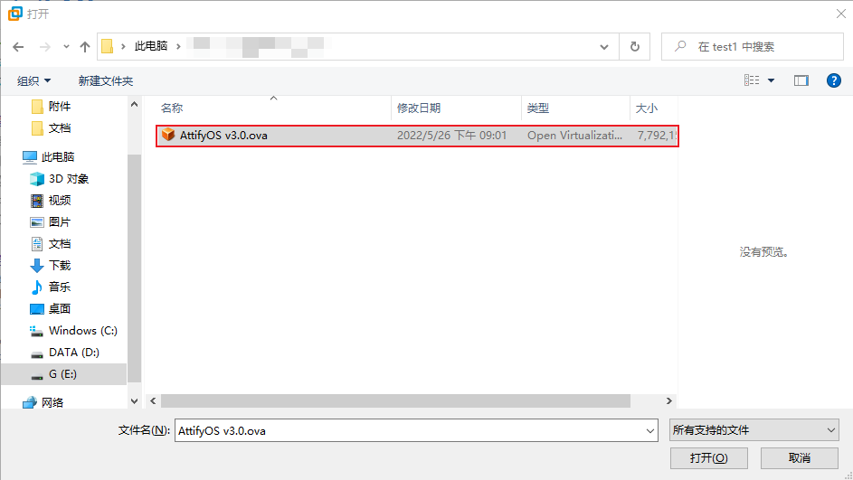
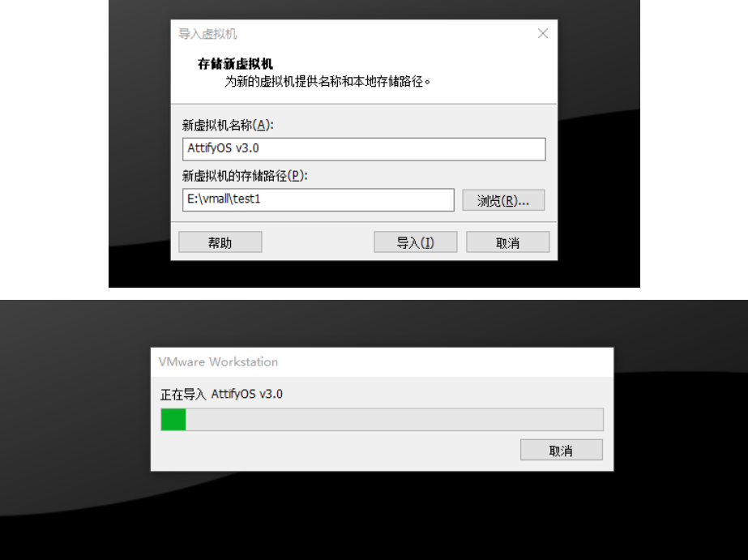
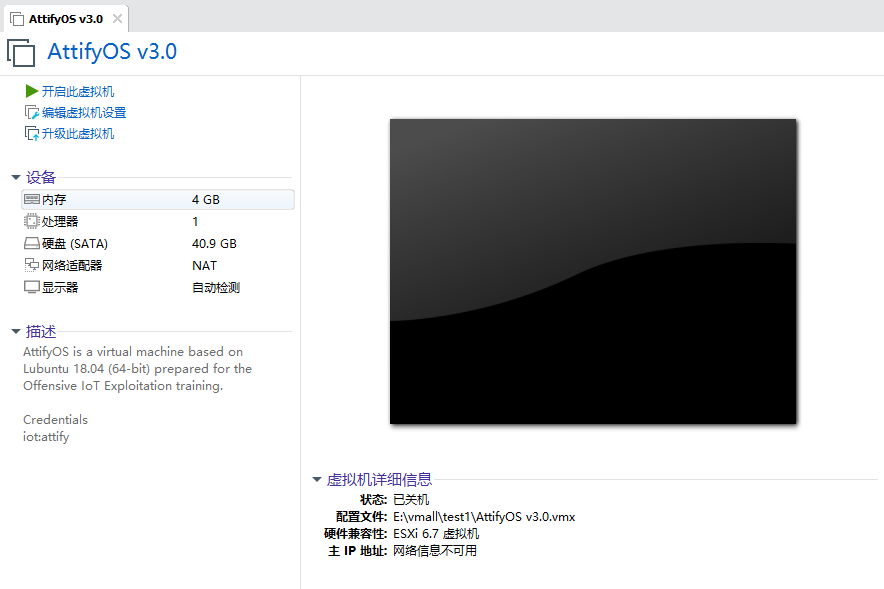
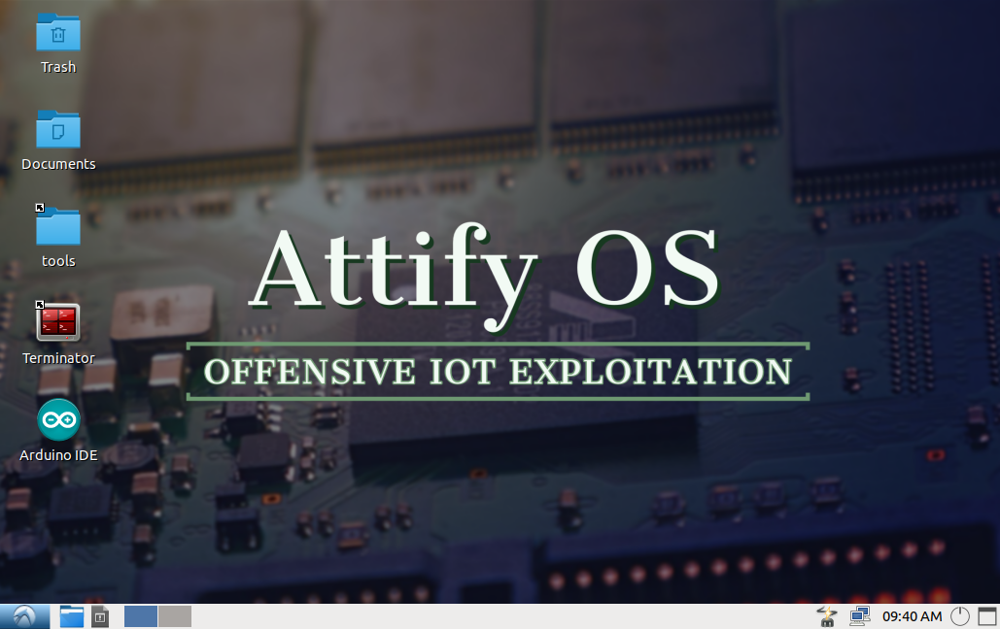

## 0. 环境配置

为了确保能够快速而顺利地进行固件安全测试，通常需要一个良好的分析环境，可以省去多数环境配置和软件安装依赖等问题。推荐以下两款常用于物联网领域的虚拟机attify和IOT-Research，虚拟机资源都是从互联网中收集，可根据自身需要选择是否使用。

### attify OS 虚拟机

[attify](https://github.com/adi0x90/attifyos) (虚拟机账户口令`iot`:`attify`)

下载地址：谷歌云盘 - <https://drive.google.com/drive/folders/1C5BKrpoCtxqZODbF0A-tt0UNjx-UmKt3>

**AttifyOS虚拟机安装步骤：**

1. 下载连接中提供的虚拟机文件，使用VMware workstation打开虚拟机(文件-->打开[Ctrl+O])，选中AttifyOS v3.0.ova文件。

2. 按照提示的步骤导入虚拟机 ，选择合适的路径存储新的虚拟机，等待虚拟机导入完成。

3. 导入成功就可以直接开启虚拟机，同时在虚拟机描述信息中也标明了账户和口令信息。

4. 开启虚拟机进入系统，默认用户iot，不需要登录口令。

### IOT-Research虚拟机

[IOT-Research](https://www.iotsec-zone.com/article/110)虚拟机账户口令：`iot`：`iot`

百度云盘的分享链接如下(提取码：`nqy3`)：
windows版虚拟机

> 链接： <https://pan.baidu.com/s/1ke6gvJ9sFlnpPE17O9nMuQ>

Mac M1版虚拟机

> 链接：<https://pan.baidu.com/s/10BIt97pd4XQUyraAINdicw>

下载好文件虚拟机后，同样的方式打开并登录虚拟机。

其中包含很多已经安装了很多常用的工具，例如binwalk、FirmAE 、flashrom等。

