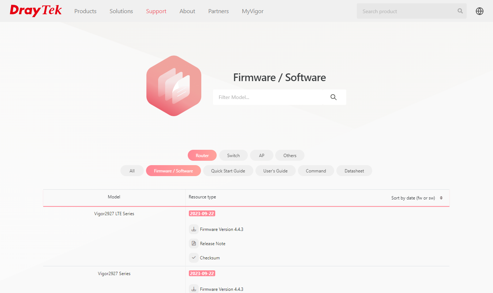
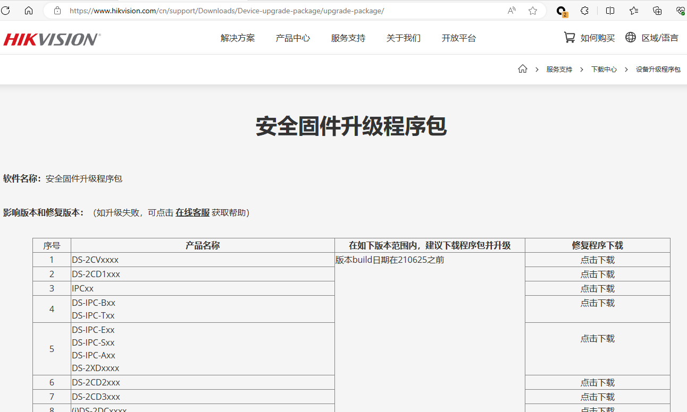
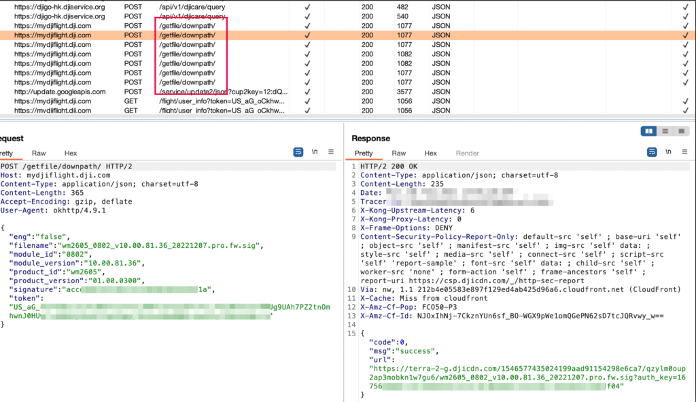
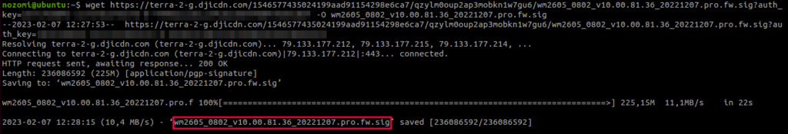
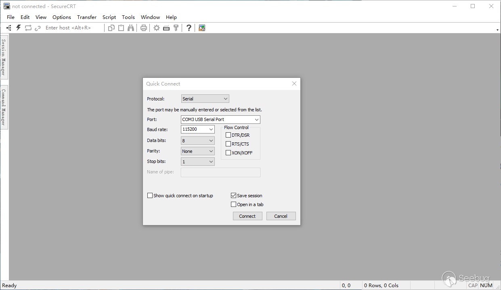
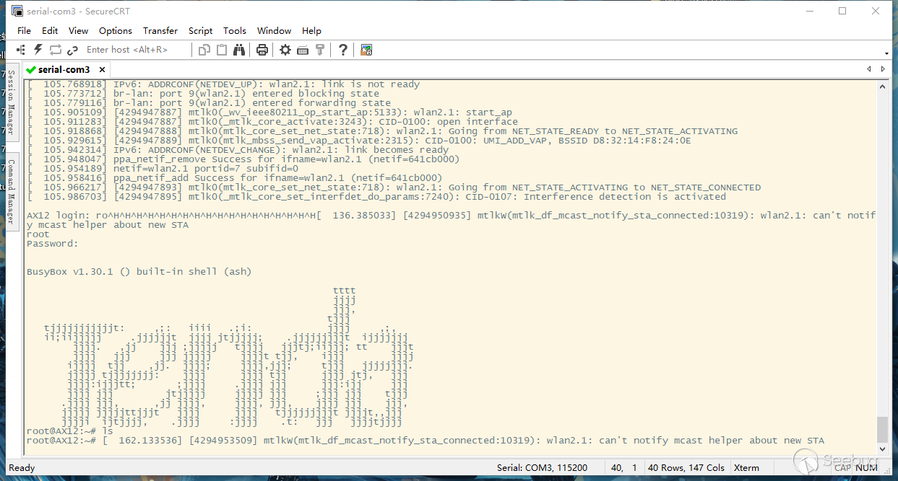
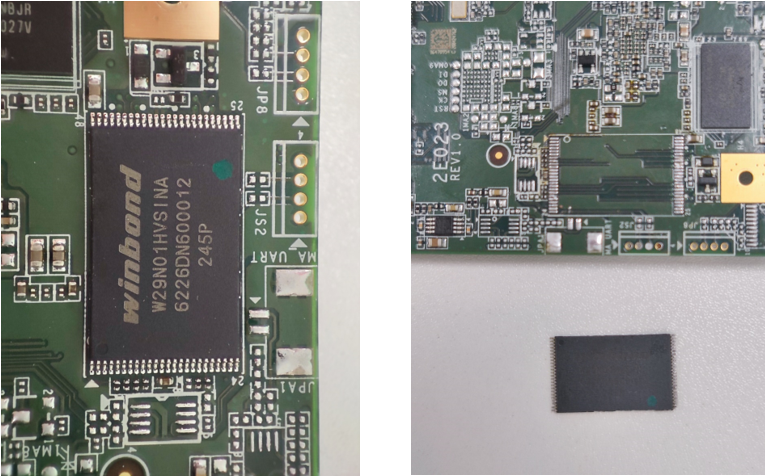
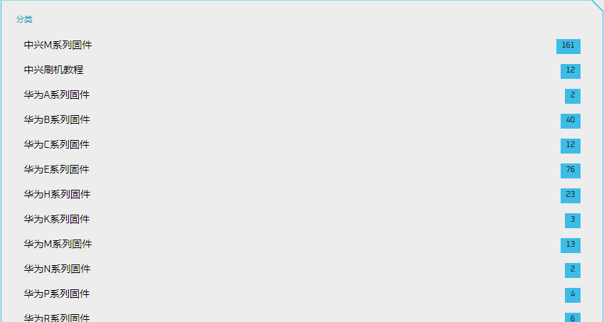

## 1. 获取固件

### 1.1 从供应商的support网站获取

对于固件获取，第一种最直接的方法就是通过官网的下载渠道，来获取相应的固件文件。首先找到官网的网址，根据官方提供的固件下载链接进行下载。例如获取DrayTek厂商的设备固件：https://www.draytek.com/support/resources/routers#version

也有部分厂商仅在官网提供最新版本的固件，当我们需要一些旧版本的固件时，不知道路径的话很难下载到。有部分厂商的多数固件都是放在某个FTP服务器目录下，知道地址即可获取到固件。例如DrayTek固件服务器：https://fw.draytek.com.tw/

当然，部分厂商的固件在国内的官网中是难以下载到的，或着国内厂商提供的固件并不是大家需要的，此时可以访问该厂商针对不同国家提供的官网页面进行下载。例如海康威视在国外和国内的官网提供的固件下载的数量和固件的排序方式存在较大差矣。在获取固件时多去不同地区的官网进行查找，往往有意想不到的收获。

HIKVISION EUROPE B.V 提供的固件

HIKVISION CHINA B.V 提供的固件

国内外常见路由器厂商的固件下载链接：

| 厂商           | 下载链接                                                                     |
| -------------- | ---------------------------------------------------------------------------- |
| D-LINK         | https://tsd.dlink.com.tw/ddwn                                                |
|                | https://files.dlink.com.au/products/                                         |
|                | http://www.dlink.com.cn/techsupport/                                         |
| TOTOLINK       | https://www.totolink.net/home/index/menu_listtpl/listtpl/support/id/27.html  |
| FAST           | https://service.fastcom.com.cn/download-list.html#0                          |
| TP-LINK        | https://resource.tp-link.com.cn/?&productorlist=1&filterClass=[4]            |
| MERCURY        | https://service.mercurycom.com.cn/download-list.html                         |
| TENDA          | https://www.tenda.com.cn/download/cata-11.html                               |
| Trendnet       | https://downloads.trendnet.com/                                              |
| NETCORE(磊科)  | https://www.netcoretec.com/service-support/download                          |
| NETIS          | https://www.netis-systems.com/Suppory/down.html                              |
| UTT(艾泰)      | https://www.utt.com.cn/downloadcenter.php                                    |
| RUIJIE(锐捷)   | https://www.ruijie.com.cn/fw/rj/                                             |
|                | https://www.ruijienetworks.com/resources/products/1896-1897                  |
| WAYOS(维盟)    | https://www.wayos.com/fuwuzhici/xiazaizhongxin/                              |
| ADSLR(飞鱼星)  | https://www.adslr.com/companyfile/2/                                         |
|                | https://www.feiyuxing.com.cn/Downloads/                                      |
| B-LINK         | https://www.b-link.net.cn/downloads_16.html                                  |
| ASUS(华硕)     | https://www.asus.com.cn/support/Download-Center/                             |
| DrayTek        | https://www.draytek.com/support/resources/routers#version                    |
|                | https://fw.draytek.com.tw/                                                   |
| NETGEAR        | http://support.netgear.cn/download.asp                                       |
|                | https://www.cisco.com/c/zh_cn/support/all-products.html                      |
| LB-LINK        | https://www.lb-link.com/support/downloads/                                   |
| MIKROTIK       | https://mikrotik.com/download                                                |
|                | http://46.167.242.10/firmware/mikrotik/                                      |
| IKUAI(爱快)    | https://www.ikuai8.com/component/download                                    |
| FORTINET(飞塔) | https://support.fortinet.com/Download/FirmwareImages.aspx                    |
|                | https://it-help.tips/en/fortigate-firmware-download/                         |
| MI(小米)       | http://www.miwifi.com/miwifi_download.html                                   |
| H3C            | https://www.h3c.com/cn/Service/Document_Software/Software_Download/          |
| LINKSYS        | https://www.linksys.com/jp/linksys-support/                                  |
| COMFAST        | http://www.comfast.com.cn/index.php?m=content&c=index&a=lists&catid=31       |
| 360            | https://luyou.360.cn/home/support/download?from=nav                          |
| WAVLINK        | https://www.wavlink.com/zh_cn/firmware.html                                  |
| IP-COM         | https://www.ip-com.com.cn/download/list-5.html                               |
| Advantech      | https://www.advantech.com/en/search/?q=router&st=support&from=support        |
| Zyxel          | https://www.zyxel.com/global/en/support/download                             |
| NetModule      | https://www.netmodule.com/en/support/downloads/device-software-manual        |
| Nexxt          | https://support.nexxtsolutions.com/935819-English                            |
| Teltonika      | https://wiki.teltonika-networks.com/view/RUT_Routers                         |
| Belkin         | https://www.belkin.com/support-search/?search=router                         |
| Engeniustech   | https://www.engeniustech.com/wp_firmware/                                    |
| AmpedWireless  | https://ampedwireless.com/support.html                                       |
| Actiontec      | https://opensource.actiontec.com/                                            |
| Level1         | http://download.level1.com/level1/firmware/                                  |
| Edimax         | https://www.edimax.com/edimax/download/download/data/edimax/global/download/ |
| peplink        | https://www.peplink.com/support-01/downloads/                                |
| sierrawireless | https://source.sierrawireless.com/                                           |
| E-lins         | https://www.szelins.com/firmware-t-10.html                                   |
| gl-inet        | https://dl.gl-inet.com/                                                      |
| PhoenixContact | https://www.phoenixcontact.com/en-sg/products/industrial-communication       |
|                |                                                                              |
|                |                                                                              |

### 1.2 设备更新进行中间人获取

中间人攻击（Man-in-the-Middle Attack，简称MitM攻击）是一种网络安全攻击，其中攻击者插入自己在两个通信方之间，窃取或篡改他们之间的数据传输。这种攻击可以发生在各种通信渠道中，包括互联网连接、局域网、Wi-Fi网络等。

以大疆无人机Mavic 3设备固件升级为例：

在升级 Mavic 3 Classic 时，拦截通信并分析用于下载新固件包的 API 端点（绕过证书锁定）。调查显示，该无人机有多个组件，每个组件都有其独特的固件映像，由模块 ID 识别并单独下载。这个过程是通过向mydjiflight.dji.com主机上的端点/getfile/downpath发出经过身份验证的HTTP REST请求（每个固件模块一个）来完成的。

除了下载固件映像所需的信息（如模块ID、产品ID和版本）外，POST请求还包含一个签名，用于对请求本身进行身份验证。响应包含一个链接，其中包含下载固件映像时所需的相关身份验证密钥auth_key，如图6所示。只需使用提供的链接和身份验证密钥作为参数执行wget工具就足以下载固件。

对于 Mavic 3 Classic，可用列表中最有趣的升级包是关联 ID 0802 的模块，因为其尺寸较大，这表明它可能包含无人机的主操作系统。

### 1.3 通过设备调试接口中提取

标准的调试接口通常是用于连接到计算机或其他调试设备的接口，以便开发人员可以进行调试、编程和分析。这些接口可以用于访问和操纵硬件或软件，以帮助诊断问题、改进性能或进行逆向工程。以下是一些常见的标准调试接口：

| 调试接口 |                                                                      描述信息                                                                      |
| :------: | :------------------------------------------------------------------------------------------------------------------------------------------------: |
|   UART   | UART是一种串行通信接口，通常用于与嵌入式系统通信。它可以通过串口连接（通常是RS-232或RS-485）与设备通信，使开发人员能够查看和修改设备的输出和输入。 |
|   JTAG   |        JTAG是一种用于测试、调试和编程集成电路的标准接口。它提供了一种途径，允许开发人员访问芯片内部的各种信号和寄存器，用于调试和编程目的。        |
|   SWD   |             SWD是一种用于低功耗微控制器调试的串行接口，通常用于ARM Cortex-M微控制器。它提供了访问设备内部的调试信号、寄存器和存储器。             |
|   SPI   |  SPI是一种串行通信接口，通常用于连接微控制器、传感器和外围设备。虽然它通常用于通信，但它也可以用于调试目的，通过读取和写入寄存器来监视设备状态。  |
|   I2C   |                       I2C是一种串行通信协议，通常用于连接微控制器、传感器和其他集成电路。类似于SPI，I2C也可以用于调试目的。                       |
|   ICE   |              ICE是一种用于嵌入式系统调试的硬件设备，通常使用专用接口与目标设备连接，允许开发人员在目标设备中单步执行代码和监视状态。              |

这里以seebug中分析Tenda Ax12 设备的文章作为参考。通过串口调试(UART)的方式从设备在获取固件。

要的工具有FT232，杜邦线，万用表，SecureCRT软件。

FT232 USB转UART串口模块。

UART引脚作用

- VCC：供电pin，一般是3.3v-5v，正极
- GND：接地，负极
- RXD：接收数据引脚
- TXD：发送数据引脚

现在我们就知道了电路板上GND就是GND，IN就是RXD，OUT就是TXD，3V3就是VCC。但是连接杜邦线的时候需要这样连接，一般来说连GND，RXD，TXD就可以了。

- FT232上的TXD连接到电路板的RXD(IN)
- FT232上的RXD连接到电路板的TXD(OUT)
- FT232上的GND连接到电路板的GND

然后打开SecureCRT，设置好波特率115200（常用）

然后重启路由器，就可以看到在打印启动日志了。

然后等待一段时间，就会出现登录了

### 1.4 从Flash闪存芯片进行提取

> **不拆芯片读取固件**

使用夹子、钩子等连接导线，适合引脚较少的芯片。通过夹具夹住芯片引脚，然后连接编程器读取芯片内容，通过编程器连接芯片需要注意引脚的顺序，在 IC 芯片上都会有一个小点，大多数情况下，小点对应的引脚即为芯片的第一脚，而连接编程器的导线也需要插入编程器上相应的引脚。

这里以Winbond 25Q32JVSIQ芯片为例，可以看见图中芯片的右下角有一个小圆点，使用夹子的时候需要将引脚位置相互对应，通常夹子上的导线会有颜色标识，图中的红色导线就是第一脚连接的地方。同时需要正确的使用夹子夹住芯片，保证每个夹脚都正常的和芯片接触。

然后可以将夹子的另一端和对应的编程器连接，这里使用的是爱修的RT809F系列编程器，在网上能够轻松的购买到。然后在iFix爱修网下载并安装对应的编程器软件，详细安装过程请参考http://doc.ifix.net.cn/@rt809/CHN.html。

然后将编程器和电脑正确连接，然后打开编程器软件，对与常见的芯片只需要点击编程器软件中的智能识别，然后根据芯片上的信息进行校对。正确地在编程器软件中设置好芯片信息后，点击读取按钮固件就能够正常的从芯片中存储到本地中。

> 拆解芯片读取固件

拆解芯片所使用的硬件工具：热风焊台，恒温内热烙铁（尖头，刀头），吸锡带，吸锡器，助焊剂，松香，镊子，锡丝，隔热胶带等，在拆解芯片时记得提前在芯片引脚涂上助焊剂。

将热风枪的温度设置在350摄氏度左右，距离芯片1-2厘米，持续加热直到芯片引脚锡点融化，使用镊子轻轻触碰，能够感觉到明显的松动，就可以取下芯片。

将烙铁加热到400摄氏度左右，融化一截锡丝至芯片的引脚处，记得提前涂上助焊剂，然后将融化的锡球来回在芯片引脚拖动，来回拖动几次就能够轻松使用镊子取下芯片。

以下是以winbond  W29N0DN60012芯片为例，该芯片拥有48引脚，相比于常见的flash芯片(8pin或16pin)在拆解难度上更大。

将拆好的芯片表面的焊油擦拭干净，仔细观察芯片的引脚有没有被锡点粘连在一起的现象，使用锡球拖动时温度控制不好，这种芯片的引脚很容易发生粘连，如果发现粘连，在引脚涂上助焊剂使用烙铁仔细清理即可。

将拆解好的芯片放入48脚的底座中，然后使用RT809H编程卡住底座。使用的编程器依然是Ifix爱修的RT809H，当然也有其他可选的编程器，例如T48。

然后将编程器和电脑正确连接，然后打开编程器软件。编程器软件下载链接[国内版 - iFix爱修网](http://doc.ifix.net.cn/@rt809/CHN.html)，点击编程器软件中的智能识别，然后根据芯片上的信息进行校对，点击读取即可。

### 1.5 其他方式

网上购买

一些固件爱好者可以会收集各种厂商的固件，放到网上出售。一个固件一般几元到几十元不等。如：https://www.qyyd5g.top/ 联系到卖家，提出想要的固件型号，可以询问到价格，付款购买即可。

向客服索取

在很多设备的官网都会有客服咨询入口，当我们找不到想要的固件的时候，可以向客服索取，当然客服可能会向你要设备的SN码，为了验证你确实是有设备。当你向其索要的时候，注意你的表达方式，基本上都能够获取到固件。
