## 3. 固件仿真

qemu

QEMU（Quick Emulator）是一款开源的虚拟化工具和模拟器，用于在不同架构和操作系统之间进行硬件级别的虚拟化和模拟。它具有多种用途，包括虚拟机管理、嵌入式系统开发、操作系统开发和测试等

他支持多平台支持、硬件级模拟、嵌入式开发、虚拟机管理、快照和还原、高度可定制、性能优化

QEMU在虚拟化和模拟领域非常有用，它是一个强大的工具，可用于多种开发、测试和虚拟化场景。它还是一个开源项目，因此可以根据需要进行自定义和扩展


### 3.1 局部仿真

qemu-user

QEMU-User（简称QEMU-U）是QEMU项目的一部分，它提供了一种用户态的CPU模拟，允许在一个架构上运行的二进制程序在不同架构的系统上执行。具体来说，QEMU-User允许将一个CPU架构的二进制程序在另一个CPU架构的系统上运行，而不需要完全模拟整个虚拟机。

如果仅仅只有单个 elf 静态链接文件，那么可以采用局部仿真的方法进行启动
例如 arm 架构的可以直接使用如下命令，然后监听 1234 端口，等待 gdb连接
```python
qemu-arm -g 12345 ./elf_fie
```
这样就可以开启一个 12345 端口的 server，然后可以在另一个终端中使用 gdb 的 `target remote` 命令进行连接，然后调试

如果是动态链接的二进制文件，可以指定共享库的位置，可以使用qemu-user的`-L`选项指定当前目录，然后将动态库存放于当目录的 lib 子目录中
 ```python
 qemu-arm -L ./ -g 12345 ./elf_fie
 ```


ARM 32位:
```python
qemu-arm -L /path/to/lib -g 12345 /path/to/your/arm_binary
```

ARM 64位 (AArch64):
```python
qemu-aarch64 -L /path/to/lib -g 12345 /path/to/your/aarch64_binary
```

MIPS 32位:
```python
qemu-mips -L /path/to/lib -g 12345 /path/to/your/mips_binary
```

MIPS 64位:
```python
qemu-mips64 -L /path/to/lib -g 12345 /path/to/your/mips64_binary
```

在这个命令中：
- `qemu-arm` 是用于启动QEMU ARM用户模式的命令。
- `-L /path/to/lib 指定根文件系统的路径，这是需要的，因为用户模式QEMU通常需要一些系统库和资源。
- `-g 12345` 指定用于调试的端口号，你可以将这个端口连接到调试器。
- `/path/to/your/arm_binary` 是要执行的ARM架构的二进制文件的路径。

请将 `/path/to/rootfs` 和 `/path/to/your/arm_binary` 替换为实际的路径和文件名。

例子
接下来以 agentserverd 程序为例子
```python
~/Desktop/dazhong/usr/bin
file agentserverd
```

可以看到是 aarch64 的架构
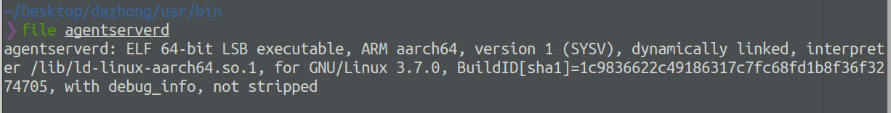

所以我们选择这条命令
```python
qemu-aarch64 -L /path/to/lib -g 12345 /path/to/your/aarch64_binary
```

将 lib 路径和程序名换成我们自己的
```python
qemu-aarch64 -L ./ ./agentserverd
```

我将 lib 放在当前目录了，所以可以直接用 ./


可以看到成功运行了


### 3.2 系统仿真

qemu-system

QEMU-System是QEMU项目的一部分，它提供了完整的虚拟化和仿真环境，允许用户模拟整个计算机系统，包括CPU、内存、外部设备等。QEMU-System是一种强大的工具，可用于多种用途，包括虚拟化、操作系统开发、嵌入式系统测试和仿真等。

QEMU-System是一个非常强大和灵活的工具，广泛用于虚拟化、操作系统开发、嵌入式系统测试和仿真等领域。它是一个开源项目，因此用户可以根据需要进行自定义和扩展。

如果有文件系统，就可以使用 qemu-system 来进行系统仿真
举个例子来说明各个参数
```python
qemu-system-arm \
	-M vexpress-a9 \
	-kernel vmlinuz-3.2.0-4-vexpress \
	-initrd initrd.img-3.2.0-4-vexpress \
	-drive if=sd,file=debian_wheezy_armhf_standard.qcow2 \
	-append "root=/dev/mmcblk0p2 console=ttyAMA0" \
	-net nic \
	-net tap,ifname=tap0,script=no,downscript=no \
	-nographic
```

-kernel 指定内核镜像文件 bzImage 路径
-initrd 设置内核启动的内存文件系统
bzImage: 压缩的linux内核
vmlinux: 未压缩的ELF格式的linux内核，可以使用extract-vmlinux解压bzImage得到
rootfs.img: 根目录的文件系统
dev_helper.ko: 编译好的驱动模块，也是要分析的目标
start.sh: qemu的启动脚本

如果使用 qemu-system 进行调试，就得需要根据架构下载三个文件，比如目标系统是 arm 的 32位 小端序
就需要去如下网站下载以下文件：
https://people.debian.org/~aurel32/qemu/

- vmlinuz-3.2.0-4-vexpress：zImage 格式压缩的 linux kernel
- initrd.img-3.2.0-4-vexpress：ramdisk 镜像
- debian_wheezy_armhf_standard.qcow2：文件系统镜像

然后进行网络配置
方便虚拟机和 qemu 进行通信

虚拟机里：
```python
sudo tunctl -t tap0 -u `whoami`  # 为了与 QEMU 虚拟机通信，添加一个虚拟网卡
sudo ifconfig tap0 10.10.10.1/24 # 为添加的虚拟网卡配置 IP 地址
```
qemu里：
```python
ifconfig eth0 10.10.10.2/24
ping -c 3 10.10.10.1 # 测下网
```

然后 qemu 启动命令
```python
sudo qemu-system-arm \
	-M vexpress-a9 \
	-kernel vmlinuz-3.2.0-4-vexpress \
	-initrd initrd.img-3.2.0-4-vexpress \
	-drive if=sd,file=debian_wheezy_armhf_standard.qcow2 \
	-append "root=/dev/mmcblk0p2 console=ttyAMA0" \
	-net nic \
	-net tap,ifname=tap0,script=no,downscript=no \
	-nographic
```

以下是各种架构的调试命令：
aarch64:

```python
sudo qemu-system-aarch64 \
	-m 1024 \
	-cpu cortex-a57 \
	-M virt \
	-nographic \
	-smp 4 \
	-kernel linux-4.14.221/arch/arm64/boot/Image \
	-append "noinintrd sched_debug root=/dev/vda rootfstype=ext4 rw crashkernel=256M loglevel=8" \
	-drive if=none,file=linux_rootfs.ext4,id=hd0 \
	-device virtio-blk-device,drive=hd0
```

armhf:
```python
sudo qemu-system-arm \
	-M vexpress-a9 \
	-kernel vmlinuz-3.2.0-4-vexpress \
	-initrd initrd.img-3.2.0-4-vexpress \
	-drive if=sd,file=debian_wheezy_armhf_standard.qcow2 \
	-append "root=/dev/mmcblk0p2 console=ttyAMA0" \
	-net nic \
	-net tap,ifname=tap0,script=no,downscript=no \
	-nographic
```

armel:
```python
sudo qemu-system-arm \
	-M versatilepb \
	-kernel vmlinuz-3.2.0-4-versatile \
	-initrd initrd.img-3.2.0-4-versatile \
	-hda debian_wheezy_armel_standard.qcow2 \
	-append root=/dev/sda1 \
	-net nic \
	-net tap,ifname=tap0,script=no,downscript=no \
	-nographic
```

mip_32:
```python
sudo qemu-system-mips \
	-M malta \
	-kernel vmlinux-3.2.0-4-4kc-malta \
	-hda debian_wheezy_mips_standard.qcow2 \
	-append "root=/dev/sda1 console=tty0" \
	-net nic -net tap,ifname=tap0,script=no,downscript=no \
	-nographic
```

mipsel_32:
```python
sudo qemu-system-mipsel \
	-M malta \
	-kernel vmlinux-3.2.0-4-4kc-malta \
	-hda debian_wheezy_mipsel_standard.qcow2 \
	-append "root=/dev/sda1 console=tty0" \
	-net nic -net tap,ifname=tap0,script=no,downscript=no \
	-nographic
```

mipsel_64:
```python
sudo qemu-system-mips64el \
    -M malta \
    -kernel vmlinux-3.2.0-4-5kc-malta \
    -hda debian_wheezy_mipsel_standard.qcow2 \
    -append "root=/dev/sda1 console=tty0" \
    -net nic \
    -net tap,ifname=tap0,script=no,downscript=no \
    -nographic
```


例子：
以思科的路由器为例

固件下载
https://software.cisco.com/download/home/283879340/type/282487380/release/1.2.0.9
https://software.cisco.com/download/home/285026142/type/282465789/release/1.0.3.44

使用 binwalk 进行提取
```python
binwalk -Me RV130X_FW_1.0.3.44.bin
```

得到如下文件系统


对漏洞程序 httpd 进行查看
可以发现是 arm 的小端序

```python
file httpd
httpd: ELF 32-bit LSB executable, ARM, EABI4 version 1 (SYSV), dynamically linked, interpreter /lib/ld-uClibc.so.0, stripped
```


qemu 启动命令
```python
sudo qemu-system-arm \
	-M vexpress-a9 \
	-kernel vmlinuz-3.2.0-4-vexpress \
	-initrd initrd.img-3.2.0-4-vexpress \
	-drive if=sd,file=debian_wheezy_armhf_standard.qcow2 \
	-append "root=/dev/mmcblk0p2 console=ttyAMA0" \
	-net nic \
	-net tap,ifname=tap0,script=no,downscript=no \
	-nographic
```

目录结构如下


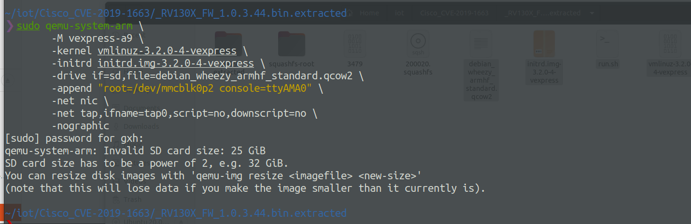

然后会有个报错
```python
qemu-system-arm: Invalid SD card size: 25 GiB
SD card size has to be a power of 2, e.g. 32 GiB.
You can resize disk images with 'qemu-img resize <imagefile> <new-size>'
(note that this will lose data if you make the image smaller than it currently is).

qemu-img resize debian_wheezy_armhf_standard.qcow2 32G
```
应该是镜像大小不是 2的n 次方

我们可以手动调整大小
```python
qemu-img resize debian_wheezy_armhf_standard.qcow2 32G
```

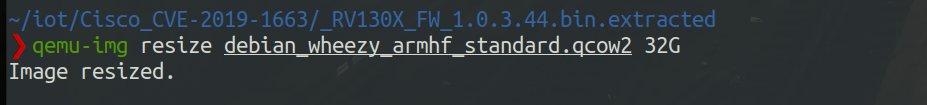

之后就可以正常运行 qemu
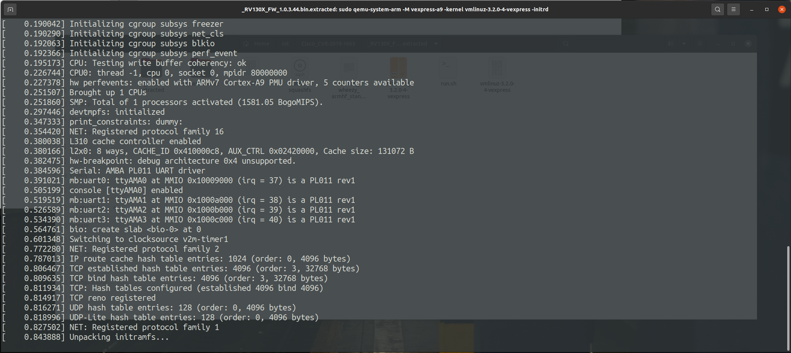


然后这时，为了能让虚拟机和 qemu 通信，我们需要配置一下网络
虚拟机里：
```python
sudo tunctl -t tap0 -u `whoami`  # 为了与 QEMU 虚拟机通信，添加一个虚拟网卡
sudo ifconfig tap0 10.10.10.1/24 # 为添加的虚拟网卡配置 IP 地址
```


qemu里：
```python
ifconfig eth0 10.10.10.2/24
ping -c 3 10.10.10.1 # 测下网
```

传入文件系统
```python
sudo scp -r ./squashfs-root root@10.10.10.2:/root/
```

这里有个坑，如果直接传入 squashfs-root，var 下的软链接会出问题，导致后面 nginx 服务无法正常启动

然后将 squashfs-root 的压缩包传入 qemu 中
```python
tar zcvf 1.tar squashfs-root
sudo scp -r 1.tar root@10.10.10.2:/root/
```

挂载文件系统
```python
# 然后挂载文件系统
mount -o bind /dev ./squashfs-root/dev/
# mount -t sys /sys/ ./squashfs-root/sys/
mount -t proc /proc/ ./squashfs-root/proc/
chroot ./squashfs-root sh
```

之后就可以正常调试了


#### 自动化仿真工具

[firmware-analysis-toolkit](https://github.com/attify/firmware-analysis-toolkit)

Firmware Analysis Toolkit（简称FAT）是一种用于分析嵌入式设备固件的开源工具套件。它旨在帮助安全研究人员和逆向工程师分析和理解嵌入式设备的固件，以发现漏洞、安全问题和潜在的攻击面。以下是Firmware Analysis Toolkit（FAT）的一些主要特点和功能：
1. 固件提取：FAT允许您从嵌入式设备中提取固件，无论它们是存储在闪存芯片、固态硬盘还是其他媒体上。这是进行后续分析的第一步。
   
2. 固件分析：FAT提供了各种分析工具，以帮助您深入研究固件的内部结构和组件。这包括文件系统解析、二进制文件分析、文件提取等。
   
3. 字符串提取：该工具还能够从固件中提取字符串，以帮助您识别固件中可能包含的敏感信息或有用的配置参数。
   
4. 固件比较：FAT允许您比较不同版本的固件，以查找更改和差异。这对于检测漏洞修复或新功能添加等方面很有用。
   
5. 漏洞分析：FAT包括一些用于静态和动态漏洞分析的工具，以帮助您发现潜在的安全问题。
   
6. 攻击面评估：该工具套件还提供了一些功能，用于评估嵌入式设备的潜在攻击面，帮助您识别可能的攻击矢量。
   
7. 插件系统：FAT支持插件系统，这意味着您可以编写自定义插件来扩展工具的功能，以满足特定的需求。

首先需要安装 firmware-analysis-toolkit，安装完后目录结构如下


安装完成后，编辑文件`fat.config`并提供 sudo 密码，如下所示。Firmadyne 的某些操作需要 sudo 权限。提供 sudo 密码是为了自动化该过程。


使用方法如下
```python
./fat.py RV130X_FW_1.0.3.44.bin
```
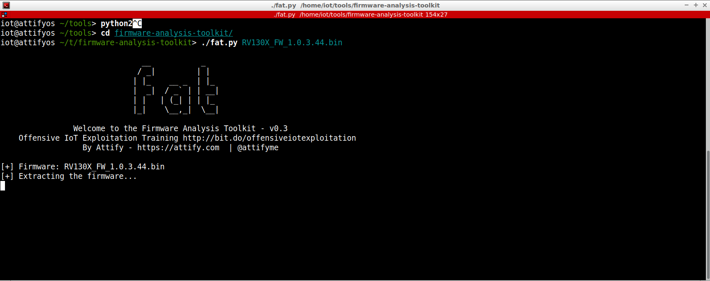

跑起来之后会有提示，需要按下回车键才会开始仿真


```python
./fat.py DIR823GA1_FW102B03.bin
```
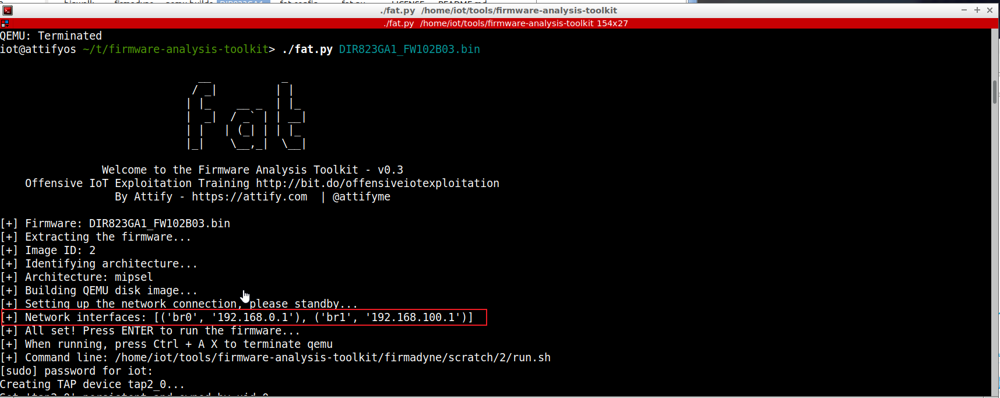

跑起来之后访问 192.168.0.1 即可


按下回车可以进入 qemu


要删除所有分析的固件映像，请运行
```python
./reset.py
```


如果未检测到网络接口，请尝试将超时值从 60 增加到`scripts/inferNetwork.sh`如下所示
```python
echo "Running firmware ${IID}: terminating after 60 secs..."
timeout --preserve-status --signal SIGINT 60 "${SCRIPT_DIR}/run.${ARCH}.sh" "${IID}"
```


[FirmAE](https://github.com/pr0v3rbs/FirmAE)

FirmAE 是一个执行仿真和漏洞分析的全自动框架。FirmAE 使用五种仲裁技术显著提高仿真成功率（从Firmadyne的 16.28% 提高到 79.36%）。

Clone `FirmAE`

```shell
git clone --recursive https://github.com/pr0v3rbs/FirmAE
```

运行`download.sh`

```shell
./download.sh
```

运行 `install.sh`

```shell
./install.sh
```

firmae 的使用
首先执行初始化脚本

```python
./init.sh
```

检查仿真条件 -c 参数

```python
sudo ./run.sh -c <brand> <firmware>
```

firmware 填写固件名称
brand 是开发板名称，可以随便填，不影响正常使用

完成`run.sh -c`后，可debug固件，这样后面进行 debug 时，等待的时间会大大减少

-a 使用分析模式

```python
sudo ./run.sh -a <brand> <firmware>
```

运行模式，有利于进行网络测试

```shell
sudo ./run.sh -r <brand> <firmware>
```

user-mode 调试固件

```python
sudo ./run.sh -d <brand> <firmware>
```

system-mode 调试固件

```python
sudo ./run.sh -b <brand> <firmware>
```

使用 FirmAE 对思科路由器设备漏洞进行仿真

第一步，首先检查仿真条件
使用 -c 参数

```python
sudo ./run.sh -c cisco /home/gxh/iot/Cisco_CVE-2019-1663/RV130X_FW_1.0.3.44.bin
```


可以看到检查仿真条件成功了

完成`run.sh -c`后，可以 debug 固件，先进行 -c 后面就会快一些，不进行 -c 也可以

然后进行 -r，运行模式，有利于进行网络测试

```python
sudo ./run.sh -r cisco /home/gxh/iot/Cisco_CVE-2019-1663/RV130X_FW_1.0.3.44.bin
```


可以看到 -r 运行成功了，然后我们去访问一下看看，可以看到完全访问成功


用户名和密码都是弱密码 cisco，我们尝试登录，然后修改密码之后，可以访问正常服务


[firmdyne](https://github.com/firmadyne/firmadyne)

FIRMADYNE 是一个自动化且可扩展的系统，用于对基于 Linux 的嵌入式固件进行仿真和动态分析。旨在帮助安全研究人员和逆向工程师研究、测试和分析固件，以识别其中可能存在的漏洞、安全问题和潜在的攻击面。它包括以下组件：
- 用于检测固件执行的修改内核（MIPS：v2.6、ARM：v4.1、 v3.10 ）；
- 用于模拟硬件 NVRAM 外设的用户空间NVRAM 库；
- 一个提取器，用于从下载的固件中提取文件系统和内核；
- 一个小型控制台应用程序，用于生成用于调试的附加 shell；
- 以及一个用于从 42 多个不同供应商下载固件的爬虫。

如何安装 firmadyne？
首先需要按照依赖项

```python
sudo apt-get install busybox-static fakeroot git dmsetup kpartx netcat-openbsd nmap python-psycopg2 python3-psycopg2 snmp uml-utilities util-linux vlan
```

递归克隆
```python
git clone --recursive https://github.com/firmadyne/firmadyne.git
```

还需要安装 binwalk 及其依赖项：
```python
git clone https://github.com/ReFirmLabs/binwalk.git
cd binwalk
sudo ./deps.sh
sudo python ./setup.py install
```

然后就是数据库的安装和配置
```python
sudo apt-get install postgresql
sudo -u postgres createuser -P firmadyne
sudo -u postgres createdb -O firmadyne firmware
sudo -u postgres psql -d firmware < ./firmadyne/database/schema
```

记得设置密码为 firmadyne
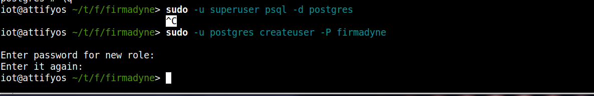

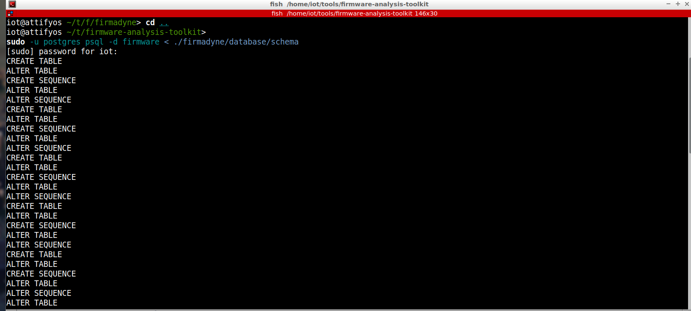


然后就是二进制组件的安装
```python
cd ./firmadyne; ./download.sh
```

最后就是 qemu
```python
sudo apt-get install qemu-system-arm qemu-system-mips qemu-system-x86 qemu-utils
```

如何使用呢？
首选我们需要启动数据库

```python
service postgresql start
```

可以随便找个固件进行测试
这里使用 netgear 的固件

```python
wget -N --continue \
http://www.downloads.netgear.com/files/GDC/WNAP320/WNAP320%20Firmware%20Version%202.0.3.zip \
-O firmware.bin
```

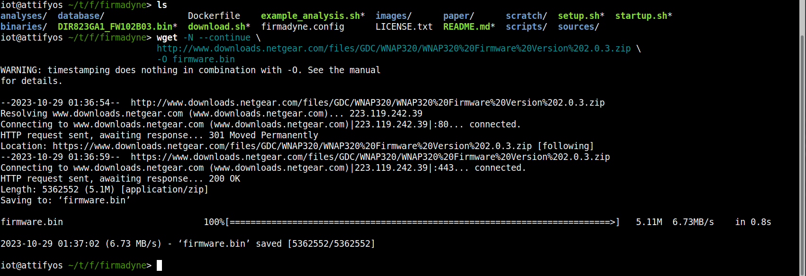

然后使用之前安装的工具进行解压
```python
python3 ./sources/extractor/extractor.py -b Netgear -sql 127.0.0.1 -np -nk "firmware.bin" images
```
- 解析固件`firmware.bin`创建项目
- 解压后目录`./../images/`下会多出一个`tar.gz`文件,文件名就是这个固件的id
- `-b Netgear`指定固件类型为`Netgear`,可以随便写一个
- `-sql`指定数据库位置
- `-np`禁止多线程解压
- `-nk`不处理内核

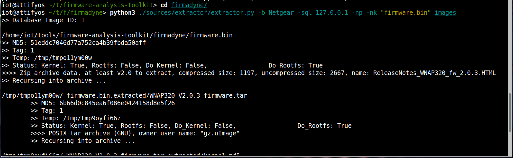
可以看到解压成功
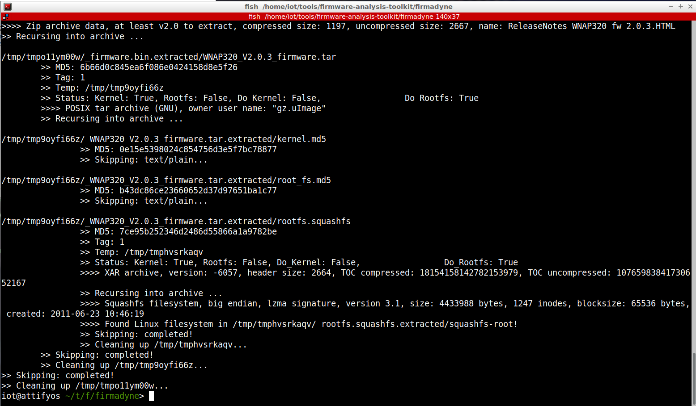

images 下多出的 targz
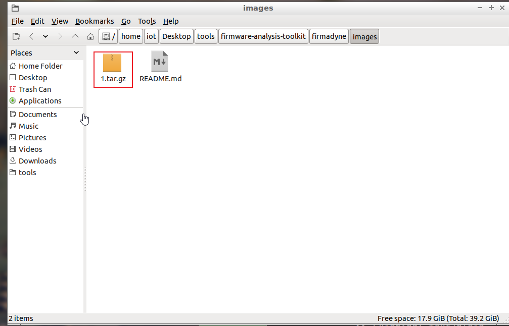

然后进行自动化分析固件架构
```python
./scripts/getArch.sh ./../images/1.tar.gz
```
可以看到是 mipseb 的架构
说白了就是对 busybox 进行架构检测
![[Pasted image 20231029173003.png]]

同时也会将结果保存到数据库，方便后面自动分析

然后对固件信息进行收集
```python
./scripts/tar2db.py -i 1 -f ./../images/1.tar.gz
```


同样的，同时也会将结果保存到数据库，方便后面自动分析

然后这时我们需要对固件创建 img
```python
./scripts/makeImage.sh 1 [arch]
```
- `[arch]`是可选参数,用于覆盖数据库中的`arch`记录

然而实际上不指定就会报错


最后对固件的网络接口情况进行分析
```python
./scripts/inferNetwork.sh 1 mipseb
```
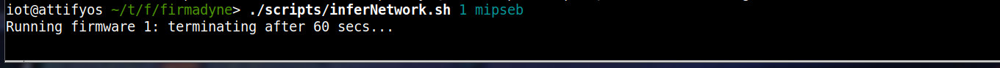
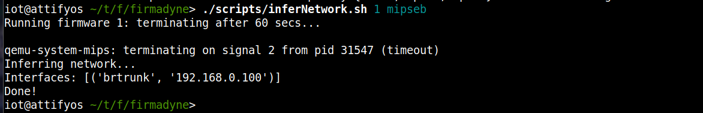

最后进行固件模拟
```python
./scratch/1/run.sh
```


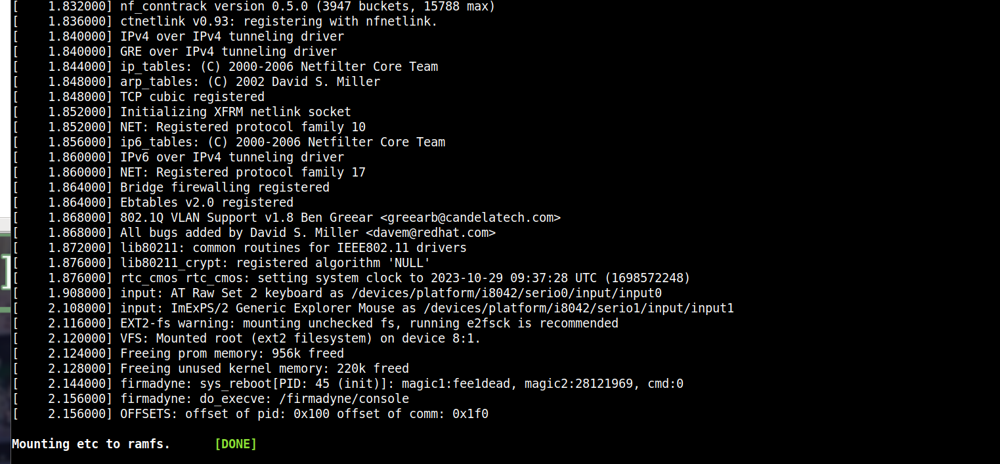

可以看到调试成功


[EMUX](https://github.com/therealsaumil/emux)


