## 4. 固件自动化分析工具

### EMBA

EMBA 是一个针对嵌入式设备固件的安全分析工具。在 Github 上，官方的介绍如下：

> EMBA 被设计为渗透测试人员和产品安全团队的中央固件分析工具。 它支持完整的安全分析过程，从固件提取开始，通过仿真进行静态分析和动态分析，最后生成网络报告。 EMBA 自动发现固件中可能的弱点和漏洞。 例如不安全的二进制文件、旧的和过时的软件组件、潜在易受攻击的脚本或硬编码的密码。 EMBA 是一个命令行工具，可以生成易于使用的网络报告以供进一步分析。
>
> EMBA 协助渗透测试人员和产品安全团队识别固件映像中的弱点和漏洞。 EMBA 提供了尽可能多的有关固件的信息，测试人员可以决定重点领域并负责验证和解释结果。

其视频演示链接为：https://youtu.be/_dvdy3klFFY

官方EMBA-wiki链接：https://github.com/e-m-b-a/emba/wiki


#### 安装

测试安装环境：Ubuntu 22.04

根据 Github 中 readme 里的安装命令直接 clone 下来安装即可。

```shell
git clone https://github.com/e-m-b-a/emba.git
cd emba
sudo ./installer.sh -d
```

注：Docker镜像较大，需要安装的依赖比较多，时间会有点长。

安装好之后，就可以使用下面的命令来测试 EMBA 是否安装好了 ：

```shell
sudo ./emba
```

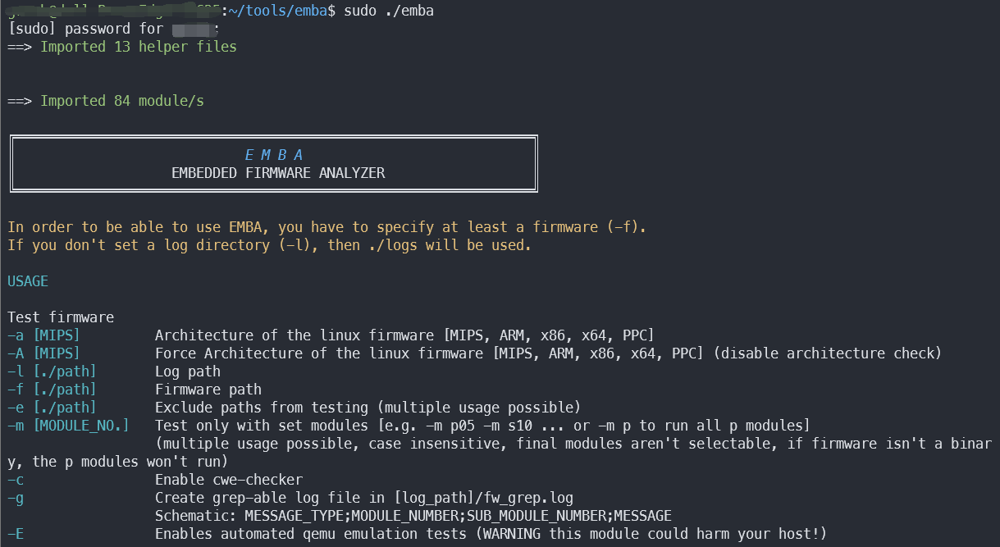

#### 用法

**静态固件测试**

- 执行 EMBA 并设置参数（在 emba 目录下），例如：

  ```shell
  sudo ./emba -l ./log -f ./firmware
  ```

  必选参数：

  `-l` 参数指定日志输出目录

  `-f` 参数指定待分析固件路径

  可选参数：

  通过 `-h` 选项查看

执行上述格式命令后即可运行 emba，如下：

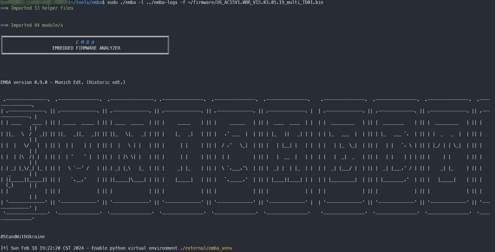

等待运行结束即可，运行时间很长，会按照顺序调用 modules 目录下各模块的脚本，对固件进行全方面的检测。生成的结果记录在指定的日志文件中，如下所示：

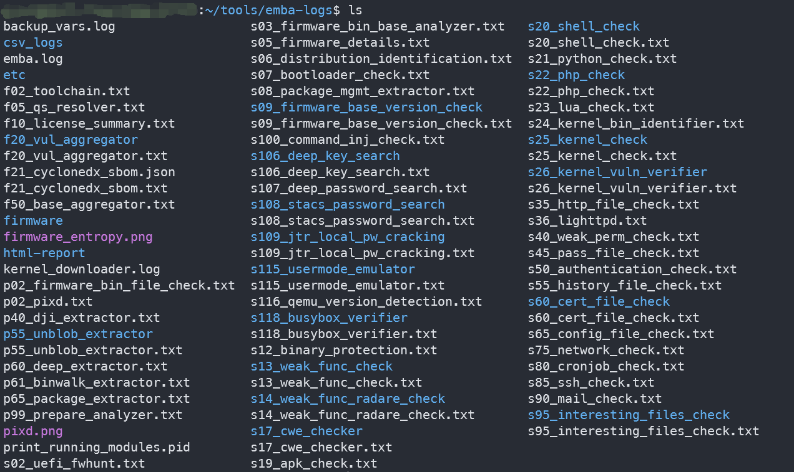

EMBA 还将结果生成html网页形式，在目录 html-report 下：

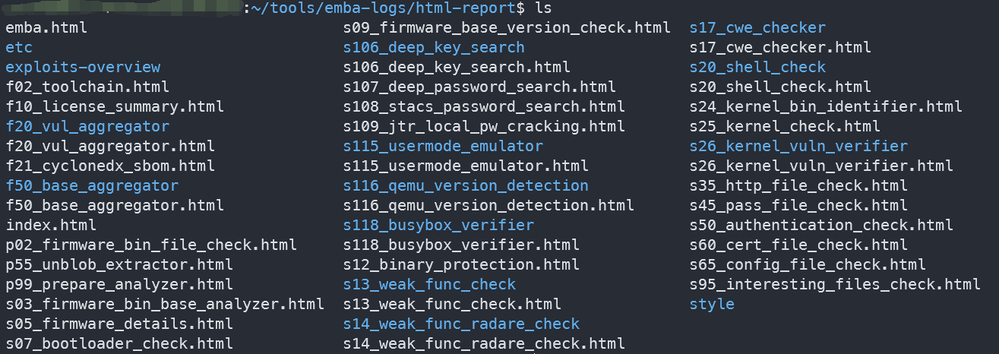

访问 index.html 页面即可查看固件分析结果：

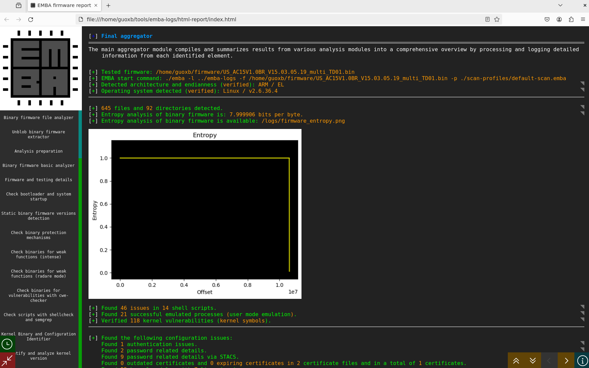


#### EMBA 文件简要分析

EMBA 项目采用纯Shell编写，主要由五个函数：`import_helper`、`import_module`、`sort_modules`、`run_modules`、`main` 组成，每个函数的大概功能如下：

- `import_helper` 函数

  导入 /emba/helpers 目录下以 helpers_emba_ 开头的脚本文件。

- `import_module` 函数

  导入 /emba/modules 目录下的脚本

- `sort_modules` 函数

  根据 modules 目录中脚本的类型以及线程优先级来对脚本进行排序。

- `run_modules` 函数

  执行 modules 目录中的脚本，有三个参数：

  第一个参数指定 module 的模式类型，有[P, S, L, F, Q, D] 

  第二个参数指定是否开启多线程模式

  第三个参数指定是否生成html文件

- `main` 函数

  调用上述函数，对固件进行自动化分析，主要包含以下几个模块。

##### 主要模块梳理

1. 请求模块 （Quests， Q模块）

   ```shell
   Q02_openai_question.sh	# 面向容器的Openai提问模块
   ```

2. 预检查模块（Pre-Check，P 模块）

   ```shell
   P02_firmware_bin_file_check.sh	# 提供有关所提供的固件二进制文件的一些非常基本的信息。
   P05_patools_init.sh				# 用patools工具提取zip、tar、tgz
   P10_vmdk_extractor.sh			# 提取vmdk镜像
   P14_ext_mounter.sh				# 挂载并提取extX映像(目前binwalk会破坏权限和符号链接)
   P15_ubi_extractor.sh			# 提取ubi文件系统
   P17_gpg_decompress.sh			# 提取gpg压缩 (未加密) 固件映像
   P18_BMC_decryptor.sh			# 从Supermicro BMC解密并提取固件图像
   P19_bsd_ufs_mounter.sh			# 挂载和提取BSD UFS映像
   P20_foscam_decryptor.sh			# 从供应商Foscam提取加密的固件映像
   P21_buffalo_decryptor.sh		# 从供应商Buffalo提取加密的固件映像
   P22_Zyxel_zip_decrypt.sh		# 提取受密码保护的Zyxel固件映像
   P23_qemu_qcow_mounter.sh		# 挂载和提取Qemu QCOW2映像
   P25_android_ota.sh				# 提取Android OTA更新文件
   P35_UEFI_extractor.sh			# 使用BIOSUtilities提取UEFI映像
   P40_DJI_extractor.sh			# 提取DJI无人机固件
   P55_unblob_extractor.sh			# 将带有unblob的固件提取到模块日志目录。
   P60_deep_extractor.sh			# 使用unblob分析固件，检查熵并将固件提取到日志目录。
   P61_binwalk_extractor.sh		# 使用binwalk将固件提取到模块日志目录。
   P65_package_extractor.sh		# 识别和提取典型的软件包档案，如deb，apk，ipk
   P99_prepare_analyzer.sh			# 一些准备工作 (检查固件、架构检查等)
   ```

3. 差异检查模块（Diff mode， D 模块）

   ```shell
   D02_firmware_diffing_bin_details.sh # 对两个固件进行一些基本检查
   D05_firmware_diffing_extractor.sh	# 该模块用于两个固件映像的提取
   D10_firmware_diffing.sh				# 进行主要的差异检查工作
   ```

   

4. 固件检查模块（Firmware-Check，S 模块）

   ```shell
   S02_UEFI_FwHunt.sh					# 使用FwHunt识别可能的UEFI固件中的漏洞
   S03_firmware_bin_base_analyzer.sh	# 对所使用的操作系统的粗略猜测
   S05_firmware_details.sh				# 计算固件中文件和可执行文件的数量，并在日志文件中打印固件树。
   S06_distribution_identification.sh	# 识别主要的Linux发行版，如Kali Linux，Debian，Fedora或OpenWRT
   S07_bootloader_check.sh				# 扫描设备树blob、引导加载程序和启动文件，并检查默认运行级别。
   S08_package_mgmt_extractor.sh		# 搜索包管理信息的已知位置
   S09_firmware_base_version_check.sh	# 遍历具有所有可执行文件的版本详细信息的正则表达式标识符的列表，并检查这些是否适合固件中的二进制文件
   S100_command_inj_check.sh			# 在www等文件夹中查找基于web的文件，并在其中搜索代码执行
   S106_deep_key_search.sh				# 搜索内部具有指定字符串模式的文件
   S107_deep_password_search.sh		# 搜索内部具有指定密码模式的文件
   S108_stacs_password_search.sh		# 在固件中搜索密码模式
   S109_jtr_local_pw_cracking.sh		# 用jtr从S109 (STACS模块) 中破解密码哈希
   S10_binaries_basic_check.sh			# 识别使用弱函数的二进制文件
   S110_yara_check.sh					# 使用yara检查文件是否存在可疑模式
   S115_usermode_emulator.sh			# 使用qemu从固件模拟可执行文件以获取版本信息
   S116_qemu_version_detection.sh		# 从S115的结果中提取版本信息
   S118_busybox_verifier.sh			# 识别BusyBox，针对CVE数据库检查BusyBox的可能漏洞
   S12_binary_protection.sh			# 该模块通过checksec在二进制文件中查找保护机制。
   S13_weak_func_check.sh				# 识别使用弱函数的二进制文件（objdump）
   S14_weak_func_radare_check.sh		# 识别使用弱函数的二进制文件（radare）
   S15_radare_decompile_checks.sh		# 识别使用弱函数的二进制文件（r2dec）
   S17_cwe_checker.sh					# 在Ghidra上运行带有cwe-checker的Docker容器，以检查二进制文件中是否存在常见的错误类型
   S19_apk_check.sh					# 识别Android apk包并使用APKHunt执行静态漏洞测试
   S20_shell_check.sh					# 检查shell脚本中的错误
   S21_python_check.sh					# 检查python脚本中的错误
   S22_php_check.sh					# 检查php脚本中的错误
   S23_lua_check.sh					# 检查lua脚本中的错误
   S24_kernel_bin_identifier.sh		# 识别内核文件和init命令行
   S25_kernel_check.sh					# 确定内核版本和说明，并检查内核配置
   S26_kernel_vuln_verifier.sh			# 通过版本号识别漏洞并尝试验证CVEs
   S35_http_file_check.sh				# 搜索http和webserver (Apache，nginx，Lighttpd等) 相关文件，并检查php.ini。
   S36_lighttpd.sh						# 此模块测试确定感兴趣的区域的lighttpd配置文件
   S40_weak_perm_check.sh				# 检查系统用户相关配置、密码文件的风险
   S45_pass_file_check.sh				# 搜索与密码相关的文件并尝试提取密码和root帐户
   S50_authentication_check.sh			# 检查身份验证等
   S55_history_file_check.sh			# 搜索可能的历史文件，如bash_history
   S60_cert_file_check.sh				# 获取认证文件及其结束日期
   S65_config_file_check.sh			# 扫描系统的典型配置文件
   S75_network_check.sh				# 检查systemd网络配置文件
   S80_cronjob_check.sh				# 检查cronjob配置的所有文件
   S85_ssh_check.sh					# 查找ssh相关文件并检查squid配置
   S90_mail_check.sh					# 在/var/mail中搜索邮件文件
   S95_interesting_files_check.sh		# 显式搜索二进制文件
   S99_grepit.sh						# CRASS (代码审查审计脚本扫描器) great grepit工具的初步实现
   ```

   

5. 实时模拟模块（Live Emulation - Check，L 模块）

   ```shell
   L10_system_emulation		# 文件夹
   L10_system_emulation.sh		# 构建和仿真Linux固件
   L15_emulated_checks_nmap.sh	# 测试在L10中构建并启动的仿真实时系统(实验模块)
   L20_snmp_checks.sh			# 同上
   L22_upnp_hnap_checks.sh		# 同上
   L23_vnc_checks.sh			# 同上
   L25_web_checks.sh			# 对在L10中构建并启动的仿真实时系统执行web服务器测试
   L30_routersploit.sh			# 测试在L10中构建并启动的仿真实时系统
   L35_metasploit_check.sh		# 使用Metasploit测试在L10中构建并启动的仿真实时系统
   L99_cleanup.sh				# 停止和清理仿真环境
   ```

   

6. 报告模块 （Reporting， F 模块）

   ```shell
   F02_toolchain.sh		# 收集对构建/识别工作工具链有用的进一步详细信息
   F05_qs_resolver.sh		# 解决Q和S模块之间的所有依赖关系和链接
   F10_license_summary.sh	# 收集许可证详细信息，并提供包含二进制文件、标识版本和相应许可证 (如果可用) 的列表
   F20_vul_aggregator.sh	# 将S06、S08、S09、S25、S26、S115/S116和l15中找到的所有版本号聚合在一起。这些版本用于识别已知漏洞cve搜索，最后创建一个与cve匹配的漏洞列表
   F21_cyclonedx_sbom.sh	# 通过cyclonedx从已识别的软件清单生成最小json SBOM
   F50_base_aggregator.sh	# 生成所有模块的概述
   ```

   

#### 参考博客

> 1.https://ylcao.top/2023/04/27/EMBA%E5%AE%89%E8%A3%85%E3%80%81%E4%BD%BF%E7%94%A8%E4%B8%8E%E6%BA%90%E4%BB%A3%E7%A0%81%E5%88%86%E6%9E%90/#%E4%B8%BB%E6%96%87%E4%BB%B6emba%E4%BB%A3%E7%A0%81%E5%88%86%E6%9E%90
>
> 2.https://www.freebuf.com/articles/system/263517.html
>
> 3.https://bbs.kanxue.com/thread-277053.htm

### FACT-core

FACT（Firmware Analysis and Comparison Tool）是一款固件分析和比较工具 (以前称为Fraunhofer的固件分析框架 (FAF)) ，旨在自动执行固件安全分析。它解压缩任意固件文件并处理多个分析。此外，它可以比较多个映像或单个文件。其解包、分析和比较都基于插件，保证了最大的灵活性和可扩展性。

官方wiki链接：https://github.com/fkie-cad/FACT_core/wiki/

#### 安装

测试安装环境：Ubuntu 22.04

官方推荐系统版本为：Ubuntu20.04、22.04 和 Debian 11，并提供了一键安装脚本。

⭐强烈建议在虚拟 Python 环境中安装 FACT，以避免和系统 Python 包造成冲突，可以使用下面的命令创建并激活虚拟环境：

```shell
python3 -m venv FACT-core
source FACT-core/bin/activate
```

现在虚拟环境已经激活，执行下面的命令进行安装即可（非 root ！）：

```shell
sudo apt update && sudo apt upgrade && sudo apt install git
git clone https://github.com/fkie-cad/FACT_core.git ~/FACT_core
~/FACT_core/src/install/pre_install.sh && sudo mkdir /media/data && sudo chown -R $USER /media/data
```

安装完成后，会提示我们重启系统：

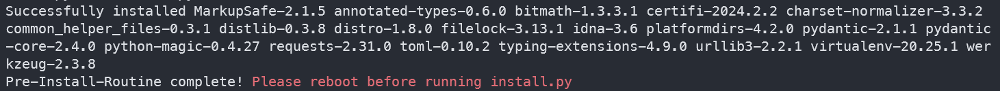

重启完之后，运行下面的命令安装依赖项（需要的时间也有点长~）（需要访问 Github 最好配置代理，不然可能会安装失败）

```shell
~/FACT_core/src/install.py
```

注<sup>1</sup>：这里似乎有一个小坑，我在 FACT_core/src/ 目录下运行 install.py 进行安装时会报如下所示错误：

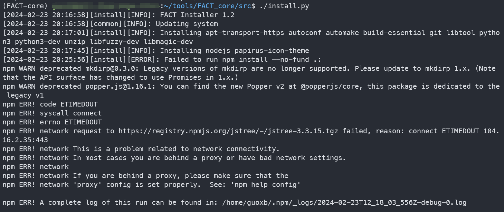

查看下面的 Traceback 可以看到是目录路径出了问题，在 src 跟 install.py 之间多了一个 ./ 

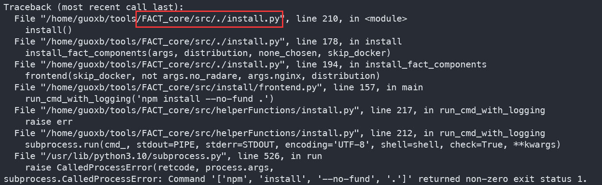

注<sup>2</sup>：安装过程中需要 docker build 命令，而 build 操作是在容器内进行的，与宿主机网络不通，在进行安装 user-and-passwords 插件时，会由于网络问题而 build 失败，如下：

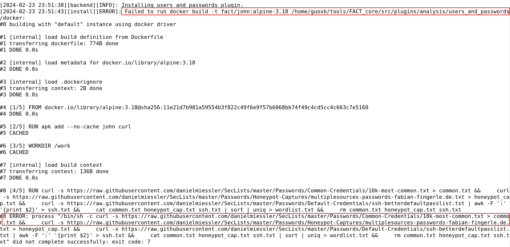

解决办法是：配置 docker 的代理，或者配置 docker 的网络模式。这里我选择后一种办法，配置 docker 网络模式为 host ，就是让 container 使用宿主机的网络，相当于 container 在网络层面和宿主机不做隔离，使用这种网络模式执行 docker build，就不需要在 dockerfile 中添加 http_proxy 环境变量，container 可以直接读取宿主上的环境变量。

查看 Traceback 中 运行 docker build 命令的代码位置：

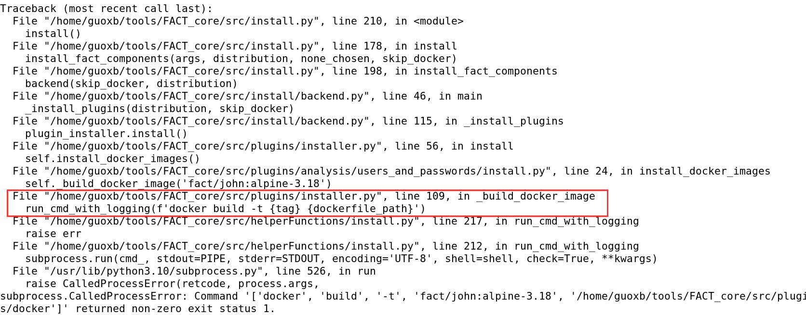

在 src/plugins/installer.py 文件中第 109 行处，在 `docker build` 命令之后加上 `--network host` 即可。

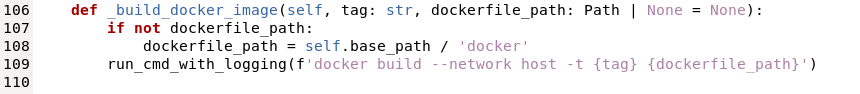

重新执行 src/install.py 命令，等待安装好后如下图所示：

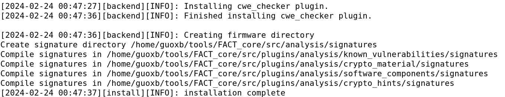


---

方法2：此外官方也说明可以通过 vagrant 安装，命令如下：

```shell
# 1. install vagrant and virtualbox
sudo apt install virtualbox vagrant

# 2. reboot your machine to ensure that the virtualbox dkms is loaded into the kernel
sudo reboot now

# 3. create a new folder for vagrant
mkdir FACT-master
cd FACT-master

# 4. create a FACT-master configuration
vagrant init fact-cad/FACT-master

# 5. edit the Vagrantfile to your needs! an example can be found below.
nano Vagrantfile

# 6. start the VM. The first time executing this command will take some time, as the box is getting downloaded and imported. So better grab a coffee!
vagrant up

# Bonus: if you want to ssh into the vm, execute:
vagrant ssh

# Bonus: if you want to stop the vm, execute:
vagrant halt
```

等待运行成功后，访问 http://localhost:5000 即可。

注<sup>1</sup>：在 VMware 虚拟机 Ubuntu 22.04 中似乎不能再安装虚拟机，执行 vagrant up 后会出现如下报错：

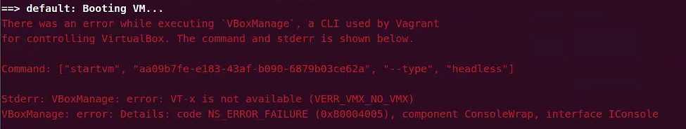

通过以下命令进行检查：

```shell
sudo apt install cpu-checker
sudo kvm-ok
```

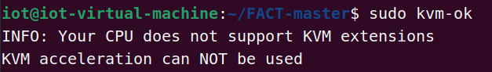

可以看到不支持 KVM，由于对虚机化这方面不太了解，暂时没有通过这种方法安装成功。

注<sup>2</sup>：示例 Vagrantfile 配置及其他事项可参考官方文档：FACT_core/INSTALL.vagtant.md


#### 用法

运行下列命令：

```shell
~/FACT_core/start_all_installed_fact_components
```

等待几秒后，可以看到 Successfully started FACT Backend，说明启动成功。

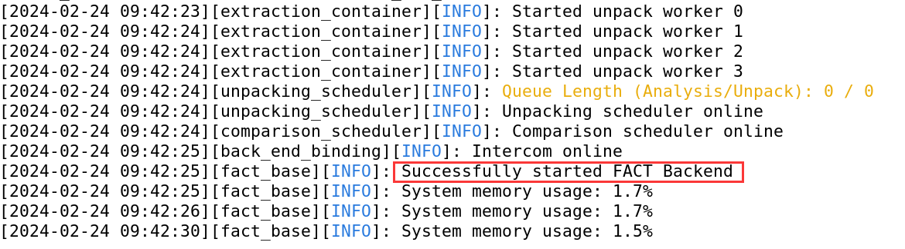

打开浏览器并转到 http://localhost:5000 可以看到 FACT 的前端页面：

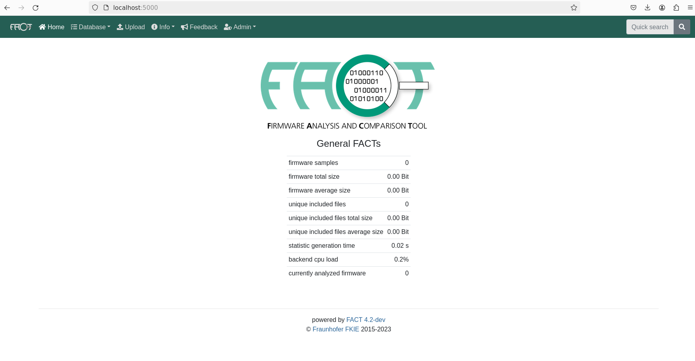

点击菜单栏 Upload 上传固件，填写固件相关信息以及 Analysis Preset 之后提交即可。

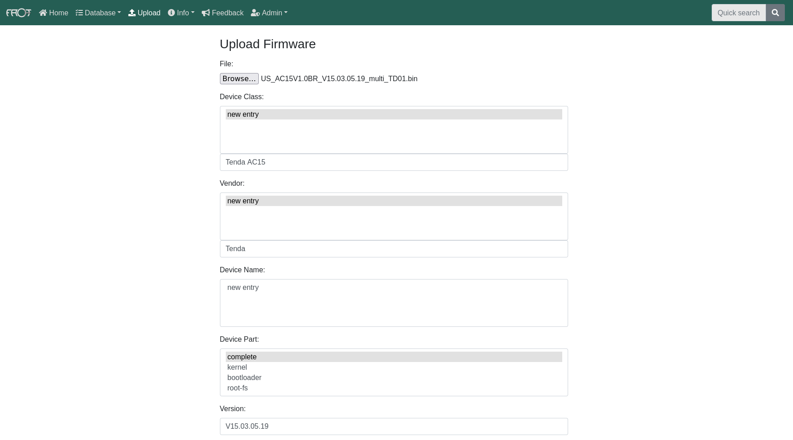

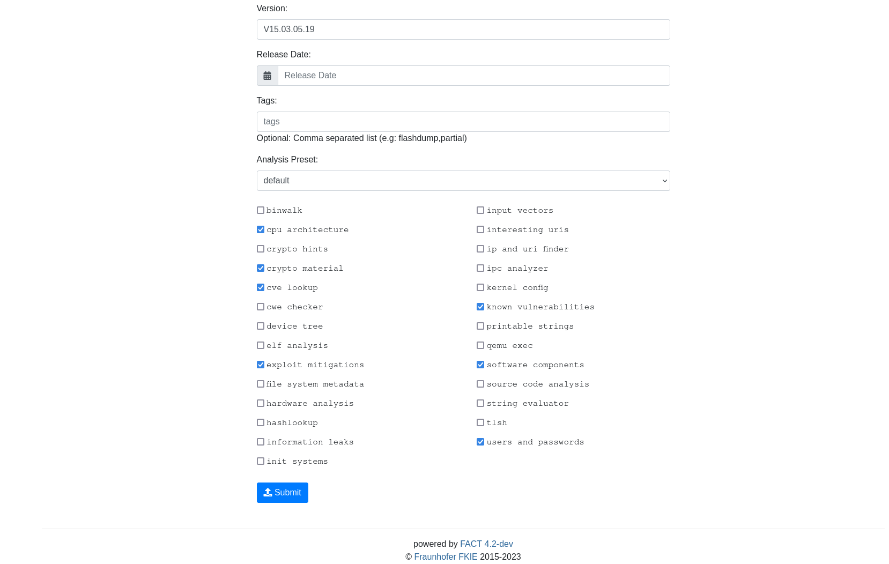

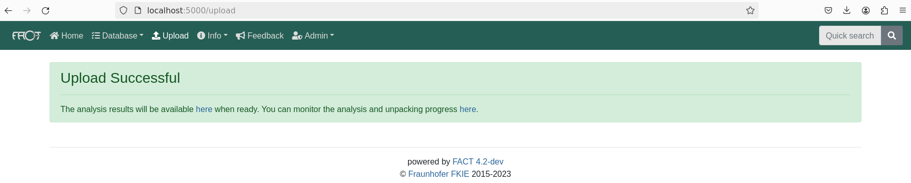

提交成功后，FACT 已经开始自动分析该固件。可以通过菜单栏 Info -> system 来查看相关分析信息，如下：

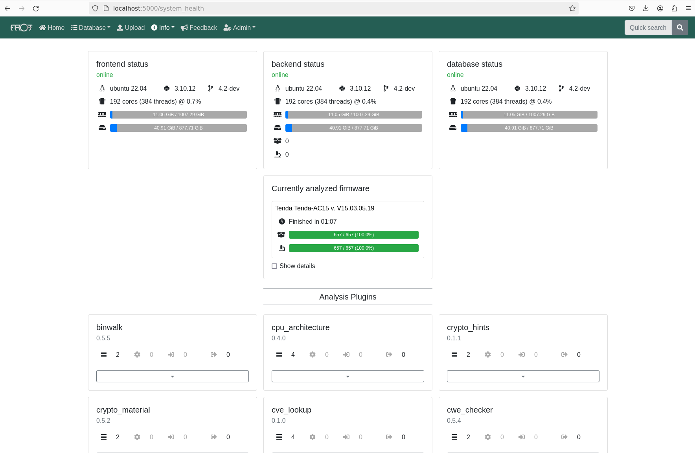

可以点击该区域查看详细的分析结果，或者等待分析结束后从菜单栏 Database 处查看：

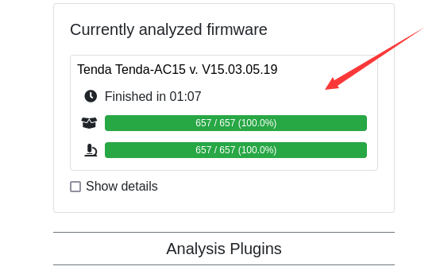

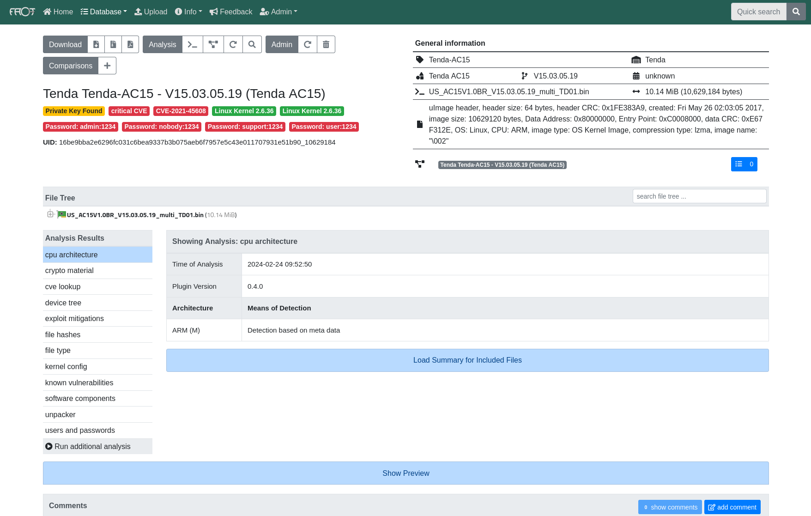

#### 参考博客

> 1.https://simpleapples.com/2019/04/18/building-docker-image-behind-proxy
>
> 2.https://askubuntu.com/questions/779277/when-using-vagrant-stderr-vboxmanage-error-vt-x-is-not-available-verr-vmx-no

### Podding & shambles 

账号需要申请方可使用
