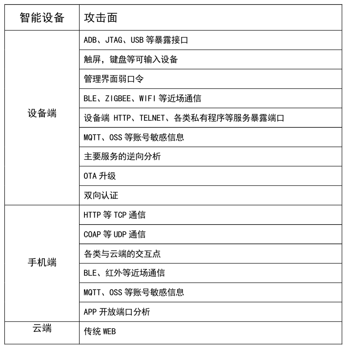
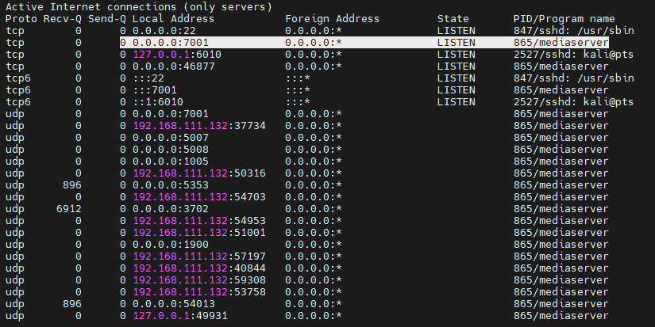
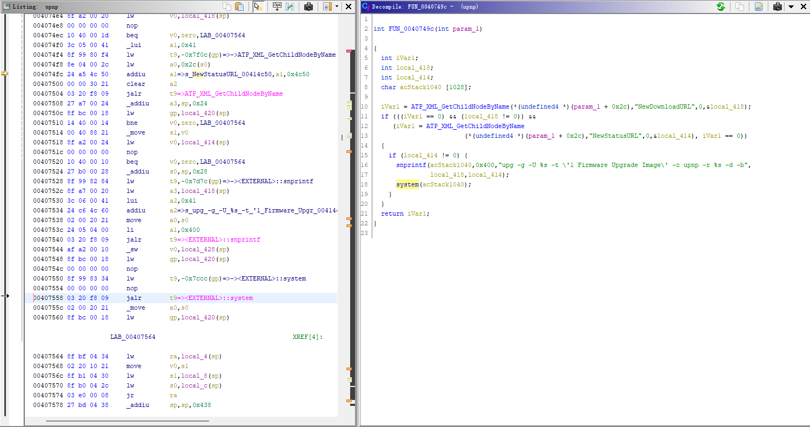

## 6. 漏洞挖掘思路

### 6.1 攻击面分析

在做攻击面分析前我们首先要知道，对于一个常规的物联网设备而言，可以分为设备端、手机端和云端。而这三个不同的端都会存在自己一些特殊的攻击面。比如设备端我们往往会先想办法获取固件然后分析核心服务，而APP端则会有注入蓝牙等一系列操作。

### 6.2 硬件分析

针对硬件的分析主要停留在电路板上使用的芯片以及配套的解决方案，一般重点关注MCU型号以及外挂Flash闪存。其次便是寻找各类接口，如UART、ADB、JTAG等。

对于UART口一般可以直接找并排或相距不远的多个焊点和通孔，然后借助万用表来识别每个串口对应的功能。也可以直接使用JTAGulator来直接进行识别，当然他更强大的功能是识别JTAG接口。

### 6.3 信息收集

做完硬件层面的分析接下来就是要正式开始，一般会在未获取固件前就对端口开放信息进行扫描，了解其对外开放的一些服务并进行黑盒测试。

过第一步说的接口进入shell后可以用ps查看设备开启了哪些服务，这些服务都是后期重点的挖掘方向。其次便是分析固件文件系统，查看固件使用了哪些中间件，如果有中间件，查看中间件的配置文件，获取中间件配置信息，当没思路的时候可以查看中间件是否有漏洞，中间件有漏洞就可以打开一扇窗口了。

设备固件中往往会包含大量敏感信息，如设备账号密码等信息。对于提取固件内配置文件中的敏感信息，我们可以通过firmwalker.sh脚本自动化获取。

### 6.4 固件分析

固件的分析一般以运行的主程序和会对外监听端口的程序为主。以常见的httpd服务为例。常见的httpd文件名: boa、gohead、httpd（lighttpd、minihttpd）等。获取httpd版本信息、通过互联网可以发现是否存在历史漏洞

另外一些厂商为方便调试会特意在设备固件上留有后门，通过逆向等技术手段，找出不属于正常功能且可能存在安全问题的接口。利用后门漏洞可以直接控制硬件设备，进一步发起信息窃取、网络钓鱼、DNS劫持等攻击行为，直接威胁用户网上交易和数据存储的安全。

搜索危险函数: system,popen,strcpy,snprintf,printf等，查看危险函数变量是否可控，可控可能就有漏洞。通过IDA跟踪请求url处理函数，跟踪每个变量处理过程，查看是否对变量进行过滤处理，无长度限制可尝试栈溢出、堆溢出，对特殊符号进行尝试绕过等操作来寻找进一步的漏洞。

### 6.5 协议分析

现在的智能设备会使用各类协议进行通讯，如MQTT、ZigBee、UPnP等。以UPnP为例测试思路一遍有获取设备描述Lcation，请求Location查看服务描述，也可通过upnp配置路径获取服务描述xml文件，通过xml文件记录每个变量，用IDA对UPnP进行反编译，搜索变量跟踪路径查看函数处理过程是否存在漏洞

这里拿HG532系列路由器远程命令执行举例，该函数对变量没有过滤，直接使用system，导致出现远程命令注入漏洞。

当然除了传统的各类网络协议，物联网设备也会存在例如蓝牙、射频信号等攻击面。

