## 7. 固件解密

### 7.1 加密固件更新的方式

固件制造商出于对产品安全的考虑，防止固件被恶意篡改，通常会采取各种防范手段，阻止固件被直接解包和破解。其中一种重要且有效的手段就是利用加密算法对固件进行加密，例如使用AES、DES等对称加密算法加密固件中的内核和文件系统，或使用XOR、ROT等简单置换算法对固件进行处理，这使得研究人员无法直接读取固件中的明文内容。

对固件进行解密之前，需提前了解厂商一般会以怎样的形式发布加密固件以及在设备启动和固件升级过程中，会在哪些地方对固件进行解密。厂商发布加密固件一般有以下三种场景：

1. **固件出厂未加密后续发布包含解密方案的未加密固件**

固件在出厂时未加密，也未包含任何解密代码，后续为了发布加密固件，会提前发布一个包含解密程序的未加密版本作为过渡版本，这样后续发布加密固件时可使用该解密程序进行解密，这类情况在发布时间较早的设备中比较常见。

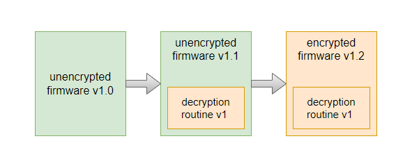

对于此种情况，可寻找固件过渡版本v1.1，从中分析出所包含的解密逻辑和算法，从而实现对后续加密固件的解密。因为用户无法从v1.0直接升级v1.2的固件，所以在官方的固件发布描述中，一般会存在如下图所述的描述。

2. **固件出厂加密后续发布包含新版解密方案的未加密固件**

设备固件在原始版本中已加密。供应商决定更改加密方案并发布未加密的过渡版本 v1.2，其中包含新的解密程序。与方案 1 类似，可以从 v1.2 映像中获取解密例程，并将其应用于最新的加密固件。阅读固件版本的发行说明可能有助于识别未加密的过渡版本。发行说明通常会指导用户在升级到最新版本之前升级到中间版本，中间版本很可能是未加密的过渡固件


以过渡版本v1.2作为分界线，分别对其前后版本固件的解密进行说明。对于v2及更高版本的固件即过渡版本之后的固件（假设都使用同一种加密方案，无其它过渡版本）：可以通过寻找过渡版本v1.2，从中分析出v2的解密方法从而对v2固件进行解密。

3. **固件出厂加密后续发布包含新版解密方案的加密固件**

设备固件在原始版本中已加密。但是供应商决定更改加密方案，并发布包含新解密例程的未加密过渡版本，在这种情况下，没有简单的方法来获得解密程序。一种方法是购买设备并直接从硬件中提取未加密的固件。


### 7.2 解密的方法

针对物联网终端设备的固件解密，总结如下五种方法和技巧：

1. **基于老版本未加密固件中的解密程序实现新版本加密固件的解密**

对于固件出厂时未加密，后续发布的固件是加密的情况，可以通过对比边界版本，解包最后一个未加密版本逆向升级程序还原加密过程，以实现对加密固件的解密。

2. **基于调试串口直接提取未加密固件**

如果设备存在UART、JTAG等调试接口，可通过连接硬件接口获取设备的Shell，从而dump出设备的固件。

但由于某些设备安全限制较高导致无法进入Linux Shell，我们可尝试进入BootLoader Shell（最常见的是Uboot Shell）对固件进行提取。这里要说明的一点是部分设备更新固件后会将解密后的新版固件写回Flash，这种情况下dump出的固件是未加密的，而相反的是部分设备Flash中的固件一直是加密状态存在，只是在每次设备启动时进行动态解密。所以此种方法提取出的固件可能也是加密的，但好处在于可以避免因拆解设备Flash去读固件导致设备损坏的风险，并且可以获取到较为完整的固件（官方下载的固件可能只是某块数据的更新包）。

3. **基于管理服务获取设备Shell提取文件系统**

对于有Telnet、SSH等服务的设备，可以通过这些服务进入设备的Linux Shell进行固件提取。服务一般在设备的web管理页面中可手动开启，但需要说明的一点是某些厂商会开发自家的CLI屏蔽掉底层Linux Shell，连接这些服务进入的Shell只是厂商的CLI，也无法提取文件系统，不过某些设备（光猫居多）的CLI存在可进入Linux Shell的命令，具体可自行在互联网上搜索相应的方法。

4. **基于低版本固件RCE漏洞获取设备Shell分析解密逻辑实现对新版固件的解密**

如果设备历史加密版本固件出现过RCE漏洞，可将存在漏洞的固件刷入设备，通过RCE漏洞获取设备Linux Shell，再分析其包含的解密逻辑，最终通过该解密逻辑实现对更新版本固件的解密。需要注意的是存在RCE漏洞版本的固件所使用的加密方案需要与新版本固件一致。

5. **直接分析完整固件中包含的解密逻辑实现对固件的解密**

常见情况下固件的解密逻辑肯定是存在Flash中的，当获取到完整版固件（拆机从Flash读取或者从BootLoader Shell中提取等）后，可以直接对整个固件进行逆向分析寻找解密逻辑代码实现对固件的解密，但此种方法难度较大，并且这类设备安全性一般较高，很有可能分析出了解密逻辑但拿不到解密密钥，如密钥单独存放在某个安全芯片中。

### 7.3 固件解密步骤

1. 通过设备固件中间过渡版本或者通过物理设备的UART接口进入到系统中获取解密程序和算法（可以观察固件名称，带有Middle_FW_Unencrypt这种字符的基本都是中间版本，包含解密程序）
2. 利用QEMU执行跨架构的chroot，获取有效SHELL。
3. 使用获得的解密程序对加密固件进行解密
4. 测试解密程序是否对新版本加密固件有效，若对新版本固件无效解密，很可能还包含其他中间过渡版本。

### 7.4 固件解密演示

#### 解密DIR-878

以D-LINK设备 DIR-878 为例，通过中间版本能直接拿到固件的解密程序或者算法，通过解密程序再去解密新的固件。DIR-878 的固件中间过渡版本没有加密但是包含解密程序，可以通过 binwalk 直接获取固件的文件系统。

DIR-878固件下载地址：https://tsd.dlink.com.tw/ddetail

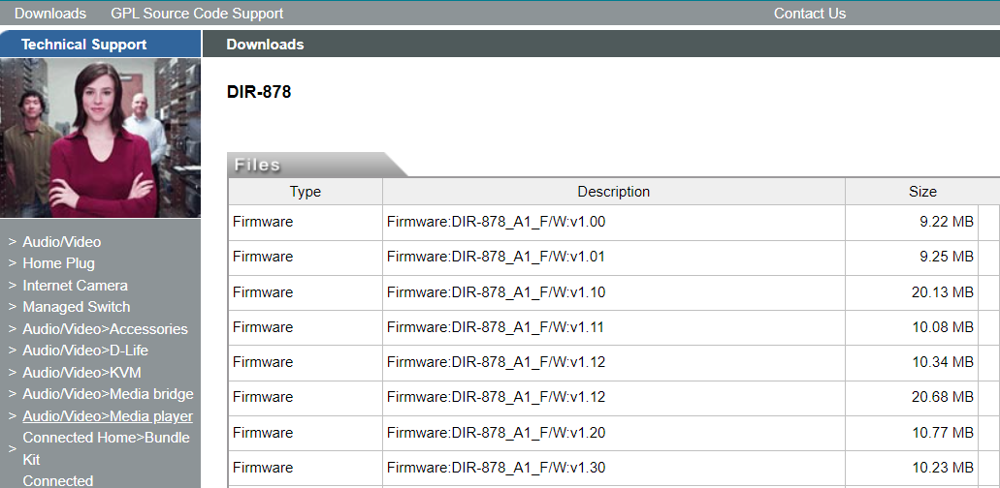

将固件都下载到本地中，使用binwalk检查最早的固件版本，它将正确检测到uImage标头和LZMA压缩数据，能检测到就直接使用 -Me参数进行递归提取。


最终在 1.10B05 固件压缩包中获取到中间版本的固件：DIR878A1_FW104B05_Middle_FW_Unencrypt.bin（所谓中间版本就是该版本使用binwalk可以检测到数据，后面版本都不能检测到数据，就可以猜测该版本为中间版本） 提取中间版本(DIR878A1_FW104B05_Middle_FW_Unencrypt.bin)的文件系统

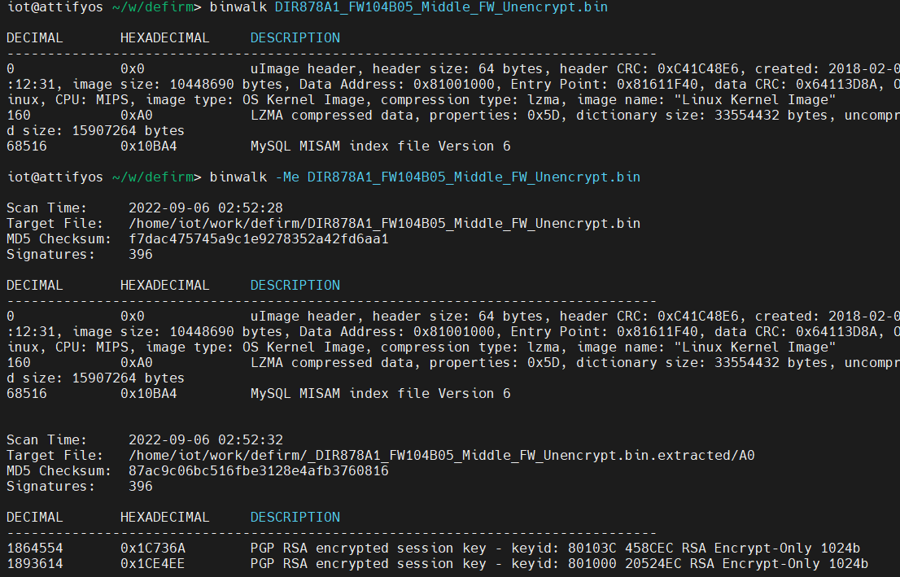

找到了中间版本，按照固件升级的思路，肯定有一个升级程序，在这个程序内部可能存在着加密算法，我们首要目的就是去寻找这个解密程序。最终在程序目录 /bin文件夹下面，发现了一个名为 imgdecrypt 的二进制文件。

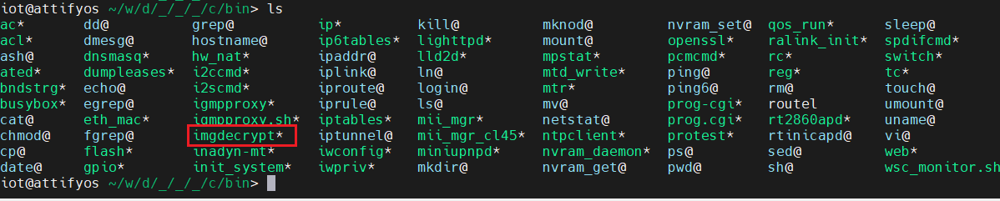

因为主机(x86)和二进制文件(MIPS)之间的处理器体系结构上存在差异。


可以使用QEMU执行跨架构的chroot。为此，首先我们将qemu-mipsel-static二进制文件复制到固件根文件系统的/usr/bin/目录中，我们还将加密的固件复制到未加密的固件文件系统。最后，我们将chroot插入固件根目录并获得一个有效的shell，然后运行执行解密的二进制程序，按照提示输入需要解密的固件，输出key代表固件已经成功的被解密。(未将QEMU放在正确位置，启动任何程序都会报错No such file or directory。这个报错会有很多歧义，因此一定要自己确认一下QEMU确实在rootfs的“/usr/bin”目录中)

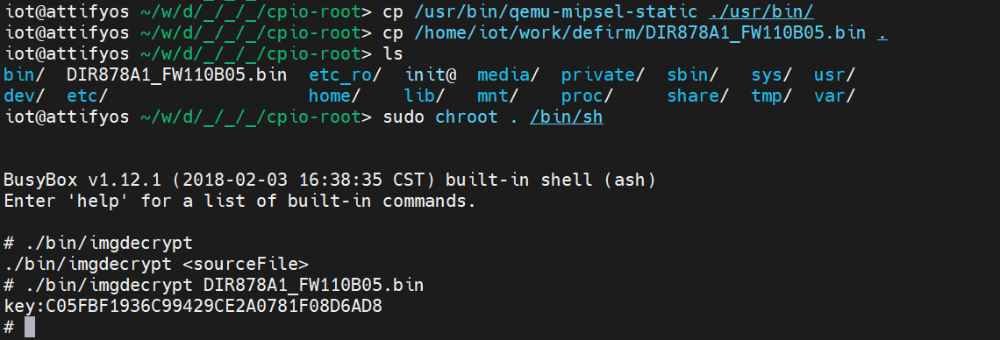

使用binwalk再次对解密后的固件(1.10B05)进行检测，已经成功的获取到了固件的uImage标头和LZMA压缩数据。（执行binwalk前注意要给固件读写权限）这样就成功的解密了固件，并提取到了固件文件系统


当然这种方式还是比较麻烦，在GitHub中已经有大佬完善了整个解密过程，通过逆向分析解密程序imgdecrypt，还原解密算法并找到硬编码的密钥信息。该解密脚本目前能够支持的固件版本：包括但不仅限于DIR-825、DIR-867、DIR-878、DIR-882、DIR-1260、DIR-1960、DIR-2660、DIR-3060。

解密脚本链接：https://github.com/0xricksanchez/dlink-decrypt

逆向分析文章：

- 第一篇：https://0x00sec.org/t/breaking-the-d-link-dir3060-firmware-encryption-recon-part-1/21943
- 第二篇：https://0x00sec.org/t/breaking-the-d-link-dir3060-firmware-encryption-static-analysis-of-the-decryption-routine-part-2-1/22099
- 第三篇：https://0x00sec.org/t/breaking-the-d-link-dir3060-firmware-encryption-static-analysis-of-the-decryption-routine-part-2-1/22099


#### 解密Linksys-EA6100

需要解密固件的版本是：FW_EA6100_1.1.6.181939_prod.gpg.img (Build 181939)，固件下载地址：https://www.linksys.com/hk/en/linksys-support/（搜索对应的型号）

首先使用binwalk对下载好的固件1.1.6进行检测，并且尝试提取固件，但是并未得到任何有价值的信息。

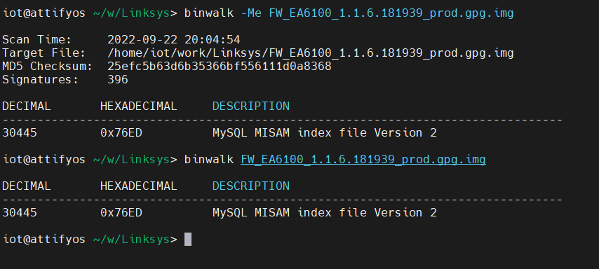

使用binwalk -E 查看固件的熵值，EA6100固件的信息熵接近1，可以说明固件是经过加密的。

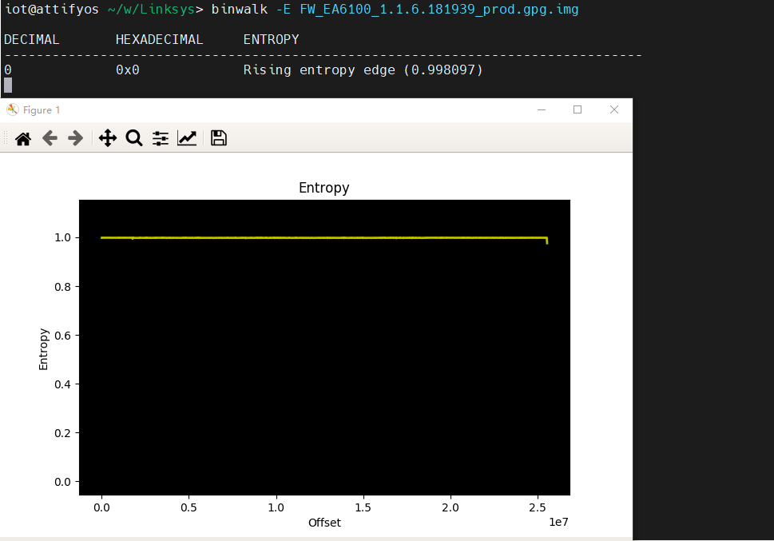

在下载固件的时候，可以看到一个提示信息，需要先下载中间过渡版本。

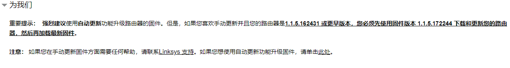

根据提示下载好过渡版本的固件 FW_EA6100_1.1.5.172244_prod.img （Build 172244），并尝试提取固件。


可以看见成功的提取到了文件系统，由于固件更新的目标是加密的，所以猜测固件中存在解密的程序，尝试在解密的文件中寻找相关的解密程序。

在下载固件时，可以发现1.1.6版本的加密固件的命名多了gpg后缀(*.prod.gpg.img)，GPG是不对称加密、数字签名的经典和标准，不但可以为个人的数字传输提供信用保障，用于保护个人之间通讯的隐私，保护敏感数据，而且可以在更大的范围内，如公司范围内的数据加密，电子产品的数字签名，知识产权保护等。可以知道新版本的固件很可能使用了gpg的方式来加密固件。

寻找解密文件，检索一些其他的密钥保存的格式之后，一般都是下面的这种方式

``````
——-BEGIN RSA PRIVATE KEY——- # 私钥内容
… (private key in base64 encoding) …
——-END RSA PRIVATE KEY——-
——-BEGIN CERTIFICATE——- # 证书信息
… (certificate in base64 PEM encoding) …
——-END CERTIFICATE——-
``````

使用grep命令检索文件，找到了类似 gpg 密钥的文件keydata 

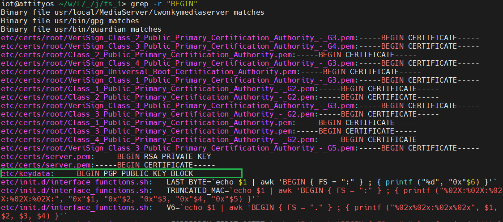

首先将keydata 加载到 主机系统中的 gpg 中，然后再进行对固件包解密

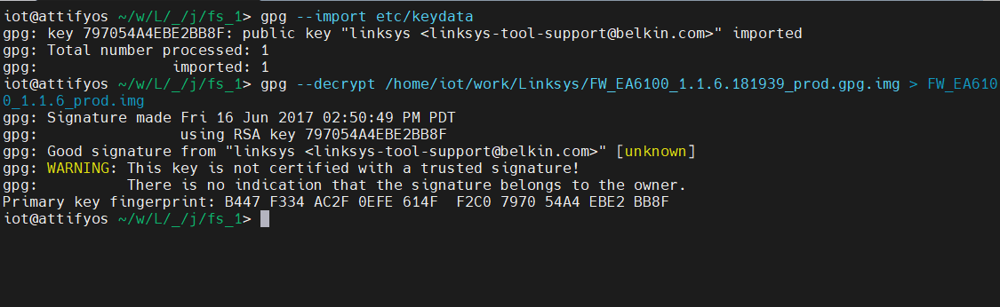

看起来没有出现什么问题，将解密之后的文件进行binwalk探测并尝试提取文件。最终成功的解密固件。

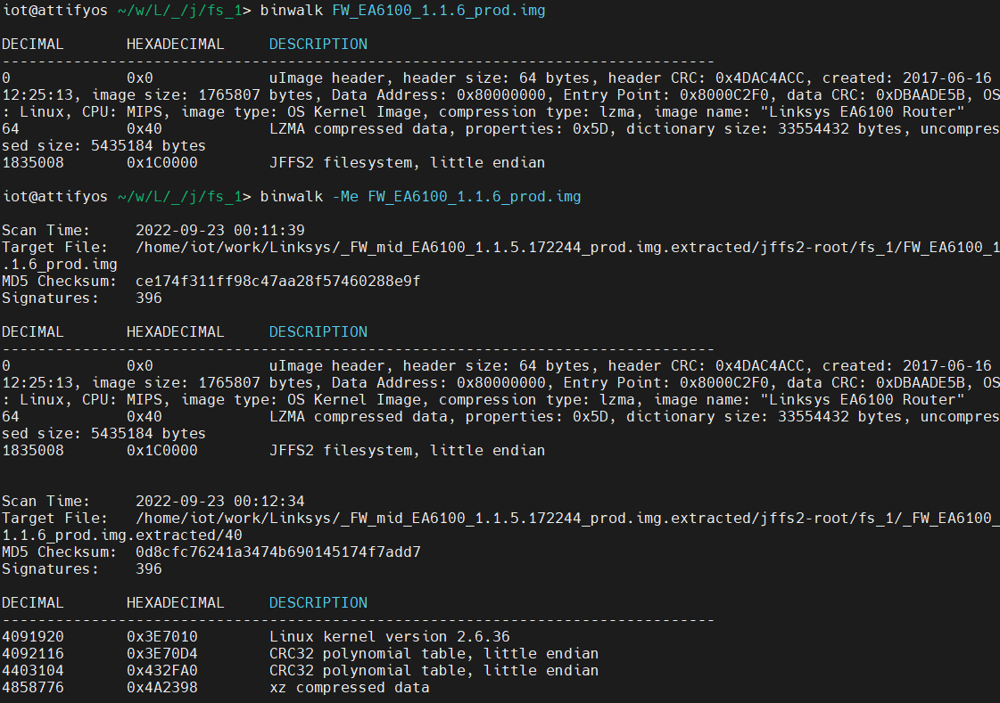


