# 物联网设备固件分析指南（持续更新中...）

本测试指南旨在帮助安全从事行业中者快速了解物联网固件安全，掌握分析物联网设备技能，并具备深入研究和分析物联网设备漏洞的能力。 

**前言**

感谢以下各位师傅的辛勤付出，大家在阅读文章和学习的过程中遇到不妥当分析和描述，亦或者需要帮助的地方可直接通过邮箱联系各位师傅，同样也欢迎各位师傅的加入。

:handshake: Arrebol [中科院软件所 南京软件技术研究院] :e-mail:caojun@nj.iscas.ac.cn 

:handshake:gxh191[二进制安全爱好者]:e-mail: guoxuehhh@gmail.com

:handshake:


## 环境配置

为了确保能够快速而顺利地进行固件安全测试，通常需要一个良好的分析环境，可以省去多数环境配置和软件安装依赖等问题。推荐以下两款常用于物联网领域的虚拟机attify和IOT-Research，虚拟机资源都是从互联网中收集，可根据自身需要选择是否使用。

### attify OS 虚拟机

[attify](https://github.com/adi0x90/attifyos) (虚拟机账户口令`iot`:`attify`)

下载地址：谷歌云盘 - <https://drive.google.com/drive/folders/1C5BKrpoCtxqZODbF0A-tt0UNjx-UmKt3>


**AttifyOS虚拟机安装步骤：**

1. 下载连接中提供的虚拟机文件，使用VMware workstation打开虚拟机(文件-->打开[Ctrl+O])，选中AttifyOS v3.0.ova文件。


2. 按照提示的步骤导入虚拟机 ，选择合适的路径存储新的虚拟机，等待虚拟机导入完成。


3. 导入成功就可以直接开启虚拟机，同时在虚拟机描述信息中也标明了账户和口令信息。


4. 开启虚拟机进入系统，默认用户iot，不需要登录口令。


### IOT-Research虚拟机

[IOT-Research](https://www.iotsec-zone.com/article/110)虚拟机账户口令：`iot`：`iot`

百度云盘的分享链接如下(提取码：`nqy3`)：
windows版虚拟机

> 链接： <https://pan.baidu.com/s/1ke6gvJ9sFlnpPE17O9nMuQ>

Mac M1版虚拟机

> 链接：<https://pan.baidu.com/s/10BIt97pd4XQUyraAINdicw>

下载好文件虚拟机后，同样的方式打开并登录虚拟机。

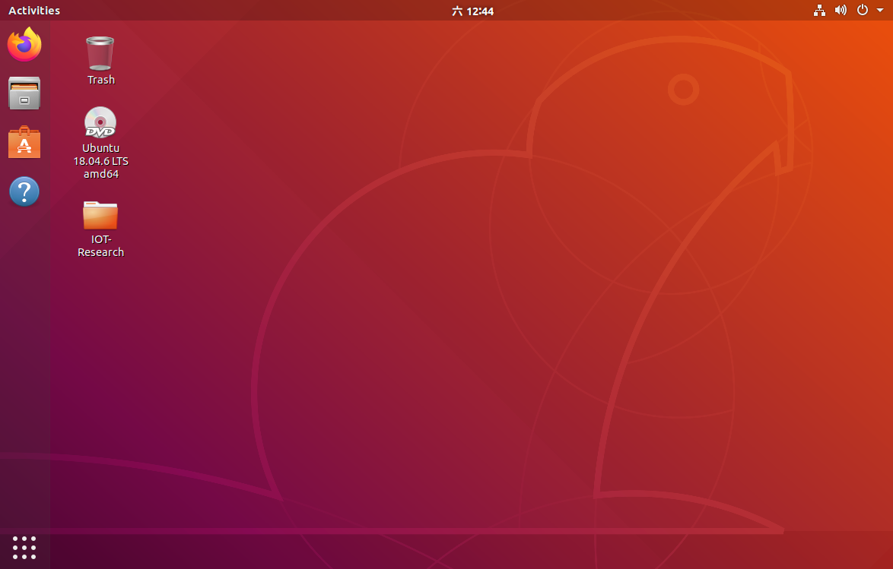

其中包含很多已经安装了很多常用的工具，例如binwalk、FirmAE 、flashrom等。

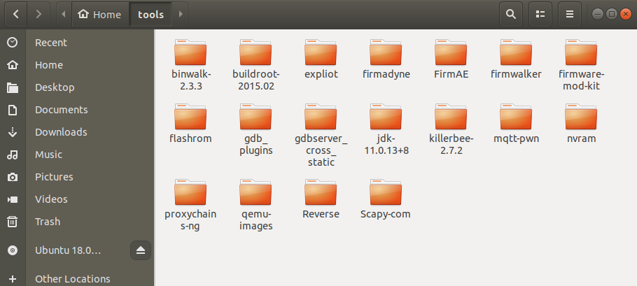


## 1. 获取固件

### 1.1 从供应商的support网站获取

对于固件获取，第一种最直接的方法就是通过官网的下载渠道，来获取相应的固件文件。首先找到官网的网址，根据官方提供的固件下载链接进行下载。例如获取DrayTek厂商的设备固件：https://www.draytek.com/support/resources/routers#version


也有部分厂商仅在官网提供最新版本的固件，当我们需要一些旧版本的固件时，不知道路径的话很难下载到。有部分厂商的多数固件都是放在某个FTP服务器目录下，知道地址即可获取到固件。例如DrayTek固件服务器：https://fw.draytek.com.tw/

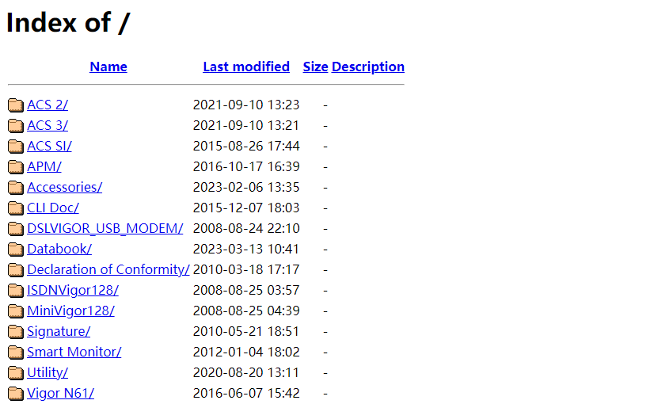

当然，部分厂商的固件在国内的官网中是难以下载到的，或着国内厂商提供的固件并不是大家需要的，此时可以访问该厂商针对不同国家提供的官网页面进行下载。例如海康威视在国外和国内的官网提供的固件下载的数量和固件的排序方式存在较大差矣。在获取固件时多去不同地区的官网进行查找，往往有意想不到的收获。

HIKVISION EUROPE B.V 提供的固件

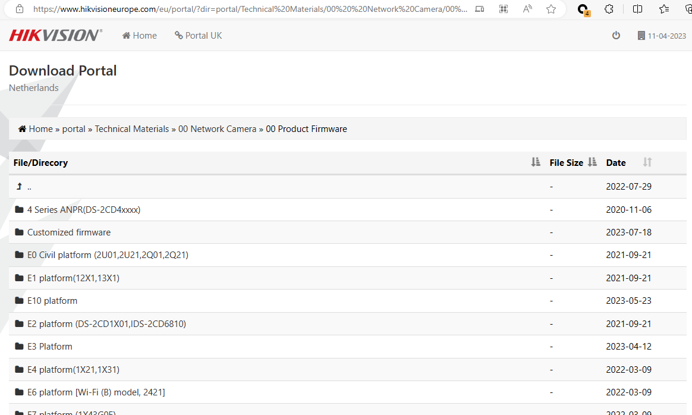

HIKVISION CHINA B.V 提供的固件


国内外常见路由器厂商的固件下载链接：

| 厂商           | 下载链接                                                     |
| -------------- | ------------------------------------------------------------ |
| D-LINK         | https://tsd.dlink.com.tw/ddwn                                |
|                | https://files.dlink.com.au/products/                         |
|                | http://www.dlink.com.cn/techsupport/                         |
| TOTOLINK       | https://www.totolink.net/home/index/menu_listtpl/listtpl/support/id/27.html |
| FAST           | https://service.fastcom.com.cn/download-list.html#0          |
| TP-LINK        | https://resource.tp-link.com.cn/?&productorlist=1&filterClass=[4] |
| MERCURY        | https://service.mercurycom.com.cn/download-list.html         |
| TENDA          | https://www.tenda.com.cn/download/cata-11.html               |
| Trendnet       | https://downloads.trendnet.com/                              |
| NETCORE(磊科)  | https://www.netcoretec.com/service-support/download          |
| NETIS          | https://www.netis-systems.com/Suppory/down.html              |
| UTT(艾泰)      | https://www.utt.com.cn/downloadcenter.php                    |
| RUIJIE(锐捷)   | https://www.ruijie.com.cn/fw/rj/                             |
|                | https://www.ruijienetworks.com/resources/products/1896-1897  |
| WAYOS(维盟)    | https://www.wayos.com/fuwuzhici/xiazaizhongxin/              |
| ADSLR(飞鱼星)  | https://www.adslr.com/companyfile/2/                         |
|                | https://www.feiyuxing.com.cn/Downloads/                      |
| B-LINK         | https://www.b-link.net.cn/downloads_16.html                  |
| ASUS(华硕)     | https://www.asus.com.cn/support/Download-Center/             |
| DrayTek        | https://www.draytek.com/support/resources/routers#version    |
|                | https://fw.draytek.com.tw/                                   |
| NETGEAR        | http://support.netgear.cn/download.asp                       |
|                | https://www.cisco.com/c/zh_cn/support/all-products.html      |
| LB-LINK        | https://www.lb-link.com/support/downloads/                   |
| MIKROTIK       | https://mikrotik.com/download                                |
|                | http://46.167.242.10/firmware/mikrotik/                      |
| IKUAI(爱快)    | https://www.ikuai8.com/component/download                    |
| FORTINET(飞塔) | https://support.fortinet.com/Download/FirmwareImages.aspx    |
|                | https://it-help.tips/en/fortigate-firmware-download/         |
| MI(小米)       | http://www.miwifi.com/miwifi_download.html                   |
| H3C            | https://www.h3c.com/cn/Service/Document_Software/Software_Download/ |
| LINKSYS        | https://www.linksys.com/jp/linksys-support/                  |
| COMFAST        | http://www.comfast.com.cn/index.php?m=content&c=index&a=lists&catid=31 |
| 360            | https://luyou.360.cn/home/support/download?from=nav          |
| WAVLINK        | https://www.wavlink.com/zh_cn/firmware.html                  |
| IP-COM         | https://www.ip-com.com.cn/download/list-5.html               |
| Advantech      | https://www.advantech.com/en/search/?q=router&st=support&from=support |
| Zyxel          | https://www.zyxel.com/global/en/support/download             |
| NetModule      | https://www.netmodule.com/en/support/downloads/device-software-manual |
| Nexxt          | https://support.nexxtsolutions.com/935819-English            |
| Teltonika      | https://wiki.teltonika-networks.com/view/RUT_Routers         |
| Belkin         | https://www.belkin.com/support-search/?search=router         |
| Engeniustech   | https://www.engeniustech.com/wp_firmware/                    |
| AmpedWireless  | https://ampedwireless.com/support.html                       |
| Actiontec      | https://opensource.actiontec.com/                            |
| Level1         | http://download.level1.com/level1/firmware/                  |
| Edimax         | https://www.edimax.com/edimax/download/download/data/edimax/global/download/ |
| peplink        | https://www.peplink.com/support-01/downloads/                |
| sierrawireless | https://source.sierrawireless.com/                           |
|                |                                                              |

### 1.2 设备更新进行中间人获取


 中间人攻击（Man-in-the-Middle Attack，简称MitM攻击）是一种网络安全攻击，其中攻击者插入自己在两个通信方之间，窃取或篡改他们之间的数据传输。这种攻击可以发生在各种通信渠道中，包括互联网连接、局域网、Wi-Fi网络等。

以大疆无人机Mavic 3设备固件升级为例：

在升级 Mavic 3 Classic 时，拦截通信并分析用于下载新固件包的 API 端点（绕过证书锁定）。调查显示，该无人机有多个组件，每个组件都有其独特的固件映像，由模块 ID 识别并单独下载。这个过程是通过向mydjiflight.dji.com主机上的端点/getfile/downpath发出经过身份验证的HTTP REST请求（每个固件模块一个）来完成的。


除了下载固件映像所需的信息（如模块ID、产品ID和版本）外，POST请求还包含一个签名，用于对请求本身进行身份验证。响应包含一个链接，其中包含下载固件映像时所需的相关身份验证密钥auth_key，如图6所示。只需使用提供的链接和身份验证密钥作为参数执行wget工具就足以下载固件。


对于 Mavic 3 Classic，可用列表中最有趣的升级包是关联 ID 0802 的模块，因为其尺寸较大，这表明它可能包含无人机的主操作系统。

### 1.3 通过设备调试接口中提取

标准的调试接口通常是用于连接到计算机或其他调试设备的接口，以便开发人员可以进行调试、编程和分析。这些接口可以用于访问和操纵硬件或软件，以帮助诊断问题、改进性能或进行逆向工程。以下是一些常见的标准调试接口：

| 调试接口 |                           描述信息                           |
| :------: | :----------------------------------------------------------: |
|   UART   | UART是一种串行通信接口，通常用于与嵌入式系统通信。它可以通过串口连接（通常是RS-232或RS-485）与设备通信，使开发人员能够查看和修改设备的输出和输入。 |
|   JTAG   | JTAG是一种用于测试、调试和编程集成电路的标准接口。它提供了一种途径，允许开发人员访问芯片内部的各种信号和寄存器，用于调试和编程目的。 |
|   SWD    | SWD是一种用于低功耗微控制器调试的串行接口，通常用于ARM Cortex-M微控制器。它提供了访问设备内部的调试信号、寄存器和存储器。 |
|   SPI    | SPI是一种串行通信接口，通常用于连接微控制器、传感器和外围设备。虽然它通常用于通信，但它也可以用于调试目的，通过读取和写入寄存器来监视设备状态。 |
|   I2C    | I2C是一种串行通信协议，通常用于连接微控制器、传感器和其他集成电路。类似于SPI，I2C也可以用于调试目的。 |
|   ICE    | ICE是一种用于嵌入式系统调试的硬件设备，通常使用专用接口与目标设备连接，允许开发人员在目标设备中单步执行代码和监视状态。 |

这里以seebug中分析Tenda Ax12 设备的文章作为参考。通过串口调试(UART)的方式从设备在获取固件。

要的工具有FT232，杜邦线，万用表，SecureCRT软件。

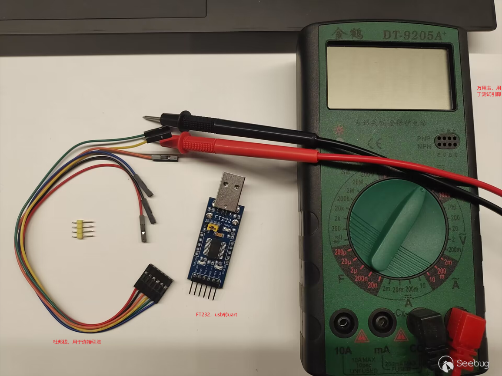

FT232 USB转UART串口模块。

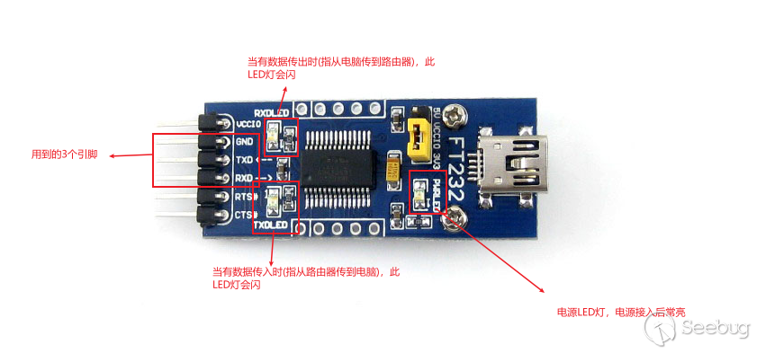

UART引脚作用

- VCC：供电pin，一般是3.3v-5v，正极
- GND：接地，负极
- RXD：接收数据引脚
- TXD：发送数据引脚

现在我们就知道了电路板上GND就是GND，IN就是RXD，OUT就是TXD，3V3就是VCC。但是连接杜邦线的时候需要这样连接，一般来说连GND，RXD，TXD就可以了。

- FT232上的TXD连接到电路板的RXD(IN)
- FT232上的RXD连接到电路板的TXD(OUT)
- FT232上的GND连接到电路板的GND

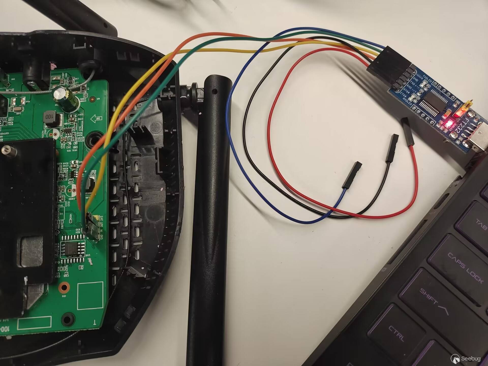

然后打开SecureCRT，设置好波特率115200（常用）


然后重启路由器，就可以看到在打印启动日志了。

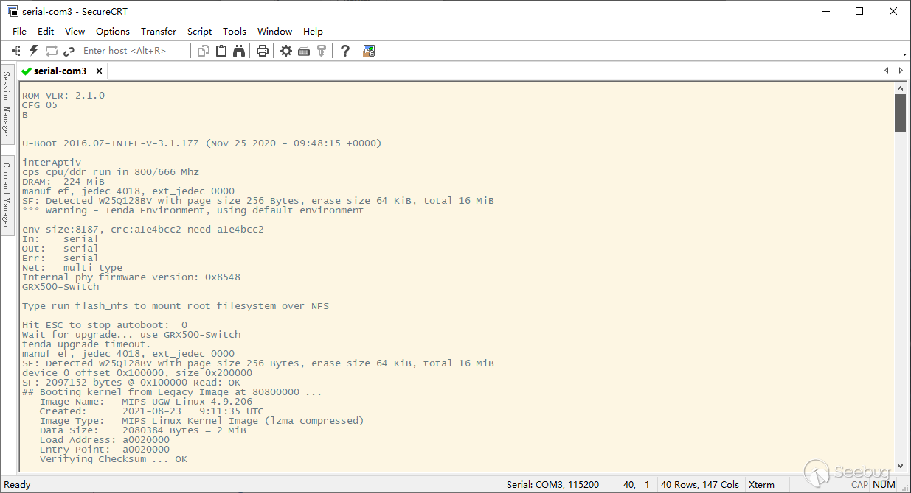

然后等待一段时间，就会出现登录了


### 1.4 从Flash闪存芯片进行提取

>  **不拆芯片读取固件**

使用夹子、钩子等连接导线，适合引脚较少的芯片。通过夹具夹住芯片引脚，然后连接编程器读取芯片内容，通过编程器连接芯片需要注意引脚的顺序，在 IC 芯片上都会有一个小点，大多数情况下，小点对应的引脚即为芯片的第一脚，而连接编程器的导线也需要插入编程器上相应的引脚。

这里以Winbond 25Q32JVSIQ芯片为例，可以看见图中芯片的右下角有一个小圆点，使用夹子的时候需要将引脚位置相互对应，通常夹子上的导线会有颜色标识，图中的红色导线就是第一脚连接的地方。同时需要正确的使用夹子夹住芯片，保证每个夹脚都正常的和芯片接触。

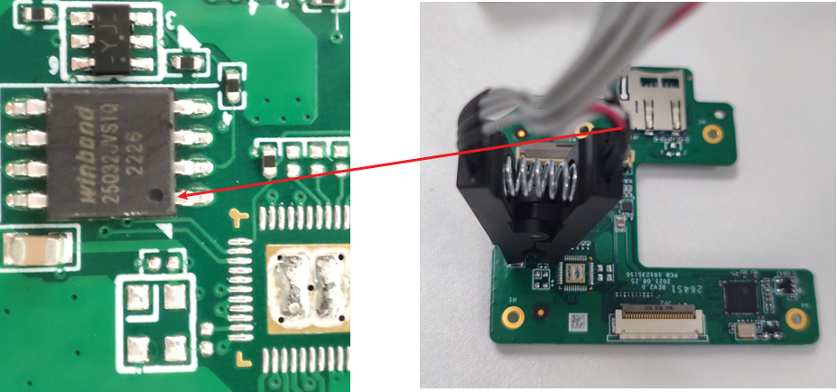

然后可以将夹子的另一端和对应的编程器连接，这里使用的是爱修的RT809F系列编程器，在网上能够轻松的购买到。然后在iFix爱修网下载并安装对应的编程器软件，详细安装过程请参考http://doc.ifix.net.cn/@rt809/CHN.html。


然后将编程器和电脑正确连接，然后打开编程器软件，对与常见的芯片只需要点击编程器软件中的智能识别，然后根据芯片上的信息进行校对。正确地在编程器软件中设置好芯片信息后，点击读取按钮固件就能够正常的从芯片中存储到本地中。

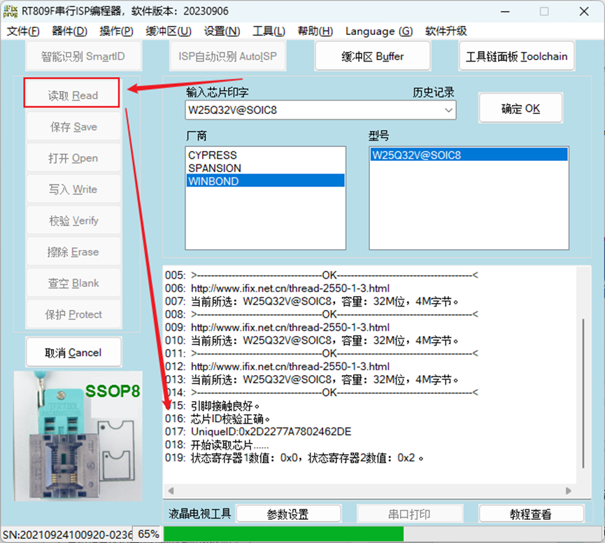

>  拆解芯片读取固件

拆解芯片所使用的硬件工具：热风焊台，恒温内热烙铁（尖头，刀头），吸锡带，吸锡器，助焊剂，松香，镊子，锡丝，隔热胶带等，在拆解芯片时记得提前在芯片引脚涂上助焊剂。

将热风枪的温度设置在350摄氏度左右，距离芯片1-2厘米，持续加热直到芯片引脚锡点融化，使用镊子轻轻触碰，能够感觉到明显的松动，就可以取下芯片。

将烙铁加热到400摄氏度左右，融化一截锡丝至芯片的引脚处，记得提前涂上助焊剂，然后将融化的锡球来回在芯片引脚拖动，来回拖动几次就能够轻松使用镊子取下芯片。

以下是以winbond  W29N0DN60012芯片为例，该芯片拥有48引脚，相比于常见的flash芯片(8pin或16pin)在拆解难度上更大。


将拆好的芯片表面的焊油擦拭干净，仔细观察芯片的引脚有没有被锡点粘连在一起的现象，使用锡球拖动时温度控制不好，这种芯片的引脚很容易发生粘连，如果发现粘连，在引脚涂上助焊剂使用烙铁仔细清理即可。

将拆解好的芯片放入48脚的底座中，然后使用RT809H编程卡住底座。使用的编程器依然是Ifix爱修的RT809H，当然也有其他可选的编程器，例如T48。


然后将编程器和电脑正确连接，然后打开编程器软件。编程器软件下载链接[国内版 - iFix爱修网](http://doc.ifix.net.cn/@rt809/CHN.html)，点击编程器软件中的智能识别，然后根据芯片上的信息进行校对，点击读取即可。

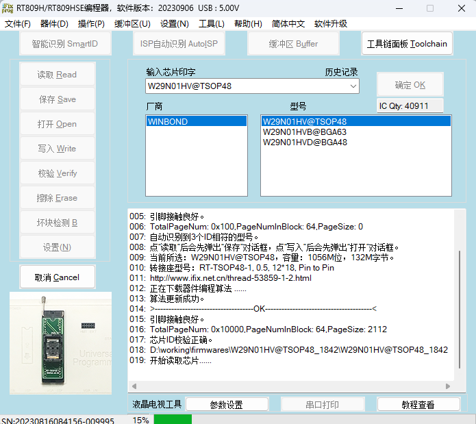

### 1.5 其他方式

网上购买

一些固件爱好者可以会收集各种厂商的固件，放到网上出售。一个固件一般几元到几十元不等。如：https://www.qyyd5g.top/ 联系到卖家，提出想要的固件型号，可以询问到价格，付款购买即可。


向客服索取

在很多设备的官网都会有客服咨询入口，当我们找不到想要的固件的时候，可以向客服索取，当然客服可能会向你要设备的SN码，为了验证你确实是有设备。当你向其索要的时候，注意你的表达方式，基本上都能够获取到固件。


## 2. 分析固件

### 2.1 提取文件系统

#### binwalk

杂项工具，用于扫描隐藏文件，分离文件

安装：

```python
git clone https://github.com/ReFirmLabs/binwalk.git
cd binwalk
sudo python3 setup.py install
```

使用：

```python
binwalk filename

❯ binwalk 1.mp4
DECIMAL       HEXADECIMAL     DESCRIPTION
--------------------------------------------------------------------------------
27657186      0x1A603E2       PGP RSA encrypted session key - keyid: 7DEBB57A 854F782F RSA (Encrypt or Sign) 1024b
27820636      0x1A8825C       MySQL ISAM index file Version 8
28976826      0x1BA26BA       HPACK archive data
40994603      0x271872B       PNG image, 941 x 320, 8-bit/color RGBA, non-interlaced
40994644      0x2718754       Zlib compressed data, default compression
# 两列数字是偏移，可以 dd 手动分离
dd if=1.mp4 of=1.jpg skip=40994603 bs=1
# 这里if是指定输入文件，of是指定输出文件，skip是指定从输入文件开头跳过140147个块后再开始复制，bs设置每次读写块的大小为1字节 
```

可以使用 binwalk 的 `-e` 参数来提取固件中的文件

```python
binwalk -e test.bin
```

如果你还指定了 `-M` 选项，binwalk 会递归扫描文件

```python
binwalk -Me test.bin
```

如果指定了 `-r` 选项，则将自动删除无法提取的任何文件签名或导致大小为 0 的文件

```python
binwalk -Mre firmware.bin
```

还可以使用 binwalk 进行固件比较，指定 `-W` 选项
或者 -hexdump 指令

```python
binwalk -W test1 test2 test3
```


#### firmware-mod-kit

基于binwalk的解打包工具，但是由于很久没用更新，使用场景有限。

安装方法：

首先安装依赖

```python
sudo apt-get install git build-essential zlib1g-dev liblzma-dev python-magic
```

安装工具

```python
git clone https://github.com/mirror/firmware-mod-kit.git  
  
cd firmware-mod-kit/src  
  
./configure && make
```

解包固件
将固件 firmware.bin 解包到 working_directory/ 下

```python
./extract_firmware.sh firmware.bin working_directory/
```

重新打包固件
将新生成的固件放到 output_directory 下

```python
./build_firmware.sh output_directory/ working_directory/
```

基于binwalk的解打包工具，但是由于很久没用更新，使用场景有限。


### 2.2 分析文件系统

#### 2.2.1 手动分析

静态分析文件系统

在固件分析中，常常遇到各种文件系统，如 Squashfs、Cramfs、YAFFS2、UBIFS、EXT4

常见的 squashfs-root 文件系统通常可以将整个文件系统或者某个单一的目录压缩在一起, 存放在某个设备, 某个分区或者普通的文件中

以思科路由器的这个文件系统为例

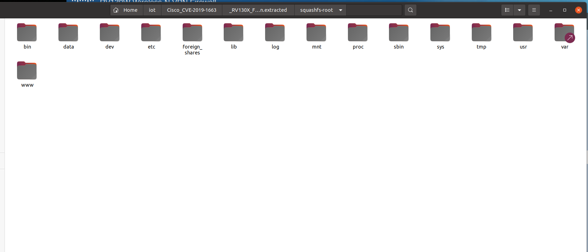

常用目录的说明：

| 目录  |                           目录描述                           |
| :---: | :----------------------------------------------------------: |
| /bin  | 这个目录包含了系统启动和基本维护所需的核心命令和可执行文件。这些文件在系统引导过程中就需要使用，因此 /bin 目录通常需要与根文件系统位于同一分区，以确保在挂载其他文件系统之前就可以访问这些命令 |
| /dev  | /dev 目录包含了与设备和设备接口相关的文件。在Linux中，一切都是文件，包括硬件设备。设备文件通常用于与硬件交互，例如磁盘驱动器、键盘、鼠标等。这些设备文件是Linux系统中特有的文件类型，用于实现对硬件的访问和控制 |
| /etc  | 包含了系统主要的配置文件，包括网络配置、用户帐户配置、服务配置以及其他系统参数。这些配置文件在系统运行时会被读取，因此只有具有 root 权限的用户才能够修改它们 |
| /lib  | /lib 目录包含了共享库文件和驱动程序，这些文件用于支持系统启动和运行根文件系统中的可执行程序。共享库是系统中多个程序所共享的动态链接库，它们提供了各种功能和服务，以减小可执行文件的大小并提高效率 |
| /var  | 通常包含可变的数据，例如日志文件、邮件排队目录、临时文件等。这些数据通常会在系统运行时不断变化，因此被放在 /var 目录下，而不是 /usr 或 /bin 目录下，这些目录通常包含不变的系统文件 |
| /proc | /proc 目录是一个虚拟文件系统，它提供了有关正在运行的进程和系统内核的信息。这些信息以文件和目录的形式呈现，可以通过 /proc 文件系统来访问。这是一个动态生成的文件系统，用于监控和管理系统进程 |

因为思科路由器的 web 服务框架为 nginx 框架，所以我们需要找到启动 nginx 的方法，配置文件一般位于 etc 下面，例如 http 服务启动啥的，但是思科用的是 nginx，所以我们找 nginx 即可

在www/cgi-bin/目录下存在3个cgi程序 `blockpage.cgi` `jsonrpc.cgi` `upload.cgi`

然后可以发现 etc 下有个 init.d，这下面就放的是 nginx 的启动文件

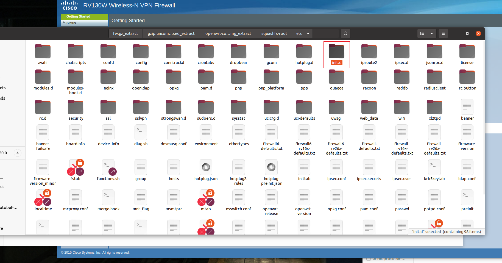

然后在/etc/nginx/conf.d/目录下有nginx对应的一些配置文件然后在/etc/nginx/conf.d/目录下有nginx对应的一些配置文件。
例如`jsonrpc`和`upload`

```python
location /jsonrpc {
    include uwsgi_params;
    proxy_buffering off;
    uwsgi_modifier1 9;
    uwsgi_pass jsonrpc;
    uwsgi_read_timeout 3600;
    uwsgi_send_timeout 3600;
}
location /form-file-upload {
    include uwsgi_params;
    proxy_buffering off;
    uwsgi_modifier1 9;
    uwsgi_pass 127.0.0.1:9003;
    uwsgi_read_timeout 3600;
    uwsgi_send_timeout 3600;
}

location /upload {
    upload_pass /form-file-upload;
    upload_store /tmp/upload;
    upload_store_access user:rw group:rw all:rw;
    upload_set_form_field $upload_field_name.name "$upload_file_name";
    upload_set_form_field $upload_field_name.content_type "$upload_content_type";
    upload_set_form_field $upload_field_name.path "$upload_tmp_path";
    upload_aggregate_form_field "$upload_field_name.md5" "$upload_file_md5";
    upload_aggregate_form_field "$upload_field_name.size" "$upload_file_size";
    upload_pass_form_field "^.*$";
    upload_cleanup 400 404 499 500-505;
    upload_resumable on;
}
```

对应 upload 和 jsonrpc 配置了对应路由，uwsgi 是用于与其他服务器进行通信的本机二进制通信协议，可以在/etc/uwsgi中找到对应的配置，设置了请求处理的对应端口以及对应程序。

```python
[uwsgi]
plugins = cgi
workers = 1
master = 1
uid = www-data
gid = www-data
socket=127.0.0.1:9003
buffer-size=4096
cgi = /www/cgi-bin/upload.cgi
cgi-allowed-ext = .cgi
cgi-allowed-ext = .pl
cgi-timeout = 300
ignore-sigpipe = true

[uwsgi]
plugins = cgi
workers = 4
master = 1
uid = www-data
gid = www-data
socket=127.0.0.1:9000
buffer-size=4096
cgi = /jsonrpc=/www/cgi-bin/jsonrpc.cgi
cgi-allowed-ext = .cgi
cgi-allowed-ext = .pl
cgi-timeout = 3600
ignore-sigpipe = true
```


#### 2.2.2 工具分析

借助一些自动化的工具对固件的文件系统进行分析

[firmwalker](https://github.com/craigz28/firmwalker)

这是一个简单的 bash 脚本，用于搜索提取或安装的固件文件系统
是动态分析的一种工具，它将在提取或安装的固件文件系统中搜索感兴趣的内容，例如：

- etc/shadow 和 etc/passwd
- 列出 etc/ssl 目录
- 搜索 SSL 相关文件，例如 .pem、.crt 等。
- 搜索配置文件
- 寻找脚本文件
- 搜索其他 .bin 文件
- 查找关键字，例如管理员、密码、远程等。
- 搜索 IoT 设备上使用的常见 Web 服务器
- 搜索常见的二进制文件，例如 ssh、tftp、dropbear 等。
- 搜索 URL、电子邮件地址和 IP 地址
- 使用 Shodan CLI 调用 Shodan API 的实验性支持

使用方法如下，最后会自动生成一个 firmwalker.txt

```python
./firmwalker.sh 固件路径
./firmwalker {path to root file system} {path for firmwalker.txt}
```

例如：使用firmwalker分析思科路由器的固件

```python
./firmwalker.sh /home/gxh/unblob/RV34X-v1.0.03.18-2020-06-11-11-55-25-AM.img_extract/64-72350826.gzip_extract/gzip.uncompressed_extract/fw.gz_extract/gzip.uncompressed_extract/openwrt-comcerto2000-hgw-rootfs-ubi_nand.img_extract/squashfs-root
```

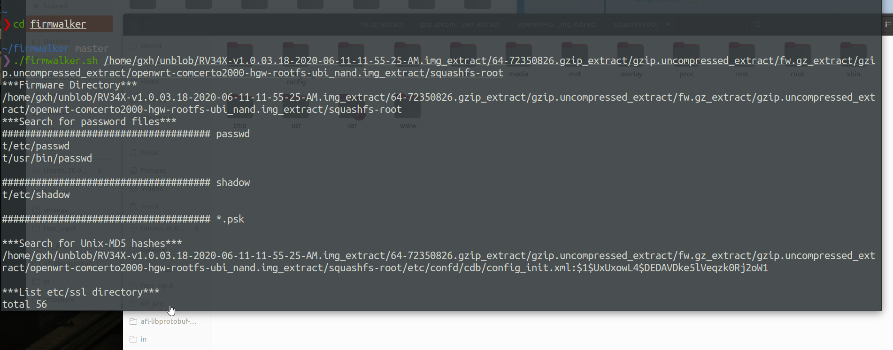

可以看到  firmwalker.txt 中生成了分析的结果

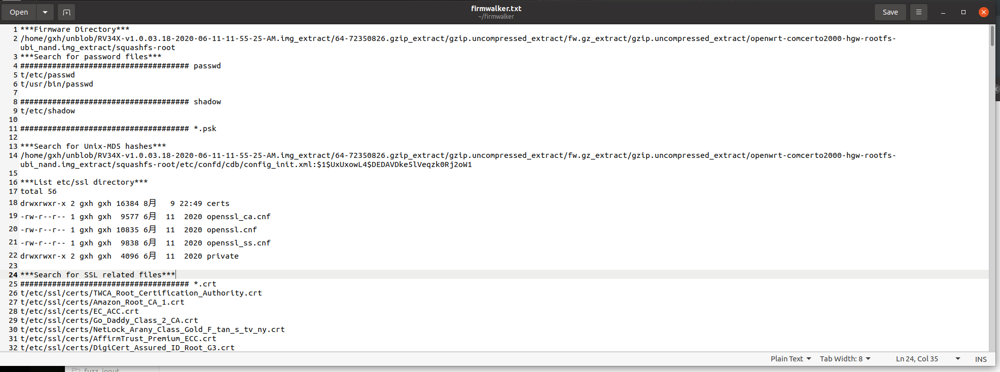

可以看到此工具会检索etc/shadow和 etc/passwd


检索Unix-MD5 hashes


然后就是枚举etc/ssl目录下内容

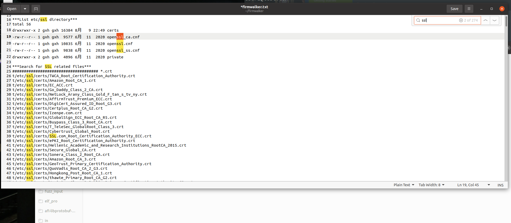

还会搜索 SSL相关文件，例如.pem、.crt 等。


根据 data 目录中 sslfiles 文件记录的`*.crt`、`*.pem`、`*.cer`、`*.p7b`、`*.p12`、`*.key`进行关键字检索


搜索 SSH相关文件
搜索配置文件：例如data目录中files文件记录的*.conf、*.cfg、*.ini

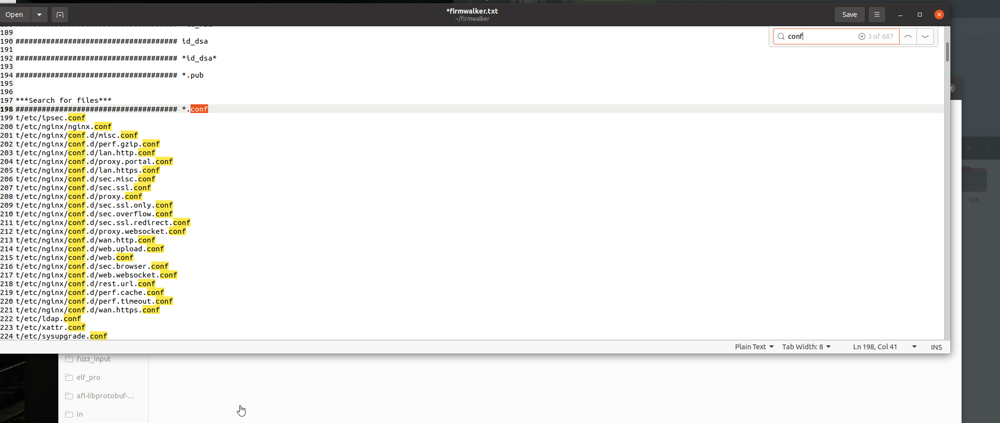

搜索常见的二进制应用，例如 ssh、tftp、dropbear等

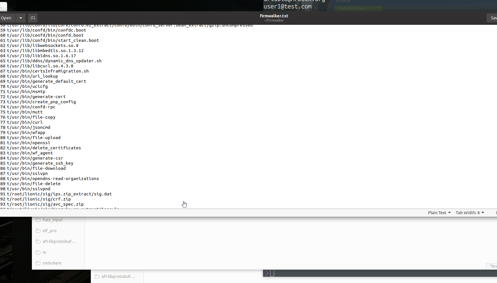


[fwanalyzer](https://github.com/cruise-automation/fwanalyzer)

FwAnalyzer旨在提供一种快速分析文件系统镜像的工具。FwAnalyzer有一个专门的配置文件，该文件定义了文件和目录的各种规则，并针对给定的文件系统镜像运行已配置的检查。FwAnalyzer的输出是一个报告，其中包含违反配置中指定的任何规则的文件列表。该报告还包含有关文件系统镜像的元信息，以及从分析的文件系统中提取的信息（如果已配置）。报告使用JSON格式，因此可以轻松的将其集成到大型的分析步骤当中

fwanalyzer 的命令行选项
cfg：string，配置文件的路径
cfgpath：string，配置文件的路径和包含的文件（可以重复）
in：string，文件系统镜像文件或目录路径
out：string，使用'-'将报告输出到文件或标准输出
tree：string，覆盖目录以从中读取filetree文件
ee：如果存在违规，则error退出
invertMatch：反转（invert ）正则表达式匹配（用于测试）

官方给的实例

```python
fwanalyzer -cfg system_fwa.toml -in system.img -out system_check_output.json
```

运行测试样例

```python
cd go/src/github.com/cruise-automation/fwanalyzer
make testsetup
make test
```

执行

```python
PATH="/go/src/github.com/cruise-automation/fwanalyzer/scripts:/go/src/github.com/cruise-automation/fwanalyzer/test:/go/bin:/usr/local/go/bin:/usr/local/sbin:/usr/local/bin:/usr/sbin:/usr/bin:/sbin:/bin" go test -count=3 -cover ./...
```

go test -count=3 -cover ./... 命令会运行当前目录及其所有子目录中的所有测试案例，每个测试案例将运行 3 次，并且将生成代码覆盖率报告，显示哪些代码已经被测试覆盖。

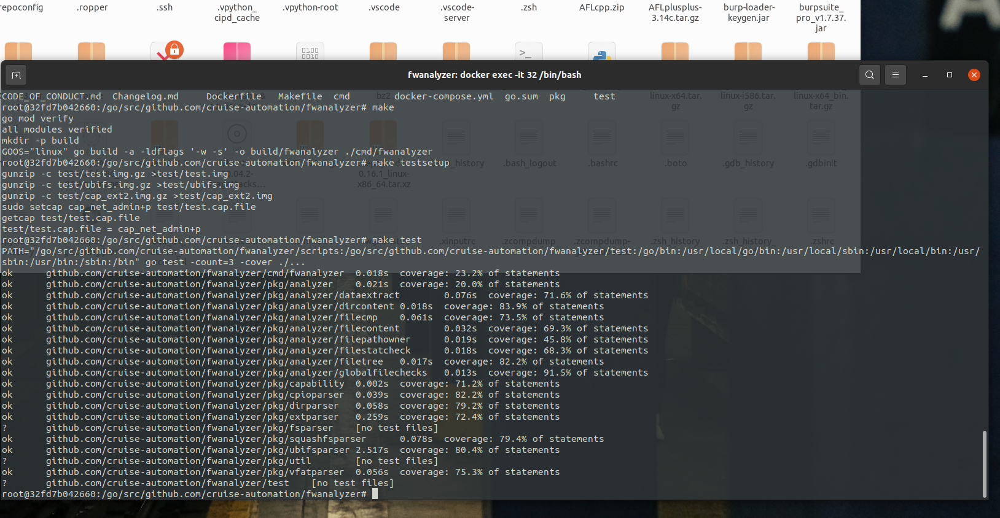

``````
ok  	github.com/cruise-automation/fwanalyzer/cmd/fwanalyzer	0.018s	coverage: 23.2% of statements
ok  	github.com/cruise-automation/fwanalyzer/pkg/analyzer	0.021s	coverage: 20.0% of statements
ok  	github.com/cruise-automation/fwanalyzer/pkg/analyzer/dataextract	0.076s	coverage: 71.6% of statements
ok  	github.com/cruise-automation/fwanalyzer/pkg/analyzer/dircontent	0.018s	coverage: 83.9% of statements
ok  	github.com/cruise-automation/fwanalyzer/pkg/analyzer/filecmp	0.061s	coverage: 73.5% of statements
ok  	github.com/cruise-automation/fwanalyzer/pkg/analyzer/filecontent	0.032s	coverage: 69.3% of statements
ok  	github.com/cruise-automation/fwanalyzer/pkg/analyzer/filepathowner	0.019s	coverage: 45.8% of statements
ok  	github.com/cruise-automation/fwanalyzer/pkg/analyzer/filestatcheck	0.018s	coverage: 68.3% of statements
ok  	github.com/cruise-automation/fwanalyzer/pkg/analyzer/filetree	0.017s	coverage: 82.2% of statements
ok  	github.com/cruise-automation/fwanalyzer/pkg/analyzer/globalfilechecks	0.013s	coverage: 91.5% of statements
....
``````

跑完测试样例会生成如下 json 文件：

``````json
root@32fd7b042660:/go/src/github.com/cruise-automation/fwanalyzer/test# cat oldtree.json 
{
    "files": [
        {
            "name": "/world", 
            "gid": 0, 
            "mode": 33206, 
            "se_linux_label": "-", 
            "uid": 0, 
            "link_target": "", 
            "digest": "e3b0c44298fc1c149afbf4c8996fb92427ae41e4649b934ca495991b7852b855", 
            "size": 0
        }, 
        {
            "name": "/bin/elf_arm64", 
            "gid": 1001, 
            "mode": 33277, 
            "se_linux_label": "-", 
            "uid": 1001, 
            "link_target": "", 
            "digest": "5e18d8042a38789761dc950cd3aa73b3562d69a4dce2a5ef8530301e71494168", 
            "size": 2110768
        }, 
        {
            "name": "/dir1", 
            "gid": 0, 
            "mode": 16877, 
            "se_linux_label": "-", 
            "uid": 0, 
            "link_target": "", 
            "digest": "0", 
            "size": 1024
        }, 
        {
            "name": "/dir1/dir11", 
            "gid": 0, 
            "mode": 16877, 
            "se_linux_label": "-", 
            "uid": 0, 
            "link_target": "", 
            "digest": "0", 
            "size": 1024
        }
      ....
      .......
    ], 
    "image_name": "test/test.img", 
    "image_digest": "9d5fd9acc98421b46976f283175cc438cf549bb0607a1bca6e881d3e7f323794"
}

``````

该报告还包含有关文件系统映像的元信息，以及从分析的文件系统内的文件中提取的信息（如果配置）。该报告使用 JSON 进行格式化，因此可以轻松地将其集成为更大分析中的一个步骤。


#### 2.2.3 动态分析

设备在正常运行或者在仿真环境中运行中的动态测试

FirmAE


Clone `FirmAE`

```shell
git clone --recursive https://github.com/pr0v3rbs/FirmAE
```

运行`download.sh`

```shell
./download.sh
```

运行 `install.sh`

```shell
./install.sh
```

firmae 的使用
首先执行初始化脚本

```python
./init.sh
```

检查仿真条件 -c 参数

```python
sudo ./run.sh -c <brand> <firmware>
```

firmware 填写固件名称
brand 是开发板名称，可以随便填，不影响正常使用

完成`run.sh -c`后，可debug固件，这样后面进行 debug 时，等待的时间会大大减少

-a 使用分析模式

```python
sudo ./run.sh -a <brand> <firmware>
```

运行模式，有利于进行网络测试

```shell
sudo ./run.sh -r <brand> <firmware>
```

user-mode 调试固件

```python
sudo ./run.sh -d <brand> <firmware>
```

system-mode 调试固件

```python
sudo ./run.sh -b <brand> <firmware>
```

使用 FirmAE 对思科路由器设备漏洞进行仿真

第一步，首先检查仿真条件
使用 -c 参数

```python
sudo ./run.sh -c cisco /home/gxh/iot/Cisco_CVE-2019-1663/RV130X_FW_1.0.3.44.bin
```


可以看到检查仿真条件成功了

完成`run.sh -c`后，可以 debug 固件，先进行 -c 后面就会快一些，不进行 -c 也可以

然后进行 -r，运行模式，有利于进行网络测试

```python
sudo ./run.sh -r cisco /home/gxh/iot/Cisco_CVE-2019-1663/RV130X_FW_1.0.3.44.bin
```

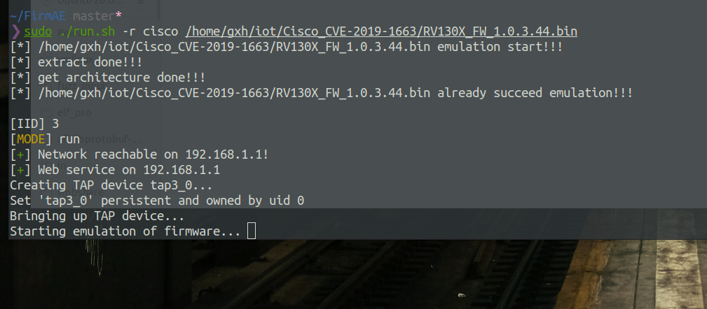

可以看到 -r 运行成功了，然后我们去访问一下看看，可以看到完全访问成功

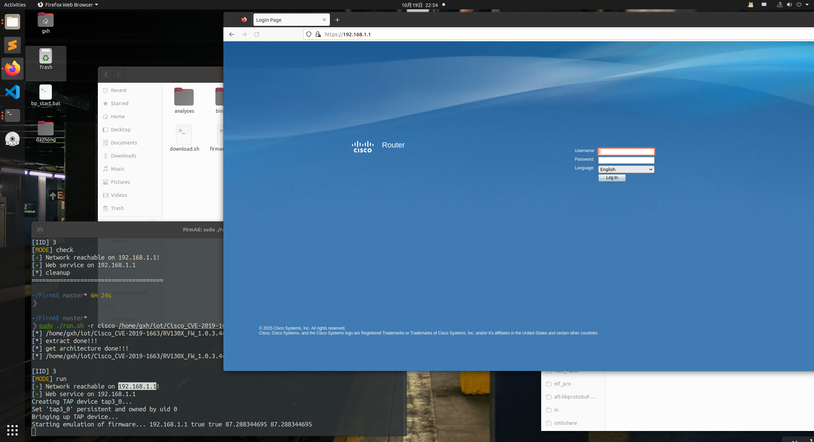

用户名和密码都是弱密码 cisco，我们尝试登录，然后修改密码之后，可以访问正常服务

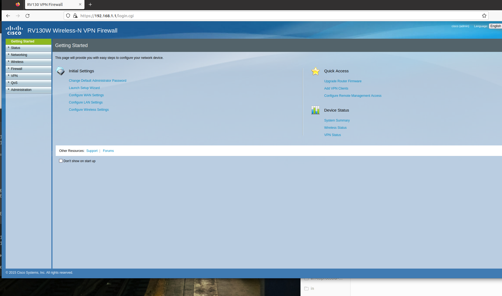


## 3. 固件仿真

qemu

QEMU（Quick Emulator）是一款开源的虚拟化工具和模拟器，用于在不同架构和操作系统之间进行硬件级别的虚拟化和模拟。它具有多种用途，包括虚拟机管理、嵌入式系统开发、操作系统开发和测试等

他支持多平台支持、硬件级模拟、嵌入式开发、虚拟机管理、快照和还原、高度可定制、性能优化

QEMU在虚拟化和模拟领域非常有用，它是一个强大的工具，可用于多种开发、测试和虚拟化场景。它还是一个开源项目，因此可以根据需要进行自定义和扩展


### 3.1 局部仿真

qemu-user

QEMU-User（简称QEMU-U）是QEMU项目的一部分，它提供了一种用户态的CPU模拟，允许在一个架构上运行的二进制程序在不同架构的系统上执行。具体来说，QEMU-User允许将一个CPU架构的二进制程序在另一个CPU架构的系统上运行，而不需要完全模拟整个虚拟机。

如果仅仅只有单个 elf 静态链接文件，那么可以采用局部仿真的方法进行启动
例如 arm 架构的可以直接使用如下命令，然后监听 1234 端口，等待 gdb连接
```python
qemu-arm -g 12345 ./elf_fie
```
这样就可以开启一个 12345 端口的 server，然后可以在另一个终端中使用 gdb 的 `target remote` 命令进行连接，然后调试

如果是动态链接的二进制文件，可以指定共享库的位置，可以使用qemu-user的`-L`选项指定当前目录，然后将动态库存放于当目录的 lib 子目录中
 ```python
 qemu-arm -L ./ -g 12345 ./elf_fie
 ```


ARM 32位:
```python
qemu-arm -L /path/to/lib -g 12345 /path/to/your/arm_binary
```

ARM 64位 (AArch64):
```python
qemu-aarch64 -L /path/to/lib -g 12345 /path/to/your/aarch64_binary
```

MIPS 32位:
```python
qemu-mips -L /path/to/lib -g 12345 /path/to/your/mips_binary
```

MIPS 64位:
```python
qemu-mips64 -L /path/to/lib -g 12345 /path/to/your/mips64_binary
```

在这个命令中：
- `qemu-arm` 是用于启动QEMU ARM用户模式的命令。
- `-L /path/to/lib 指定根文件系统的路径，这是需要的，因为用户模式QEMU通常需要一些系统库和资源。
- `-g 12345` 指定用于调试的端口号，你可以将这个端口连接到调试器。
- `/path/to/your/arm_binary` 是要执行的ARM架构的二进制文件的路径。

请将 `/path/to/rootfs` 和 `/path/to/your/arm_binary` 替换为实际的路径和文件名。

例子
接下来以 agentserverd 程序为例子
```python
~/Desktop/dazhong/usr/bin
file agentserverd
```

可以看到是 aarch64 的架构


所以我们选择这条命令
```python
qemu-aarch64 -L /path/to/lib -g 12345 /path/to/your/aarch64_binary
```

将 lib 路径和程序名换成我们自己的
```python
qemu-aarch64 -L ./ ./agentserverd
```

我将 lib 放在当前目录了，所以可以直接用 ./


可以看到成功运行了
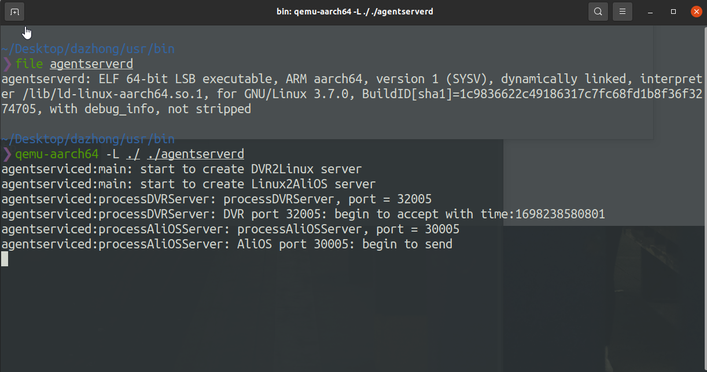

### 3.2 系统仿真

qemu-system

QEMU-System是QEMU项目的一部分，它提供了完整的虚拟化和仿真环境，允许用户模拟整个计算机系统，包括CPU、内存、外部设备等。QEMU-System是一种强大的工具，可用于多种用途，包括虚拟化、操作系统开发、嵌入式系统测试和仿真等。

QEMU-System是一个非常强大和灵活的工具，广泛用于虚拟化、操作系统开发、嵌入式系统测试和仿真等领域。它是一个开源项目，因此用户可以根据需要进行自定义和扩展。

如果有文件系统，就可以使用 qemu-system 来进行系统仿真
举个例子来说明各个参数
```python
qemu-system-arm \
	-M vexpress-a9 \
	-kernel vmlinuz-3.2.0-4-vexpress \
	-initrd initrd.img-3.2.0-4-vexpress \
	-drive if=sd,file=debian_wheezy_armhf_standard.qcow2 \
	-append "root=/dev/mmcblk0p2 console=ttyAMA0" \
	-net nic \
	-net tap,ifname=tap0,script=no,downscript=no \
	-nographic
```

-kernel 指定内核镜像文件 bzImage 路径
-initrd 设置内核启动的内存文件系统
bzImage: 压缩的linux内核
vmlinux: 未压缩的ELF格式的linux内核，可以使用extract-vmlinux解压bzImage得到
rootfs.img: 根目录的文件系统
dev_helper.ko: 编译好的驱动模块，也是要分析的目标
start.sh: qemu的启动脚本

如果使用 qemu-system 进行调试，就得需要根据架构下载三个文件，比如目标系统是 arm 的 32位 小端序
就需要去如下网站下载以下文件：
https://people.debian.org/~aurel32/qemu/

- vmlinuz-3.2.0-4-vexpress：zImage 格式压缩的 linux kernel
- initrd.img-3.2.0-4-vexpress：ramdisk 镜像
- debian_wheezy_armhf_standard.qcow2：文件系统镜像

然后进行网络配置
方便虚拟机和 qemu 进行通信

虚拟机里：
```python
sudo tunctl -t tap0 -u `whoami`  # 为了与 QEMU 虚拟机通信，添加一个虚拟网卡
sudo ifconfig tap0 10.10.10.1/24 # 为添加的虚拟网卡配置 IP 地址
```
qemu里：
```python
ifconfig eth0 10.10.10.2/24
ping -c 3 10.10.10.1 # 测下网
```

然后 qemu 启动命令
```python
sudo qemu-system-arm \
	-M vexpress-a9 \
	-kernel vmlinuz-3.2.0-4-vexpress \
	-initrd initrd.img-3.2.0-4-vexpress \
	-drive if=sd,file=debian_wheezy_armhf_standard.qcow2 \
	-append "root=/dev/mmcblk0p2 console=ttyAMA0" \
	-net nic \
	-net tap,ifname=tap0,script=no,downscript=no \
	-nographic
```

以下是各种架构的调试命令：
aarch64:

```python
sudo qemu-system-aarch64 \
	-m 1024 \
	-cpu cortex-a57 \
	-M virt \
	-nographic \
	-smp 4 \
	-kernel linux-4.14.221/arch/arm64/boot/Image \
	-append "noinintrd sched_debug root=/dev/vda rootfstype=ext4 rw crashkernel=256M loglevel=8" \
	-drive if=none,file=linux_rootfs.ext4,id=hd0 \
	-device virtio-blk-device,drive=hd0
```

armhf:
```python
sudo qemu-system-arm \
	-M vexpress-a9 \
	-kernel vmlinuz-3.2.0-4-vexpress \
	-initrd initrd.img-3.2.0-4-vexpress \
	-drive if=sd,file=debian_wheezy_armhf_standard.qcow2 \
	-append "root=/dev/mmcblk0p2 console=ttyAMA0" \
	-net nic \
	-net tap,ifname=tap0,script=no,downscript=no \
	-nographic
```

armel:
```python
sudo qemu-system-arm \
	-M versatilepb \
	-kernel vmlinuz-3.2.0-4-versatile \
	-initrd initrd.img-3.2.0-4-versatile \
	-hda debian_wheezy_armel_standard.qcow2 \
	-append root=/dev/sda1 \
	-net nic \
	-net tap,ifname=tap0,script=no,downscript=no \
	-nographic
```

mip_32:
```python
sudo qemu-system-mips \
	-M malta \
	-kernel vmlinux-3.2.0-4-4kc-malta \
	-hda debian_wheezy_mips_standard.qcow2 \
	-append "root=/dev/sda1 console=tty0" \
	-net nic -net tap,ifname=tap0,script=no,downscript=no \
	-nographic
```

mipsel_32:
```python
sudo qemu-system-mipsel \
	-M malta \
	-kernel vmlinux-3.2.0-4-4kc-malta \
	-hda debian_wheezy_mipsel_standard.qcow2 \
	-append "root=/dev/sda1 console=tty0" \
	-net nic -net tap,ifname=tap0,script=no,downscript=no \
	-nographic
```

mipsel_64:
```python
sudo qemu-system-mips64el \
    -M malta \
    -kernel vmlinux-3.2.0-4-5kc-malta \
    -hda debian_wheezy_mipsel_standard.qcow2 \
    -append "root=/dev/sda1 console=tty0" \
    -net nic \
    -net tap,ifname=tap0,script=no,downscript=no \
    -nographic
```


例子：
以思科的路由器为例

固件下载
https://software.cisco.com/download/home/283879340/type/282487380/release/1.2.0.9
https://software.cisco.com/download/home/285026142/type/282465789/release/1.0.3.44

使用 binwalk 进行提取
```python
binwalk -Me RV130X_FW_1.0.3.44.bin
```

得到如下文件系统
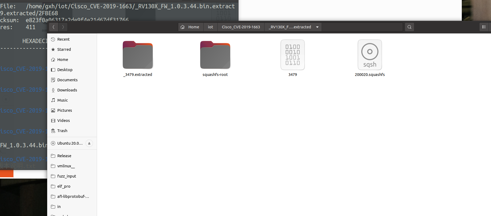

对漏洞程序 httpd 进行查看
可以发现是 arm 的小端序

```python
file httpd
httpd: ELF 32-bit LSB executable, ARM, EABI4 version 1 (SYSV), dynamically linked, interpreter /lib/ld-uClibc.so.0, stripped
```


qemu 启动命令
```python
sudo qemu-system-arm \
	-M vexpress-a9 \
	-kernel vmlinuz-3.2.0-4-vexpress \
	-initrd initrd.img-3.2.0-4-vexpress \
	-drive if=sd,file=debian_wheezy_armhf_standard.qcow2 \
	-append "root=/dev/mmcblk0p2 console=ttyAMA0" \
	-net nic \
	-net tap,ifname=tap0,script=no,downscript=no \
	-nographic
```

目录结构如下
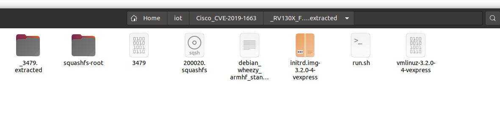


然后会有个报错
```python
qemu-system-arm: Invalid SD card size: 25 GiB
SD card size has to be a power of 2, e.g. 32 GiB.
You can resize disk images with 'qemu-img resize <imagefile> <new-size>'
(note that this will lose data if you make the image smaller than it currently is).

qemu-img resize debian_wheezy_armhf_standard.qcow2 32G
```
应该是镜像大小不是 2的n 次方

我们可以手动调整大小
```python
qemu-img resize debian_wheezy_armhf_standard.qcow2 32G
```


之后就可以正常运行 qemu


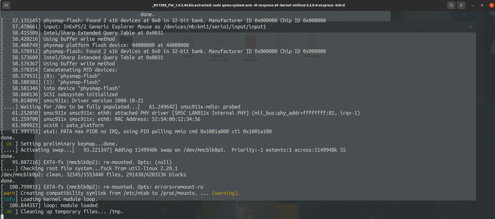

然后这时，为了能让虚拟机和 qemu 通信，我们需要配置一下网络
虚拟机里：
```python
sudo tunctl -t tap0 -u `whoami`  # 为了与 QEMU 虚拟机通信，添加一个虚拟网卡
sudo ifconfig tap0 10.10.10.1/24 # 为添加的虚拟网卡配置 IP 地址
```
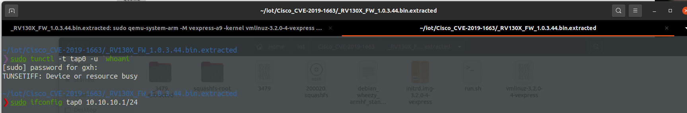

qemu里：
```python
ifconfig eth0 10.10.10.2/24
ping -c 3 10.10.10.1 # 测下网
```

传入文件系统
```python
sudo scp -r ./squashfs-root root@10.10.10.2:/root/
```

这里有个坑，如果直接传入 squashfs-root，var 下的软链接会出问题，导致后面 nginx 服务无法正常启动

然后将 squashfs-root 的压缩包传入 qemu 中
```python
tar zcvf 1.tar squashfs-root
sudo scp -r 1.tar root@10.10.10.2:/root/
```

挂载文件系统
```python
# 然后挂载文件系统
mount -o bind /dev ./squashfs-root/dev/
# mount -t sys /sys/ ./squashfs-root/sys/
mount -t proc /proc/ ./squashfs-root/proc/
chroot ./squashfs-root sh
```

之后就可以正常调试了


#### 自动化仿真工具

[firmware-analysis-toolkit](https://github.com/attify/firmware-analysis-toolkit)

Firmware Analysis Toolkit（简称FAT）是一种用于分析嵌入式设备固件的开源工具套件。它旨在帮助安全研究人员和逆向工程师分析和理解嵌入式设备的固件，以发现漏洞、安全问题和潜在的攻击面。以下是Firmware Analysis Toolkit（FAT）的一些主要特点和功能：
1. 固件提取：FAT允许您从嵌入式设备中提取固件，无论它们是存储在闪存芯片、固态硬盘还是其他媒体上。这是进行后续分析的第一步。
   
2. 固件分析：FAT提供了各种分析工具，以帮助您深入研究固件的内部结构和组件。这包括文件系统解析、二进制文件分析、文件提取等。
   
3. 字符串提取：该工具还能够从固件中提取字符串，以帮助您识别固件中可能包含的敏感信息或有用的配置参数。
   
4. 固件比较：FAT允许您比较不同版本的固件，以查找更改和差异。这对于检测漏洞修复或新功能添加等方面很有用。
   
5. 漏洞分析：FAT包括一些用于静态和动态漏洞分析的工具，以帮助您发现潜在的安全问题。
   
6. 攻击面评估：该工具套件还提供了一些功能，用于评估嵌入式设备的潜在攻击面，帮助您识别可能的攻击矢量。
   
7. 插件系统：FAT支持插件系统，这意味着您可以编写自定义插件来扩展工具的功能，以满足特定的需求。

首先需要安装 firmware-analysis-toolkit，安装完后目录结构如下
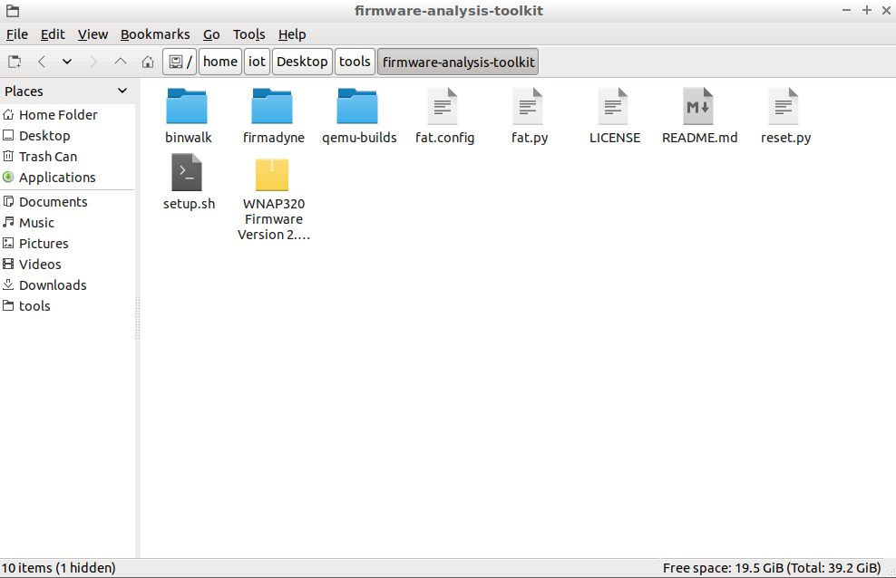

安装完成后，编辑文件`fat.config`并提供 sudo 密码，如下所示。Firmadyne 的某些操作需要 sudo 权限。提供 sudo 密码是为了自动化该过程。
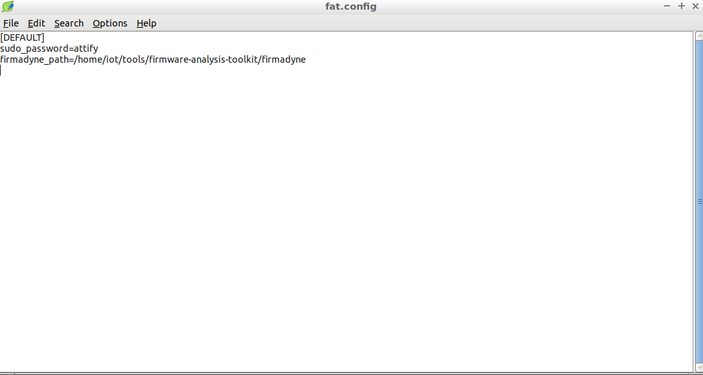

使用方法如下
```python
./fat.py RV130X_FW_1.0.3.44.bin
```


跑起来之后会有提示，需要按下回车键才会开始仿真
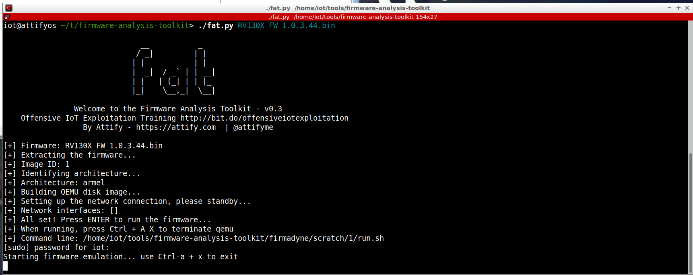

```python
./fat.py DIR823GA1_FW102B03.bin
```


跑起来之后访问 192.168.0.1 即可
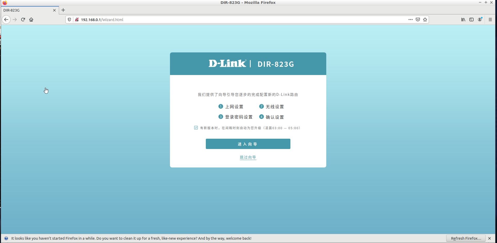

按下回车可以进入 qemu
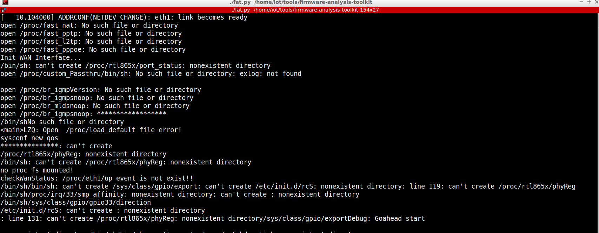

要删除所有分析的固件映像，请运行
```python
./reset.py
```
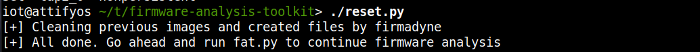

如果未检测到网络接口，请尝试将超时值从 60 增加到`scripts/inferNetwork.sh`如下所示
```python
echo "Running firmware ${IID}: terminating after 60 secs..."
timeout --preserve-status --signal SIGINT 60 "${SCRIPT_DIR}/run.${ARCH}.sh" "${IID}"
```


[FirmAE](https://github.com/pr0v3rbs/FirmAE)

FirmAE 是一个执行仿真和漏洞分析的全自动框架。FirmAE 使用五种仲裁技术显著提高仿真成功率（从Firmadyne的 16.28% 提高到 79.36%）。

Clone `FirmAE`

```shell
git clone --recursive https://github.com/pr0v3rbs/FirmAE
```

运行`download.sh`

```shell
./download.sh
```

运行 `install.sh`

```shell
./install.sh
```

firmae 的使用
首先执行初始化脚本

```python
./init.sh
```

检查仿真条件 -c 参数

```python
sudo ./run.sh -c <brand> <firmware>
```

firmware 填写固件名称
brand 是开发板名称，可以随便填，不影响正常使用

完成`run.sh -c`后，可debug固件，这样后面进行 debug 时，等待的时间会大大减少

-a 使用分析模式

```python
sudo ./run.sh -a <brand> <firmware>
```

运行模式，有利于进行网络测试

```shell
sudo ./run.sh -r <brand> <firmware>
```

user-mode 调试固件

```python
sudo ./run.sh -d <brand> <firmware>
```

system-mode 调试固件

```python
sudo ./run.sh -b <brand> <firmware>
```

使用 FirmAE 对思科路由器设备漏洞进行仿真

第一步，首先检查仿真条件
使用 -c 参数

```python
sudo ./run.sh -c cisco /home/gxh/iot/Cisco_CVE-2019-1663/RV130X_FW_1.0.3.44.bin
```


可以看到检查仿真条件成功了

完成`run.sh -c`后，可以 debug 固件，先进行 -c 后面就会快一些，不进行 -c 也可以

然后进行 -r，运行模式，有利于进行网络测试

```python
sudo ./run.sh -r cisco /home/gxh/iot/Cisco_CVE-2019-1663/RV130X_FW_1.0.3.44.bin
```


可以看到 -r 运行成功了，然后我们去访问一下看看，可以看到完全访问成功


用户名和密码都是弱密码 cisco，我们尝试登录，然后修改密码之后，可以访问正常服务


[firmdyne](https://github.com/firmadyne/firmadyne)

FIRMADYNE 是一个自动化且可扩展的系统，用于对基于 Linux 的嵌入式固件进行仿真和动态分析。旨在帮助安全研究人员和逆向工程师研究、测试和分析固件，以识别其中可能存在的漏洞、安全问题和潜在的攻击面。它包括以下组件：
- 用于检测固件执行的修改内核（MIPS：v2.6、ARM：v4.1、 v3.10 ）；
- 用于模拟硬件 NVRAM 外设的用户空间NVRAM 库；
- 一个提取器，用于从下载的固件中提取文件系统和内核；
- 一个小型控制台应用程序，用于生成用于调试的附加 shell；
- 以及一个用于从 42 多个不同供应商下载固件的爬虫。

如何安装 firmadyne？
首先需要按照依赖项

```python
sudo apt-get install busybox-static fakeroot git dmsetup kpartx netcat-openbsd nmap python-psycopg2 python3-psycopg2 snmp uml-utilities util-linux vlan
```

递归克隆
```python
git clone --recursive https://github.com/firmadyne/firmadyne.git
```

还需要安装 binwalk 及其依赖项：
```python
git clone https://github.com/ReFirmLabs/binwalk.git
cd binwalk
sudo ./deps.sh
sudo python ./setup.py install
```

然后就是数据库的安装和配置
```python
sudo apt-get install postgresql
sudo -u postgres createuser -P firmadyne
sudo -u postgres createdb -O firmadyne firmware
sudo -u postgres psql -d firmware < ./firmadyne/database/schema
```

记得设置密码为 firmadyne


然后就是二进制组件的安装
```python
cd ./firmadyne; ./download.sh
```

最后就是 qemu
```python
sudo apt-get install qemu-system-arm qemu-system-mips qemu-system-x86 qemu-utils
```

如何使用呢？
首选我们需要启动数据库

```python
service postgresql start
```

可以随便找个固件进行测试
这里使用 netgear 的固件

```python
wget -N --continue \
http://www.downloads.netgear.com/files/GDC/WNAP320/WNAP320%20Firmware%20Version%202.0.3.zip \
-O firmware.bin
```


然后使用之前安装的工具进行解压
```python
python3 ./sources/extractor/extractor.py -b Netgear -sql 127.0.0.1 -np -nk "firmware.bin" images
```
- 解析固件`firmware.bin`创建项目
- 解压后目录`./images/`下会多出一个`tar.gz`文件,文件名就是这个固件的id
- `-b Netgear`指定固件类型为`Netgear`,可以随便写一个
- `-sql`指定数据库位置
- `-np`禁止多线程解压
- `-nk`不处理内核


可以看到解压成功


images 下多出的 targz


然后进行自动化分析固件架构
```python
./scripts/getArch.sh ./images/1.tar.gz
```
可以看到是 mipseb 的架构
说白了就是对 busybox 进行架构检测
![[Pasted image 20231029173003.png]]

同时也会将结果保存到数据库，方便后面自动分析

然后对固件信息进行收集
```python
./scripts/tar2db.py -i 1 -f ./images/1.tar.gz
```
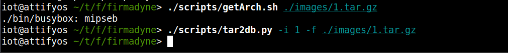

同样的，同时也会将结果保存到数据库，方便后面自动分析

然后这时我们需要对固件创建 img
```python
./scripts/makeImage.sh 1 [arch]
```
- `[arch]`是可选参数,用于覆盖数据库中的`arch`记录

然而实际上不指定就会报错
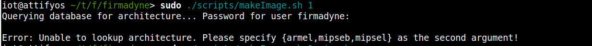

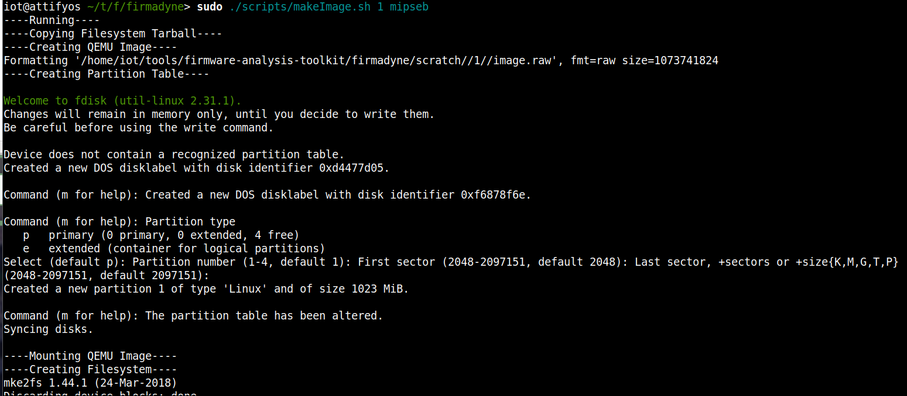
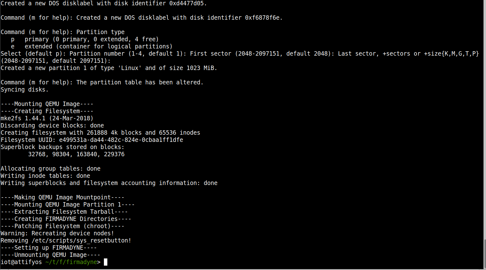

最后对固件的网络接口情况进行分析
```python
./scripts/inferNetwork.sh 1 mipseb
```


最后进行固件模拟
```python
./scratch/1/run.sh
```

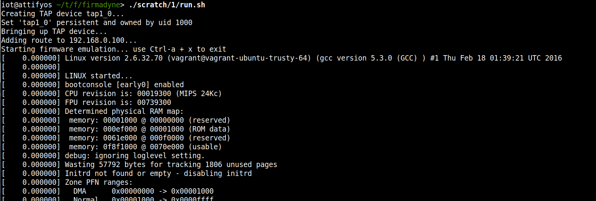


可以看到调试成功


[EMUX](https://github.com/therealsaumil/emux)


## 4. 固件自动化分析工具

[FACT_core](https://github.com/fkie-cad/FACT_core)


[EMBA](https://github.com/e-m-b-a/emba)


[Podding](https://podding.cn/#/login)


## 5. 漏洞分析与利用


## 6. 漏洞挖掘思路

### 6.1 攻击面分析

在做攻击面分析前我们首先要知道，对于一个常规的物联网设备而言，可以分为设备端、手机端和云端。而这三个不同的端都会存在自己一些特殊的攻击面。比如设备端我们往往会先想办法获取固件然后分析核心服务，而APP端则会有注入蓝牙等一系列操作。


### 6.2 硬件分析

针对硬件的分析主要停留在电路板上使用的芯片以及配套的解决方案，一般重点关注MCU型号以及外挂Flash闪存。其次便是寻找各类接口，如UART、ADB、JTAG等。


对于UART口一般可以直接找并排或相距不远的多个焊点和通孔，然后借助万用表来识别每个串口对应的功能。也可以直接使用JTAGulator来直接进行识别，当然他更强大的功能是识别JTAG接口。


### 6.3 信息收集

做完硬件层面的分析接下来就是要正式开始，一般会在未获取固件前就对端口开放信息进行扫描，了解其对外开放的一些服务并进行黑盒测试。

过第一步说的接口进入shell后可以用ps查看设备开启了哪些服务，这些服务都是后期重点的挖掘方向。其次便是分析固件文件系统，查看固件使用了哪些中间件，如果有中间件，查看中间件的配置文件，获取中间件配置信息，当没思路的时候可以查看中间件是否有漏洞，中间件有漏洞就可以打开一扇窗口了。


设备固件中往往会包含大量敏感信息，如设备账号密码等信息。对于提取固件内配置文件中的敏感信息，我们可以通过firmwalker.sh脚本自动化获取。


### 6.4 固件分析

固件的分析一般以运行的主程序和会对外监听端口的程序为主。以常见的httpd服务为例。常见的httpd文件名: boa、gohead、httpd（lighttpd、minihttpd）等。获取httpd版本信息、通过互联网可以发现是否存在历史漏洞

另外一些厂商为方便调试会特意在设备固件上留有后门，通过逆向等技术手段，找出不属于正常功能且可能存在安全问题的接口。利用后门漏洞可以直接控制硬件设备，进一步发起信息窃取、网络钓鱼、DNS劫持等攻击行为，直接威胁用户网上交易和数据存储的安全。


搜索危险函数: system,popen,strcpy,snprintf,printf等，查看危险函数变量是否可控，可控可能就有漏洞。通过IDA跟踪请求url处理函数，跟踪每个变量处理过程，查看是否对变量进行过滤处理，无长度限制可尝试栈溢出、堆溢出，对特殊符号进行尝试绕过等操作来寻找进一步的漏洞。


### 6.5 协议分析

现在的智能设备会使用各类协议进行通讯，如MQTT、ZigBee、UPnP等。以UPnP为例测试思路一遍有获取设备描述Lcation，请求Location查看服务描述，也可通过upnp配置路径获取服务描述xml文件，通过xml文件记录每个变量，用IDA对UPnP进行反编译，搜索变量跟踪路径查看函数处理过程是否存在漏洞

这里拿HG532系列路由器远程命令执行举例，该函数对变量没有过滤，直接使用system，导致出现远程命令注入漏洞。


当然除了传统的各类网络协议，物联网设备也会存在例如蓝牙、射频信号等攻击面


## 7. 固件解密

### 7.1 加密固件更新的方式

固件制造商出于对产品安全的考虑，防止固件被恶意篡改，通常会采取各种防范手段，阻止固件被直接解包和破解。其中一种重要且有效的手段就是利用加密算法对固件进行加密，例如使用AES、DES等对称加密算法加密固件中的内核和文件系统，或使用XOR、ROT等简单置换算法对固件进行处理，这使得研究人员无法直接读取固件中的明文内容。

对固件进行解密之前，需提前了解厂商一般会以怎样的形式发布加密固件以及在设备启动和固件升级过程中，会在哪些地方对固件进行解密。厂商发布加密固件一般有以下三种场景：

1. **固件出厂未加密后续发布包含解密方案的未加密固件**

固件在出厂时未加密，也未包含任何解密代码，后续为了发布加密固件，会提前发布一个包含解密程序的未加密版本作为过渡版本，这样后续发布加密固件时可使用该解密程序进行解密，这类情况在发布时间较早的设备中比较常见。


对于此种情况，可寻找固件过渡版本v1.1，从中分析出所包含的解密逻辑和算法，从而实现对后续加密固件的解密。因为用户无法从v1.0直接升级v1.2的固件，所以在官方的固件发布描述中，一般会存在如下图所述的描述。

2. **固件出厂加密后续发布包含新版解密方案的未加密固件**

设备固件在原始版本中已加密。供应商决定更改加密方案并发布未加密的过渡版本 v1.2，其中包含新的解密程序。与方案 1 类似，可以从 v1.2 映像中获取解密例程，并将其应用于最新的加密固件。阅读固件版本的发行说明可能有助于识别未加密的过渡版本。发行说明通常会指导用户在升级到最新版本之前升级到中间版本，中间版本很可能是未加密的过渡固件

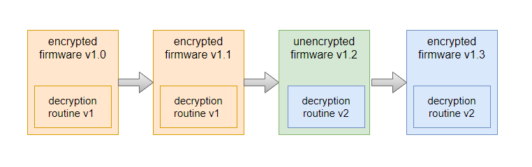

以过渡版本v1.2作为分界线，分别对其前后版本固件的解密进行说明。对于v2及更高版本的固件即过渡版本之后的固件（假设都使用同一种加密方案，无其它过渡版本）：可以通过寻找过渡版本v1.2，从中分析出v2的解密方法从而对v2固件进行解密。

3. **固件出厂加密后续发布包含新版解密方案的加密固件**

设备固件在原始版本中已加密。但是供应商决定更改加密方案，并发布包含新解密例程的未加密过渡版本，在这种情况下，没有简单的方法来获得解密程序。一种方法是购买设备并直接从硬件中提取未加密的固件。


### 7.2 解密的方法

针对物联网终端设备的固件解密，总结如下五种方法和技巧：

1. **基于老版本未加密固件中的解密程序实现新版本加密固件的解密**

对于固件出厂时未加密，后续发布的固件是加密的情况，可以通过对比边界版本，解包最后一个未加密版本逆向升级程序还原加密过程，以实现对加密固件的解密。

2. **基于调试串口直接提取未加密固件**

如果设备存在UART、JTAG等调试接口，可通过连接硬件接口获取设备的Shell，从而dump出设备的固件。

但由于某些设备安全限制较高导致无法进入Linux Shell，我们可尝试进入BootLoader Shell（最常见的是Uboot Shell）对固件进行提取。这里要说明的一点是部分设备更新固件后会将解密后的新版固件写回Flash，这种情况下dump出的固件是未加密的，而相反的是部分设备Flash中的固件一直是加密状态存在，只是在每次设备启动时进行动态解密。所以此种方法提取出的固件可能也是加密的，但好处在于可以避免因拆解设备Flash去读固件导致设备损坏的风险，并且可以获取到较为完整的固件（官方下载的固件可能只是某块数据的更新包）。

3. **基于管理服务获取设备Shell提取文件系统**

对于有Telnet、SSH等服务的设备，可以通过这些服务进入设备的Linux Shell进行固件提取。服务一般在设备的web管理页面中可手动开启，但需要说明的一点是某些厂商会开发自家的CLI屏蔽掉底层Linux Shell，连接这些服务进入的Shell只是厂商的CLI，也无法提取文件系统，不过某些设备（光猫居多）的CLI存在可进入Linux Shell的命令，具体可自行在互联网上搜索相应的方法。

4. **基于低版本固件RCE漏洞获取设备Shell分析解密逻辑实现对新版固件的解密**

如果设备历史加密版本固件出现过RCE漏洞，可将存在漏洞的固件刷入设备，通过RCE漏洞获取设备Linux Shell，再分析其包含的解密逻辑，最终通过该解密逻辑实现对更新版本固件的解密。需要注意的是存在RCE漏洞版本的固件所使用的加密方案需要与新版本固件一致。

5. **直接分析完整固件中包含的解密逻辑实现对固件的解密**

常见情况下固件的解密逻辑肯定是存在Flash中的，当获取到完整版固件（拆机从Flash读取或者从BootLoader Shell中提取等）后，可以直接对整个固件进行逆向分析寻找解密逻辑代码实现对固件的解密，但此种方法难度较大，并且这类设备安全性一般较高，很有可能分析出了解密逻辑但拿不到解密密钥，如密钥单独存放在某个安全芯片中。

### 7.3 固件解密步骤

1. 通过设备固件中间过渡版本或者通过物理设备的UART接口进入到系统中获取解密程序和算法（可以观察固件名称，带有Middle_FW_Unencrypt这种字符的基本都是中间版本，包含解密程序）
2. 利用QEMU执行跨架构的chroot，获取有效SHELL。
3. 使用获得的解密程序对加密固件进行解密
4. 测试解密程序是否对新版本加密固件有效，若对新版本固件无效解密，很可能还包含其他中间过渡版本。

### 7.4 固件解密演示

#### 解密DIR-878

以D-LINK设备 DIR-878 为例，通过中间版本能直接拿到固件的解密程序或者算法，通过解密程序再去解密新的固件。DIR-878 的固件中间过渡版本没有加密但是包含解密程序，可以通过 binwalk 直接获取固件的文件系统。

DIR-878固件下载地址：https://tsd.dlink.com.tw/ddetail


将固件都下载到本地中，使用binwalk检查最早的固件版本，它将正确检测到uImage标头和LZMA压缩数据，能检测到就直接使用 -Me参数进行递归提取。

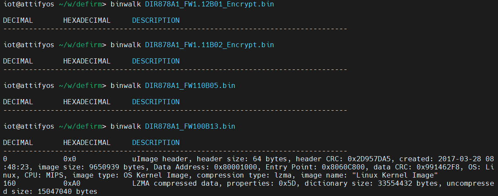

最终在 1.10B05 固件压缩包中获取到中间版本的固件：DIR878A1_FW104B05_Middle_FW_Unencrypt.bin（所谓中间版本就是该版本使用binwalk可以检测到数据，后面版本都不能检测到数据，就可以猜测该版本为中间版本） 提取中间版本(DIR878A1_FW104B05_Middle_FW_Unencrypt.bin)的文件系统


找到了中间版本，按照固件升级的思路，肯定有一个升级程序，在这个程序内部可能存在着加密算法，我们首要目的就是去寻找这个解密程序。最终在程序目录 /bin文件夹下面，发现了一个名为 imgdecrypt 的二进制文件。


因为主机(x86)和二进制文件(MIPS)之间的处理器体系结构上存在差异。

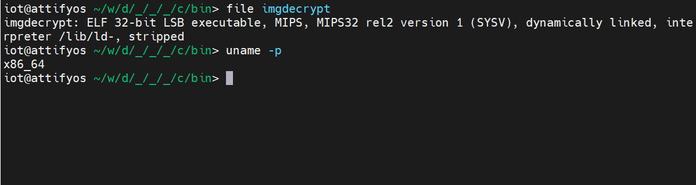

可以使用QEMU执行跨架构的chroot。为此，首先我们将qemu-mipsel-static二进制文件复制到固件根文件系统的/usr/bin/目录中，我们还将加密的固件复制到未加密的固件文件系统。最后，我们将chroot插入固件根目录并获得一个有效的shell，然后运行执行解密的二进制程序，按照提示输入需要解密的固件，输出key代表固件已经成功的被解密。(未将QEMU放在正确位置，启动任何程序都会报错No such file or directory。这个报错会有很多歧义，因此一定要自己确认一下QEMU确实在rootfs的“/usr/bin”目录中)


使用binwalk再次对解密后的固件(1.10B05)进行检测，已经成功的获取到了固件的uImage标头和LZMA压缩数据。（执行binwalk前注意要给固件读写权限）这样就成功的解密了固件，并提取到了固件文件系统

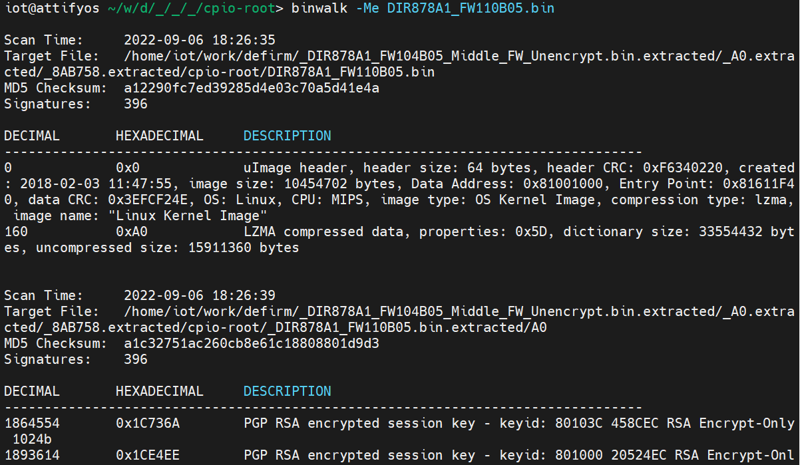

当然这种方式还是比较麻烦，在GitHub中已经有大佬完善了整个解密过程，通过逆向分析解密程序imgdecrypt，还原解密算法并找到硬编码的密钥信息。该解密脚本目前能够支持的固件版本：包括但不仅限于DIR-825、DIR-867、DIR-878、DIR-882、DIR-1260、DIR-1960、DIR-2660、DIR-3060。

解密脚本链接：https://github.com/0xricksanchez/dlink-decrypt

逆向分析文章：

- 第一篇：https://0x00sec.org/t/breaking-the-d-link-dir3060-firmware-encryption-recon-part-1/21943
- 第二篇：https://0x00sec.org/t/breaking-the-d-link-dir3060-firmware-encryption-static-analysis-of-the-decryption-routine-part-2-1/22099
- 第三篇：https://0x00sec.org/t/breaking-the-d-link-dir3060-firmware-encryption-static-analysis-of-the-decryption-routine-part-2-1/22099


#### 解密Linksys-EA6100

需要解密固件的版本是：FW_EA6100_1.1.6.181939_prod.gpg.img (Build 181939)，固件下载地址：https://www.linksys.com/hk/en/linksys-support/（搜索对应的型号）

首先使用binwalk对下载好的固件1.1.6进行检测，并且尝试提取固件，但是并未得到任何有价值的信息。


使用binwalk -E 查看固件的熵值，EA6100固件的信息熵接近1，可以说明固件是经过加密的。


在下载固件的时候，可以看到一个提示信息，需要先下载中间过渡版本。


根据提示下载好过渡版本的固件 FW_EA6100_1.1.5.172244_prod.img （Build 172244），并尝试提取固件。

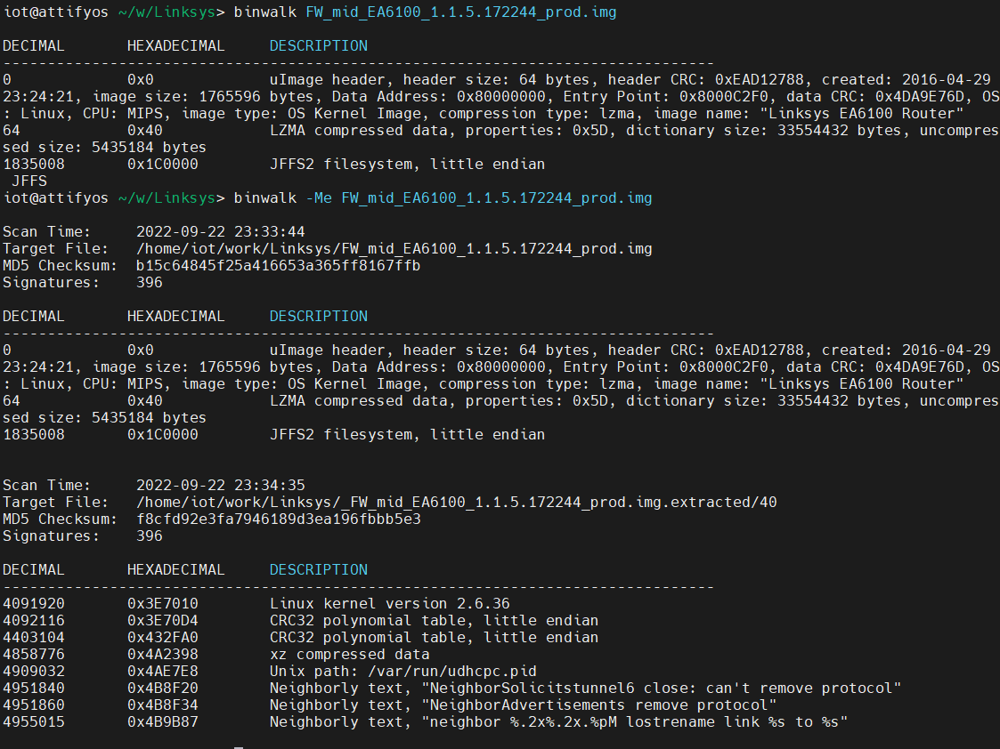

可以看见成功的提取到了文件系统，由于固件更新的目标是加密的，所以猜测固件中存在解密的程序，尝试在解密的文件中寻找相关的解密程序。

在下载固件时，可以发现1.1.6版本的加密固件的命名多了gpg后缀(*.prod.gpg.img)，GPG是不对称加密、数字签名的经典和标准，不但可以为个人的数字传输提供信用保障，用于保护个人之间通讯的隐私，保护敏感数据，而且可以在更大的范围内，如公司范围内的数据加密，电子产品的数字签名，知识产权保护等。可以知道新版本的固件很可能使用了gpg的方式来加密固件。

寻找解密文件，检索一些其他的密钥保存的格式之后，一般都是下面的这种方式

``````
——-BEGIN RSA PRIVATE KEY——- # 私钥内容
… (private key in base64 encoding) …
——-END RSA PRIVATE KEY——-
——-BEGIN CERTIFICATE——- # 证书信息
… (certificate in base64 PEM encoding) …
——-END CERTIFICATE——-
``````

使用grep命令检索文件，找到了类似 gpg 密钥的文件keydata 


首先将keydata 加载到 主机系统中的 gpg 中，然后再进行对固件包解密


看起来没有出现什么问题，将解密之后的文件进行binwalk探测并尝试提取文件。最终成功的解密固件。


## 8. 安全社区

#### 社区/论坛

看雪学苑：https://bbs.kanxue.com/

先知社区：https://xz.aliyun.com/node/18

知道创宇404 Team:https://paper.seebug.org/1045/

IOT-ZONE：https://www.iotsec-zone.com/

https://4pda.to/forum/lofiversion/index.php?index.html

https://ipcamtalk.com/


#### 实验室/个人博客

领先的物联网和移动安全提供商：https://blog.attify.com/

来自新加坡的明星实验室：https://starlabs.sg/blog/ 

星舆车联网安全实验室：http://starvlab.qianxin.com/

腾讯科恩实验室：https://keenlab.tencent.com/

灯塔实验室：https://plcscan.org/blog/

Team82：https://claroty.com/team82/research

中断实验室：https://www.interruptlabs.co.uk/labs

IOActive 实验室：https://labs.ioactive.com/?m=0

https://security.humanativaspa.it/category/news/

https://riverloopsecurity.com/blog/

https://margin.re/blog/

https://hackaday.com/blog/

https://www.pentestpartners.com/security-blog/

https://research.nccgroup.com/

 https://www.tarlogic.com/blog/

https://www.secpulse.com/newpage/author?author_id=3747

https://www.secpulse.com/newpage/author?author_id=40030


加拿大皇家银行的高级安全专家：https://boschko.ca/

物联网安全研究员（ 长亭科技）：https://bestwing.me/

物联网安全研究员（奇安信）https://cq674350529.github.io/

汽车安全研究员（奇安信）：https://delikely.eu.org/

物联网安全研究员：https://www.zhiwanyuzhou.com/

https://wzt.ac.cn/

https://www.zerodayinitiative.com/blog

https://resolverblog.blogspot.com/

https://blog.csdn.net/Breeze_CAT?type=blog

https://evilpan.com/

https://medium.com/@cq674350529

https://atcnetz.blogspot.com/


#### 公众号/订阅号

|       名称       |                             简介                             |                            公众号                            |
| :--------------: | :----------------------------------------------------------: | :----------------------------------------------------------: |
|    银弹实验室    |  探索物联网安全之道，辩析安全有无银弹，与我们一起，在路上！  |  |
|    蛇茅实验室    | 蛇矛攻防实验室成立于2020年，团队核心成员均由从事安全行业10余年经验的安全专家组成，涉及红蓝对抗、渗透测试、逆向破解、病毒分析、工控安全以及免杀等相关领域方向。 |  |
| Beacon Tower Lab | "海上千烽火，沙中百战场"，烽火台实验室将为您持续输出前沿的安全攻防技术 |  |
|  ChaMD5安全团队  | 一群不正经的老司机组成的史上最牛逼的安全团队。小二，来杯优乐美。 |  |
|  物联网IoT安全   | 我们是一个专注于物联网IOT安全 固件逆向 近源攻击 硬件破解的公众号 |  |
|     看雪学苑     |              *致力于移动与*安全研究的开发者社区              |  |
|    胖猴实验室    |                        一群想胖的猴子                        |  |
|     桥的断想     |                    分享IOT与汽车安全知识                     |  |
|   IoVSecurity    | 为智能网联汽车行业专业人士提供信息和网络安全技术、产品及服务等行业发展最新咨询 |  |
|    天问实验室    | 杭州安恒天问实验室，专注于物联网、车联网、工控等新兴领域的安全测试与安全研究 |  |
|   360 IOT安全    |                      360 IoT安全研究院                       |  |
|     TahirSec     |      未知攻，焉知防，专注于高级威胁研究与数字调查取证。      |  |
|     卫星黑客     |                           卫星黑客                           |  |


## 9. 安全论文


比较前沿的物联网安全的研究性文章


